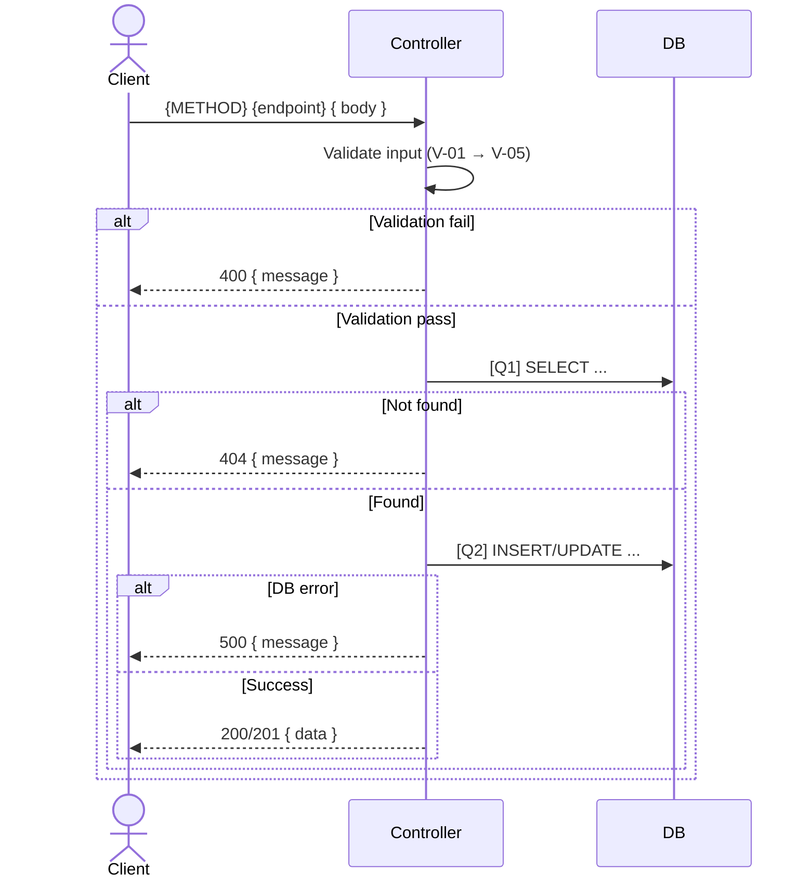

# [Design][API] API{ID}_{Group}_{Name}

## Lịch sử thay đổi

| Ver | Ngày | Nội dung thay đổi | Người tạo |
|-----|------|-------------------|-----------|
| 1.0 | YYYY-MM-DD | Tạo mới | {author} |

## 1. Tổng quan
> Mô tả ngắn gọn API dùng để làm gì, được gọi từ màn hình nào (FE) hoặc hệ thống nào.

**Tài liệu tham chiếu:**

| Loại | File | Mục đích |
|------|------|----------|
| Screen doc | `demo_docs/fe/[Design][SCREEN] {ScreenCode}_*.md` | Màn hình gọi API này |
| API List | `demo_docs/api/[Design][LIST] API_DanhSachEndpoint.md` | Danh sách toàn bộ endpoint |
| DB Schema | `demo_docs/[Design][DB] DATABASE_Schema.md` | Cấu trúc bảng |

## 2. Thông tin chung

| Thuộc tính | Giá trị |
|-----------|---------|
| Method | `GET` / `POST` / `PUT` / `PATCH` / `DELETE` |
| Endpoint | `/api/...` |
| Auth yêu cầu | Không / Có (Bearer Token) |
| Role cho phép | Public / Member / Admin |
| Controller | `src/controllers/{name}.controller.js` → `functionName` |

**Bảng DB liên quan:**

| Bảng | Hành động | Mục đích |
|------|-----------|----------|
| `table_name` | READ | Kiểm tra tồn tại |
| `table_name` | WRITE | Lưu dữ liệu mới |

## 3. Request

### 3.1 Headers & Parameters
| Tên | Vị trí | Kiểu dữ liệu | Bắt buộc | Ràng buộc | Mô tả |
|-----|--------|--------------|----------|-----------|-------|
| Authorization | Header | String | ✅ | `Bearer <token>` | Token xác thực |
| id | Path | Number | ✅ | `> 0` | ID của resource |
| page | Query | Number | ❌ | Default: `1` | Phân trang |

### 3.2 Body Payload
> Ghi "Không có" nếu là GET/DELETE request không có body.

| Logical Name | Physical Field | Kiểu dữ liệu | Bắt buộc | Ràng buộc (Min/Max/Format) | Chuẩn hóa input | Mô tả |
|-------------|---------------|--------------|----------|----------------------------|----------------|-------|
| Tên hiển thị | `field_name` | String | ✅ | Max 255 ký tự | `trim()` | Mô tả field |
| Email | `email` | String | ✅ | Format email | `trim()`, `toLowerCase()` | Email đăng nhập |

**Ví dụ Request Body:**
```json
{
  "field_name": "value",
  "email": "user@example.com"
}
```

## 4. Validation Rules

> Bảng quy tắc validation theo ID (V-01, V-02...). Thực hiện theo thứ tự từ trên xuống.

| Rule ID | Đối tượng | Quy tắc | MessageId | HTTP Status |
|---------|----------|---------|-----------|-------------|
| V-01 | Auth | Token hợp lệ và chưa hết hạn | E-401 | 401 |
| V-02 | Auth | Role có quyền thực hiện | E-403 | 403 |
| V-03 | `field_name` | Bắt buộc, không được rỗng | E-001 | 400 |
| V-04 | `email` | Đúng format email | E-002 | 400 |
| V-05 | `email` | Không trùng với record đã tồn tại | E-409 | 409 |

> Lỗi 401/403/5xx do middleware/interceptor xử lý chung, không cần khai báo lại trong controller.

## 5. Response

### 5.1 Thành công (HTTP 200 / 201)
| Field | Kiểu dữ liệu | Có thể Null | Mô tả |
|-------|--------------|-------------|-------|
| `message` | String | ❌ | Thông báo thành công |
| `data` | Array/Object | ❌ | Dữ liệu trả về |
| `data.id` | Number | ❌ | ID của resource |

**Ví dụ Response:**
```json
{
  "message": "Success",
  "data": {
    "id": 1
  }
}
```

### 5.2 Lỗi & Exceptions
| HTTP Code | Error Code | Message | Điều kiện xảy ra |
|-----------|-----------|---------|------------------|
| 400 | `ERR_VALIDATION` | `"Validation failed"` | Thiếu field bắt buộc hoặc sai format |
| 401 | `ERR_UNAUTHORIZED` | `"Unauthorized"` | Token không hợp lệ hoặc hết hạn |
| 403 | `ERR_FORBIDDEN` | `"Forbidden"` | Không đủ quyền truy cập |
| 404 | `ERR_NOT_FOUND` | `"Not found"` | Không tìm thấy resource |
| 409 | `ERR_CONFLICT` | `"Already exists"` | Dữ liệu đã tồn tại (duplicate) |

## 6. Sequence Diagram

> Vẽ cho API có logic phức tạp (auth, multi-step, rollback). Ghi "Không có" nếu API đơn giản (GET list, GET by ID).



## 7. Logic xử lý (Business Logic)
> Viết step-by-step luồng xử lý. Gắn thẻ **[Q1]**, **[Q2]** vào các bước có tương tác với Database.

1. Chuẩn hóa input: trim, toLowerCase các field cần thiết.
2. Validate theo thứ tự V-01 → V-05 (dừng ngay khi gặp lỗi đầu tiên).
3. Thực hiện **[Q1]** để kiểm tra dữ liệu tồn tại.
   - Nếu không tìm thấy → throw `404 Not Found`.
4. Thực hiện **[Q2]** để cập nhật/thêm mới dữ liệu.
5. Chuẩn hóa response và trả về.

## 8. Database Queries & Mapping
> Danh sách chi tiết các câu query được gọi trong API này (tương ứng với các thẻ Q1, Q2... ở trên).

| Query ID | Bảng (Table) | Hành động | Điều kiện (WHERE) / Data | Điều kiện OK/NG | Knex.js Snippet |
|----------|--------------|-----------|--------------------------|----------------|----------------|
| **[Q1]** | `table_name` | `SELECT` | `WHERE id = :id` | 0 record → 404 | `knex('table_name').where({ id }).first()` |
| **[Q2]** | `table_name` | `INSERT` | Data từ body | Lỗi unique → 409 | `knex('table_name').insert(data).returning('*')` |

**Data Mapping — Request → SQL:**

| API Field | SQL Param | Transform |
|-----------|-----------|-----------|
| `email` | `email` | `trim()`, `toLowerCase()` |
| `field_name` | `field_name` | `trim()` |

**Data Mapping — DB Column → Response:**

| DB Column | Response Field | Transform/Format |
|-----------|---------------|-----------------|
| `created_at` | `data.createdAt` | ISO 8601 string |
| `id` | `data.id` | Không |

## 9. Message List

| MessageId | Loại | HTTP Status | Nội dung | Điều kiện |
|-----------|------|-------------|----------|-----------|
| E-001 | Error | 400 | `"Field {field} là bắt buộc"` | Thiếu field required |
| E-002 | Error | 400 | `"Email không đúng định dạng"` | Sai format email |
| E-409 | Error | 409 | `"Dữ liệu đã tồn tại"` | Duplicate record |
| S-001 | Success | 200/201 | `"Thao tác thành công"` | API thành công |

> Lỗi chung (401/403/5xx) do middleware xử lý, không khai báo ở đây.

## 10. Side Effects (Tác động phụ)
> Các tác động ngoài Database (gửi email, upload file, gọi service ngoài...). Ghi "Không có" nếu không áp dụng.
- Không có.
