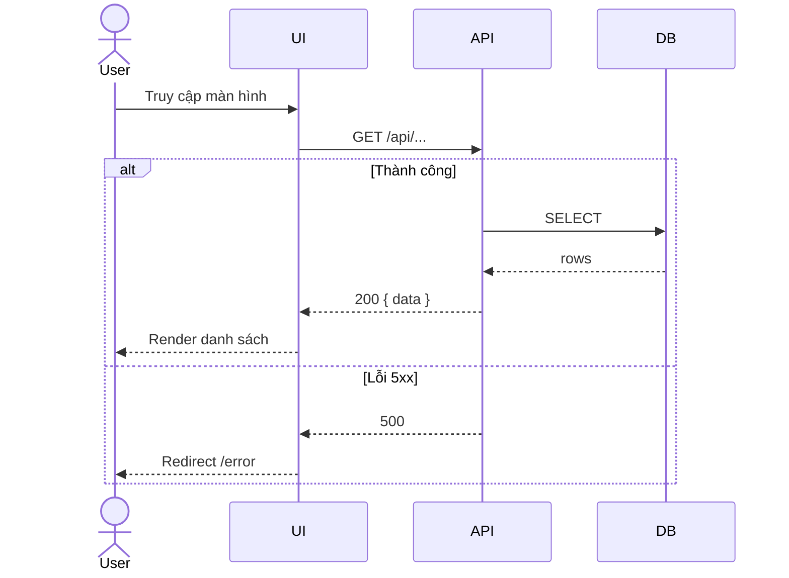
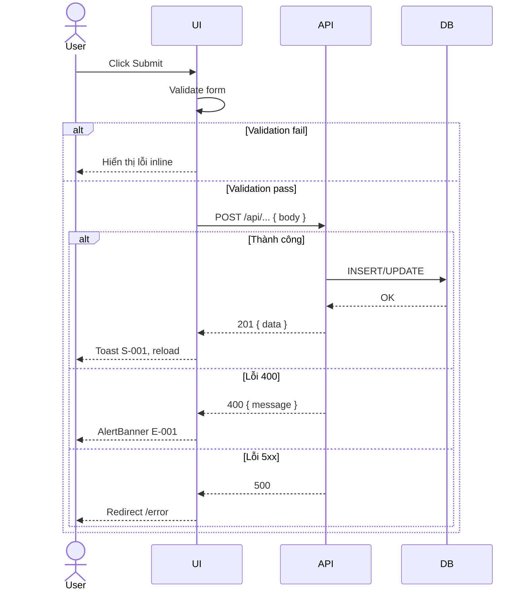

# [Design][SCREEN] {ScreenCode}_{ScreenName}

## Lịch sử thay đổi

| Ver | Nội dung thay đổi | Ngày | Người tạo |
|-----|-------------------|------|-----------|
| 1.0 | Tạo mới | YYYY-MM-DD | {author} |

## 1. Tổng quan
> Mô tả ngắn mục đích của màn hình, ai dùng, khi nào dùng.

## 2. Thông tin chung

| Thuộc tính | Giá trị |
|-----------|---------|
| Route | `/path` |
| Auth yêu cầu | Không / Có (role: member \| admin) |
| Redirect nếu chưa login | `/admin/login` |
| URL Params | Không có / `:id`, `:slug` |

## 3. Navigation

### Vào từ đâu
| Nguồn | Điều kiện |
|-------|----------|
| Sidebar Admin | Click menu item |

### Đi đến đâu
| Hành động | Destination |
|----------|------------|
| Click item | `/{route}/:id` |

## 4. Layout & Components

```jsx
<AdminLayout>
  <PageHeader title="..." />
  <MainContent>
    <ComponentA />
    <ComponentB />
  </MainContent>
</AdminLayout>
```

> Liệt kê components dùng lại: `AdminLayout`, `ProtectedRoute`, `Pagination`, v.v.

## 5. Ma trận trạng thái UI

> Áp dụng cho màn hình có nhiều button nghiệp vụ. Ghi "Không có" nếu màn hình đơn giản (chỉ form/display).

| Trạng thái | Nút A | Nút B | Nút C | Ghi chú |
|-----------|-------|-------|-------|---------|
| Khởi tạo (init) | Enable | Disable | Ẩn | Chưa chọn dòng nào |
| Đang loading | Disable | Disable | Disable | Chống double-click |
| Chọn 1 dòng | Enable | Enable | Enable | |
| Chọn nhiều dòng | Enable | Disable | Enable | Nút edit chỉ cho 1 dòng |
| Không có quyền | Ẩn | Ẩn | Ẩn | Kiểm tra permission key |

## 6. Chi tiết UI từng section

### 6.1 Form / Bảng dữ liệu

| UI Control | Loại | I/O | Ràng buộc (Min/Max/Format) | Giá trị khởi tạo | Nguồn dữ liệu | Event ID | JSON Field | Ghi chú |
|------------|------|-----|----------------------------|-----------------|--------------|----------|------------|---------|
| Email | Input text | Input | Format email, bắt buộc | `""` | N/A | E01 | `email` | Hiển thị lỗi inline |
| Mật khẩu | Input password | Input | Min 6 ký tự, bắt buộc | `""` | N/A | E01 | `password` | |
| Dropdown | Select | Input | Bắt buộc | `null` | GET /api/... | E01 | `categoryId` | Load on mount |
| Nút Submit | Button | — | Disabled khi loading | — | N/A | E01 | N/A | |

> **I/O**: `Input` = user nhập, `Output` = hiển thị dữ liệu, `Both` = vừa nhập vừa hiển thị.

## 7. API Calls

| # | Event ID | Endpoint | Method | Khi nào gọi | Auth | Link spec |
|---|---------|---------|--------|------------|------|-----------|
| 1 | E00 | `/api/...` | GET | On mount | Có | [[Design][API] API{ID}_...](../api/[Design][API]%20API{ID}_Group_Name.md) |
| 2 | E01 | `/api/...` | POST | Submit form | Có | [[Design][API] API{ID}_...](../api/[Design][API]%20API{ID}_Group_Name.md) |

### 7.1 Request Mapping

| UI Control / State | API Field | Chuyển đổi |
|-------------------|-----------|-----------|
| Input `email` | `email` | `trim()`, `toLowerCase()` |
| Input `password` | `password` | Không |

### 7.2 Response Mapping

| API Field | Hiển thị tại | Format |
|-----------|-------------|--------|
| `created_at` | Cột "Ngày tạo" | `DD/MM/YYYY` |
| `status` | Badge màu | `published` → xanh, `draft` → xám |

## 8. State Management

```js
const [items, setItems] = useState([]);
const [loading, setLoading] = useState(false);
const [error, setError] = useState(null);
```

## 9. Xử lý lỗi & Edge Cases

| Tình huống | HTTP Status | Xử lý | Component hiển thị |
|-----------|------------|-------|-------------------|
| Chưa đăng nhập | 401 | Redirect về `/admin/login` | — (interceptor) |
| Không có quyền | 403 | Hiển thị lỗi E-003 | `AlertBanner` |
| Lỗi nghiệp vụ | 400 | Hiển thị message từ response | `AlertBanner` |
| Danh sách rỗng | 200 | Hiển thị empty state I-001 | Text trong grid |
| Lỗi server | 5xx | Redirect `/error` | — (interceptor) |

> Lỗi HTTP chung (401/403/5xx) do axios interceptor xử lý, không cần khai báo lại ở từng event.

## 10. Responsive

| Breakpoint | Layout |
|-----------|--------|
| Mobile (< 768px) | Stack dọc, ẩn sidebar |
| Tablet (768–1024px) | Sidebar thu gọn |
| Desktop (> 1024px) | Full layout |

## 11. Events & Actions

### 11.1 Bảng tóm tắt sự kiện

| Event ID | Tên Event | Control | Trigger | API Endpoint | Mô tả |
|---------|----------|---------|---------|-------------|-------|
| E00 | Load màn hình | — | On mount | GET /api/... | Tải dữ liệu ban đầu |
| E01 | Submit form | Nút Submit | `onSubmit` | POST /api/... | Validate → gọi API → xử lý response |
| E02 | Clear / Reset | Nút Clear | `onClick` | — | Reset form về giá trị khởi tạo |

### 11.2 Chi tiết sự kiện

#### E00 — Load màn hình

**Trigger**: Component mount  
**API**: `GET /api/...`



#### E01 — Submit form

**Trigger**: Click nút Submit  
**API**: `POST /api/...`



## 12. Message List

| MessageId | Loại | Nội dung | Component hiển thị | Điều kiện |
|-----------|------|----------|-------------------|-----------|
| E-001 | Error | "Thao tác thất bại: {message}" | `AlertBanner` | API trả 400 |
| E-002 | Error | "Không có quyền thực hiện thao tác này" | `AlertBanner` | API trả 403 |
| C-001 | Confirm | "Bạn có chắc muốn thực hiện thao tác này?" | `ConfirmDialog` | Trước action nguy hiểm |
| S-001 | Success | "Thao tác thành công" | `Toast` | API trả 200/201 |
| I-001 | Info | "Không có dữ liệu" | Text trong grid/list | Response trả mảng rỗng |

> **Phân loại**: `E` = Error, `C` = Confirm, `S` = Success, `I` = Info/Empty-state.
