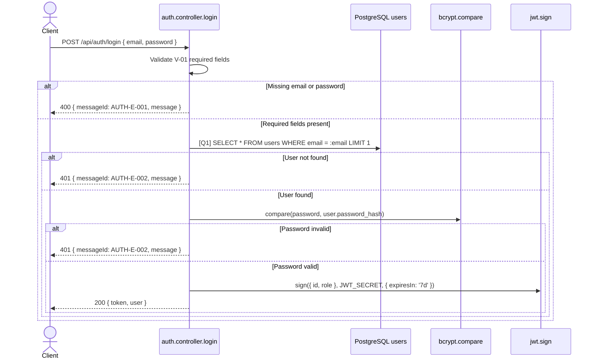

# [Design][API] API01_Auth_DangNhap

## Lịch sử thay đổi

| Ver | Ngày | Nội dung thay đổi | Người tạo |
|-----|------|-------------------|-----------|
| 1.0 | 2026-06-03 | Tạo tài liệu ban đầu cho API đăng nhập | GitHub Copilot |
| 1.1 | 2026-06-04 | Chuẩn hóa 10 sections, bổ sung Validation Rules, Sequence Diagram, Error Code, Data Mapping và Message List | GitHub Copilot |

## 1. Tổng quan

API `API01_Auth_DangNhap` xác thực người dùng `admin` hoặc `member` khi đăng nhập vào khu vực quản trị. API được gọi từ màn hình `ADMIN_LOGIN`, kiểm tra email/mật khẩu với bảng `users`, sau đó trả JWT access token và thông tin user không chứa `password_hash`.

**Tài liệu tham chiếu:**

| Loại | File | Mục đích |
|------|------|----------|
| Screen doc | `demo_docs/fe/[Design][SCREEN] ADMIN_LOGIN_DangNhap.md` | Màn hình gọi API đăng nhập |
| API List | `demo_docs/api/[Design][LIST] API_DanhSachEndpoint.md` | Danh sách toàn bộ endpoint |
| DB Schema | `demo_docs/[Design][DB] DATABASE_Schema.md` | Cấu trúc bảng `users` |
| Message Catalog | `demo_docs/[Design][COMMON] MESSAGE_Catalog.md` | Nguồn chuẩn `messageId` / `message` |

## 2. Thông tin chung

| Thuộc tính | Giá trị |
|-----------|---------|
| Method | `POST` |
| Endpoint | `/api/auth/login` |
| Auth yêu cầu | Không |
| Role cho phép | Public |
| Controller | `src/controllers/auth.controller.js` → `login` |

**Bảng DB liên quan:**

| Bảng | Hành động | Mục đích |
|------|-----------|----------|
| `users` | READ | Tìm user theo email và lấy `password_hash` để so khớp mật khẩu |

## 3. Request

### 3.1 Headers & Parameters

| Tên | Vị trí | Kiểu dữ liệu | Bắt buộc | Ràng buộc | Mô tả |
|-----|--------|--------------|----------|-----------|-------|
| Content-Type | Header | String | ✅ | `application/json` | Định dạng body JSON |
| N/A | Path/Query | N/A | ❌ | Không có | API không dùng path params hoặc query params |

### 3.2 Body Payload

| Logical Name | Physical Field | Kiểu dữ liệu | Bắt buộc | Ràng buộc (Min/Max/Format) | Chuẩn hóa input | Mô tả |
|-------------|---------------|--------------|----------|----------------------------|----------------|-------|
| Email đăng nhập | `email` | String | ✅ | Không rỗng; FE dùng HTML5 email format | Code hiện tại không trim/toLowerCase trong controller | Email của user trong bảng `users.email` |
| Mật khẩu | `password` | String | ✅ | Không rỗng; FE có `minLength=6` | Không chuẩn hóa | Mật khẩu plain text để so với `users.password_hash` |

**Ví dụ Request Body:**
```json
{
  "email": "admin@hoianblog.vn",
  "password": "password123"
}
```

## 4. Validation Rules

| Rule ID | Đối tượng | Quy tắc | MessageId | HTTP Status |
|---------|----------|---------|-----------|-------------|
| V-01 | `email`, `password` | `email` và `password` đều bắt buộc, không được falsy | `AUTH-E-001` | 400 |
| V-02 | `email` | User theo email phải tồn tại trong bảng `users` | `AUTH-E-002` | 401 |
| V-03 | `password` | `bcrypt.compare(password, user.password_hash)` phải trả `true` | `AUTH-E-002` | 401 |
| V-04 | Exception | Lỗi runtime/DB/JWT không thuộc các rule trên | `AUTH-E-003` | 500 |

## 5. Response

### 5.1 Thành công (HTTP 200)

| Field | Kiểu dữ liệu | Có thể Null | Mô tả |
|-------|--------------|-------------|-------|
| `token` | String | ❌ | JWT access token, payload gồm `{ id, role }`, hết hạn sau 7 ngày |
| `user.id` | Number | ❌ | ID người dùng |
| `user.name` | String | ❌ | Tên hiển thị |
| `user.email` | String | ❌ | Email đăng nhập |
| `user.role` | String | ❌ | Role `admin` hoặc `member` |

**Ví dụ Response:**
```json
{
  "token": "eyJhbGciOiJIUzI1NiIsInR5cCI6IkpXVCJ9...",
  "user": {
    "id": 1,
    "name": "Admin",
    "email": "admin@hoianblog.vn",
    "role": "admin"
  }
}
```

### 5.2 Lỗi & Exceptions

| HTTP Code | Error Code | MessageId | Message | Điều kiện xảy ra |
|-----------|-----------|-----------|---------|------------------|
| 400 | `ERR_AUTH_REQUIRED_FIELDS` | `AUTH-E-001` | `Email và mật khẩu là bắt buộc` | Thiếu `email` hoặc `password` |
| 401 | `ERR_AUTH_INVALID_CREDENTIALS` | `AUTH-E-002` | `Email hoặc mật khẩu không đúng` | Không tìm thấy user theo email hoặc mật khẩu sai |
| 500 | `ERR_AUTH_LOGIN_FAILED` | `AUTH-E-003` | Nội dung `err.message` hoặc `Đăng nhập thất bại` | Lỗi runtime, DB hoặc JWT |

**Ví dụ Response lỗi 400:**
```json
{
  "messageId": "AUTH-E-001",
  "message": "Email và mật khẩu là bắt buộc"
}
```

**Ví dụ Response lỗi 401:**
```json
{
  "messageId": "AUTH-E-002",
  "message": "Email hoặc mật khẩu không đúng"
}
```

**Ví dụ Response lỗi 500:**
```json
{
  "messageId": "AUTH-E-003",
  "message": "Đăng nhập thất bại"
}
```

## 6. Sequence Diagram



## 7. Logic xử lý (Business Logic)

1. Nhận `email`, `password` từ `req.body`.
2. Validate theo **V-01**: nếu thiếu `email` hoặc `password` thì trả HTTP 400 với `messageId=AUTH-E-001`.
3. Thực hiện **[Q1]** để tìm user trong bảng `users` theo `email`.
   - Nếu không có user thì trả HTTP 401 với `messageId=AUTH-E-002`.
4. Validate theo **V-03** bằng `bcrypt.compare(password, user.password_hash)`.
   - Nếu mật khẩu sai thì trả HTTP 401 với `messageId=AUTH-E-002`.
5. Tạo JWT token bằng `jwt.sign({ id: user.id, role: user.role }, process.env.JWT_SECRET, { expiresIn: '7d' })`.
6. Trả HTTP 200 với `token` và `user` gồm `id`, `name`, `email`, `role`.
7. Nếu có lỗi runtime trong `try/catch`, trả HTTP 500 với `messageId=AUTH-E-003`.

## 8. Database Queries & Mapping

| Query ID | Bảng (Table) | Hành động | Điều kiện (WHERE) / Data | Điều kiện OK/NG | Knex.js Snippet |
|----------|--------------|-----------|--------------------------|----------------|----------------|
| **[Q1]** | `users` | `SELECT` | `WHERE email = :email` | 1 record → tiếp tục so mật khẩu; 0 record → 401 `AUTH-E-002` | `db('users').where({ email }).first()` |

**Data Mapping — Request → SQL:**

| API Field | SQL Param | Transform |
|-----------|-----------|-----------|
| `email` | `users.email` | Không transform trong code hiện tại |
| `password` | N/A | Không đưa vào SQL; dùng để so với `users.password_hash` bằng bcrypt |

**Data Mapping — DB Column → Response:**

| DB Column | Response Field | Transform/Format |
|-----------|---------------|------------------|
| `users.id` | `user.id` | Không |
| `users.name` | `user.name` | Không |
| `users.email` | `user.email` | Không |
| `users.role` | `user.role` | Không; giá trị hợp lệ `admin` hoặc `member` |
| `users.password_hash` | Không trả về | Chỉ dùng nội bộ để `bcrypt.compare` |

## 9. Message List

| MessageId | Loại | HTTP Status | Nội dung | Điều kiện |
|-----------|------|-------------|----------|-----------|
| `AUTH-E-001` | Error | 400 | `Email và mật khẩu là bắt buộc` | Thiếu `email` hoặc `password` |
| `AUTH-E-002` | Error | 401 | `Email hoặc mật khẩu không đúng` | Email không tồn tại hoặc password sai |
| `AUTH-E-003` | Error | 500 | `Đăng nhập thất bại` | Lỗi login không có message hợp lệ hoặc network/runtime error |

Nguồn chuẩn: `demo_docs/[Design][COMMON] MESSAGE_Catalog.md`.

## 10. Side Effects (Tác động phụ)

- Không ghi thêm dữ liệu vào DB.
- Không cập nhật `last_login`.
- Không gửi email hoặc gọi dịch vụ ngoài.
- Tạo JWT access token phía server và trả về client; việc lưu token vào `localStorage` do frontend xử lý.
