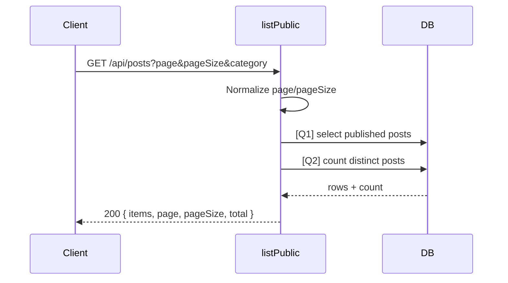

# [Design][API] API04_Posts_DanhSach

## Change Log
| Ver | Ngày | Nội dung | Người tạo |
|---|---|---|---|
| 1.2 | 2026-06-05 | Chuẩn hóa 10 sections, đồng bộ `posts.controller.js#listPublic` | docs-agent |

## 1. Tổng quan
API lấy danh sách bài viết public đã xuất bản. Tài liệu tham chiếu: API list, DB schema, Message Catalog, `posts.controller.js`, `posts.routes.js`.

## 2. Thông tin chung
| Method | Endpoint | Auth | Role | Controller |
|---|---|---|---|---|
| GET | `/api/posts` | Không cần | Public | `posts.controller.js#listPublic` |

| Bảng DB | Mục đích |
|---|---|
| `posts` | Lấy bài viết published |
| `categories` | Lấy tên/slug danh mục và lọc category |
| `users` | Lấy tên tác giả |

## 3. Request
| Vị trí | Field | Kiểu | Bắt buộc | Mặc định | Mô tả |
|---|---|---|---|---|---|
| Query | page | number | Không | 1 | Trang hiện tại, code ép tối thiểu 1 |
| Query | pageSize | number | Không | 10 | Số item/trang, code giới hạn 1..50 |
| Query | category | string | Không | - | Slug danh mục |

| Logical Name | Physical Field | Kiểu | Bắt buộc | Ràng buộc | Chuẩn hóa input | Mô tả |
|---|---|---|---|---|---|---|
| Trang | page | number | Không | number-like | `Number(page) || 1`, `Math.max(1)` | Trang hiện tại |
| Kích thước trang | pageSize | number | Không | 1..50 | `Number(pageSize) || 10`, clamp 1..50 | Số bài mỗi trang |
| Danh mục | category | string | Không | slug | Giữ nguyên | Lọc theo `categories.slug` |

```http
GET /api/posts?page=1&pageSize=10&category=du-lich
```

## 4. Validation Rules
| ID | Đối tượng | Quy tắc | MessageId | HTTP Status |
|---|---|---|---|---|
| V-01 | page | Không validate lỗi; giá trị sai fallback về 1 | POST-I-001 | 200 |
| V-02 | pageSize | Không validate lỗi; giá trị sai fallback về 10 và clamp max 50 | POST-I-001 | 200 |
| V-03 | category | Nếu có thì lọc theo slug; không có kết quả trả list rỗng | POST-I-001 | 200 |

## 5. Response
| HTTP | Mô tả |
|---|---|
| 200 | Trả danh sách bài viết public dạng flat fields |

```json
{
  "items": [
    {
      "id": 1,
      "title": "Khám phá Hội An",
      "slug": "kham-pha-hoi-an",
      "thumbnail_url": "/uploads/thumbnail.jpg",
      "created_at": "2026-06-05T00:00:00.000Z",
      "category_name": "Du lịch",
      "category_slug": "du-lich",
      "author_name": "Admin"
    }
  ],
  "page": 1,
  "pageSize": 10,
  "total": 1
}
```

| Error Code | HTTP | Contract hiện tại | Chuẩn messageId |
|---|---|---|---|
| Không có | 200 | Danh sách rỗng khi không có dữ liệu | POST-I-001 |

## 6. Sequence Diagram


## 7. Logic xử lý
1. Đọc `category`, `page`, `pageSize` từ `req.query`.
2. Chuẩn hóa `page` tối thiểu 1, `pageSize` trong khoảng 1..50.
3. [Q1] Query `posts` published, left join `categories`, `users`, sort `p.created_at desc`, áp dụng category nếu có.
4. [Q2] Count tổng số bài matching filter.
5. Trả `{ items, page, pageSize, total }`.

## 8. Database Queries & Mapping
| Query ID | Điều kiện OK | Điều kiện NG | Knex.js snippet |
|---|---|---|---|
| Q1 | Luôn trả array | DB error → 500 default | `db('posts as p').leftJoin('categories as c','p.category_id','c.id').leftJoin('users as u','p.author_id','u.id').where('p.status','published').select(...).limit(ps).offset((p-1)*ps)` |
| Q2 | Trả count | DB error → 500 default | `q.clone().countDistinct('p.id as c').first()` |

| DB Field | Response Field |
|---|---|
| `p.id/title/slug/thumbnail_url/created_at` | `items[].id/title/slug/thumbnail_url/created_at` |
| `c.name` | `items[].category_name` |
| `c.slug` | `items[].category_slug` |
| `u.name` | `items[].author_name` |

## 9. Message List
| MessageId | Loại | HTTP Status | Nội dung | Điều kiện |
|---|---|---|---|---|
| POST-I-001 | Info | 200 | `Chưa có bài viết nào.` | Không có dữ liệu |

## 10. Side Effects
Không có.
