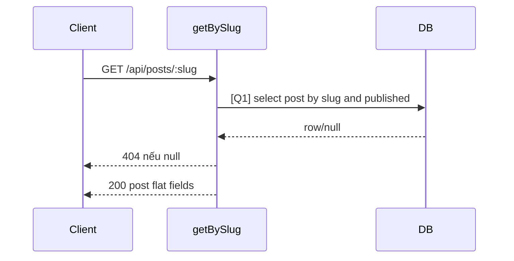

# [Design][API] API05_Posts_ChiTiet

## Change Log
| Ver | Ngày | Nội dung | Người tạo |
|---|---|---|---|
| 1.2 | 2026-06-05 | Chuẩn hóa 10 sections, đồng bộ `posts.controller.js#getBySlug` | docs-agent |

## 1. Tổng quan
API lấy chi tiết một bài viết public theo slug. Chỉ trả bài có `status = published`.

## 2. Thông tin chung
| Method | Endpoint | Auth | Role | Controller |
|---|---|---|---|---|
| GET | `/api/posts/:slug` | Không cần | Public | `posts.controller.js#getBySlug` |

| Bảng DB | Mục đích |
|---|---|
| `posts` | Lấy chi tiết bài viết |
| `categories` | Lấy tên/slug danh mục |
| `users` | Lấy tên tác giả |

## 3. Request
| Vị trí | Field | Kiểu | Bắt buộc | Mặc định | Mô tả |
|---|---|---|---|---|---|
| Path | slug | string | Có | - | Slug bài viết |

| Logical Name | Physical Field | Kiểu | Bắt buộc | Ràng buộc | Chuẩn hóa input | Mô tả |
|---|---|---|---|---|---|---|
| Slug bài viết | slug | string | Có | path param | Giữ nguyên | Dùng trong `WHERE p.slug = :slug` |

```http
GET /api/posts/kham-pha-hoi-an
```

## 4. Validation Rules
| ID | Đối tượng | Quy tắc | MessageId | HTTP Status |
|---|---|---|---|---|
| V-01 | slug | Có trong path | POST-E-003 | 404 |
| V-02 | post | Phải tồn tại và `status = published` | POST-E-003 | 404 |

## 5. Response
| HTTP | Mô tả |
|---|---|
| 200 | Trả object bài viết flat fields |

```json
{
  "id": 1,
  "title": "Khám phá Hội An",
  "slug": "kham-pha-hoi-an",
  "content": "<p>Nội dung...</p>",
  "thumbnail_url": "/uploads/thumbnail.jpg",
  "status": "published",
  "created_at": "2026-06-05T00:00:00.000Z",
  "updated_at": "2026-06-05T00:00:00.000Z",
  "category_name": "Du lịch",
  "category_slug": "du-lich",
  "author_name": "Admin"
}
```

| Error Code | HTTP | Contract hiện tại | Chuẩn messageId |
|---|---|---|---|
| ERR_NOT_FOUND | 404 | `{ "message": "Post not found" }` | POST-E-003 |

## 6. Sequence Diagram


## 7. Logic xử lý
1. Đọc `req.params.slug`.
2. [Q1] Query bài viết theo slug, `status = published`, left join category/user.
3. Nếu không có row, trả 404 `{ message: 'Post not found' }`.
4. Trả toàn bộ row từ DB, gồm `content` và các flat fields join.

## 8. Database Queries & Mapping
| Query ID | Điều kiện OK | Điều kiện NG | Knex.js snippet |
|---|---|---|---|
| Q1 | Có bài published matching slug | Không có row → 404 | `db('posts as p').leftJoin('categories as c','p.category_id','c.id').leftJoin('users as u','p.author_id','u.id').where('p.slug', req.params.slug).andWhere('p.status','published').select('p.*','c.name as category_name','c.slug as category_slug','u.name as author_name').first()` |

| DB Field | Response Field |
|---|---|
| `p.*` | Các field gốc của bài viết |
| `c.name/c.slug` | `category_name/category_slug` |
| `u.name` | `author_name` |

## 9. Message List
| MessageId | Loại | HTTP Status | Nội dung | Điều kiện |
|---|---|---|---|---|
| POST-E-003 | Error | 404 | `Post not found` | Không tìm thấy bài public theo slug |

## 10. Side Effects
Không có.
