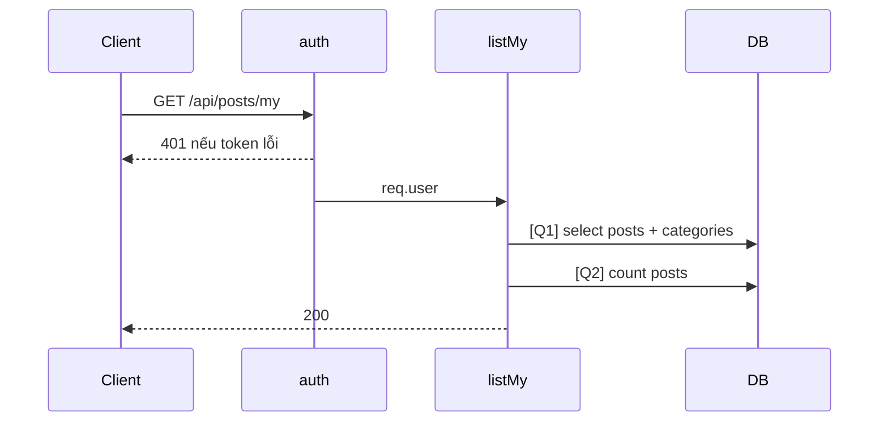

# [Design][API] API06_Posts_CuaToi

## Change Log
| Ver | Ngày | Nội dung | Người tạo |
|---|---|---|---|
| 1.1 | 2026-06-05 | Chuẩn hóa 10 sections, đồng bộ code `listMy` | docs-agent |

## 1. Tổng quan
Lấy danh sách bài viết thuộc user đang đăng nhập. Tham chiếu: API List, UTILS, MESSAGE_Catalog, DB Schema, `posts.controller.js`, `posts.routes.js`.

## 2. Thông tin chung
| Method | Endpoint | Auth | Role | Controller |
|---|---|---|---|---|
| GET | `/api/posts/my` | Bearer JWT | member/admin | `posts.controller.js#listMy` |

| Bảng DB | Mục đích |
|---|---|
| `posts` | Lọc theo `author_id` |
| `categories` | Join category |

## 3. Request
| Vị trí | Field | Kiểu | Bắt buộc | Mặc định | Mô tả |
|---|---|---|---|---|---|
| Header | Authorization | string | Có | - | `Bearer <token>` |
| Query | page | number | Không | 1 | Code ép tối thiểu 1 |
| Query | limit | number | Không | 10 | Code clamp 1..50 |
| Query | status | string | Không | - | Lọc đúng giá trị truyền vào, chưa validate enum |
| Query | search | string | Không | - | Tìm `title ILIKE` |

| Logical Name | Physical Field | Kiểu | Bắt buộc | Ràng buộc | Chuẩn hóa input | Mô tả |
|---|---|---|---|---|---|---|
| Không có | - | - | - | - | - | GET không có body |

```json
{}
```

## 4. Validation Rules
| ID | Đối tượng | Quy tắc | MessageId | HTTP Status |
|---|---|---|---|---|
| V-01 | Authorization | Token hợp lệ | POST-E-001 | 401 |
| V-02 | page/limit | Không hợp lệ thì fallback/clamp | - | 200 |
| V-03 | status | Code hiện chưa validate enum | - | 200 |

## 5. Response
| HTTP | Mô tả |
|---|---|
| 200 | Trả `{ posts, total, page, totalPages }` |

```json
{
  "posts": [{ "id": 2, "title": "Cao lầu", "slug": "cao-lau", "thumbnail_url": null, "status": "published", "created_at": "2024-01-02T00:00:00.000Z", "category": { "id": 2, "name": "Ẩm thực", "slug": "am-thuc" } }],
  "total": 1,
  "page": 1,
  "totalPages": 1
}
```

| Error Code | HTTP | Contract hiện tại | Chuẩn messageId |
|---|---|---|---|
| ERR_UNAUTHORIZED | 401 | `{ "message": "Unauthorized" }` | POST-E-001 |

## 6. Sequence Diagram


## 7. Logic xử lý
1. `auth` xác thực JWT.
2. Parse `status`, `search`, `page`, `limit`.
3. [Q1] Select posts của `req.user.id`, join categories, filter optional, phân trang.
4. [Q2] Count tổng theo cùng điều kiện.
5. Map `category` object và trả response.

## 8. Database Queries & Mapping
| Query ID | Điều kiện OK | Điều kiện NG | Knex.js snippet |
|---|---|---|---|
| Q1 | Trả rows, có thể rỗng | DB error → 500 mặc định | `db('posts as p').leftJoin('categories as c','p.category_id','c.id').where('p.author_id', req.user.id).select(...).limit(l).offset((p-1)*l)` |
| Q2 | Trả count | DB error → 500 mặc định | `q.clone().count('* as count').first()` |

| Source | Target |
|---|---|
| `req.user.id` | `posts.author_id` |
| `p.*`, `c.id/name/slug` | `posts[]`, `posts[].category` |

## 9. Message List
| MessageId | Loại | HTTP Status | Nội dung | Điều kiện |
|---|---|---|---|---|
| POST-E-001 | Error | 401 | `Unauthorized` | Token lỗi |
| POST-I-001 | Info | N/A | `Chưa có bài viết nào.` | Empty state |

## 10. Side Effects
Không có.
