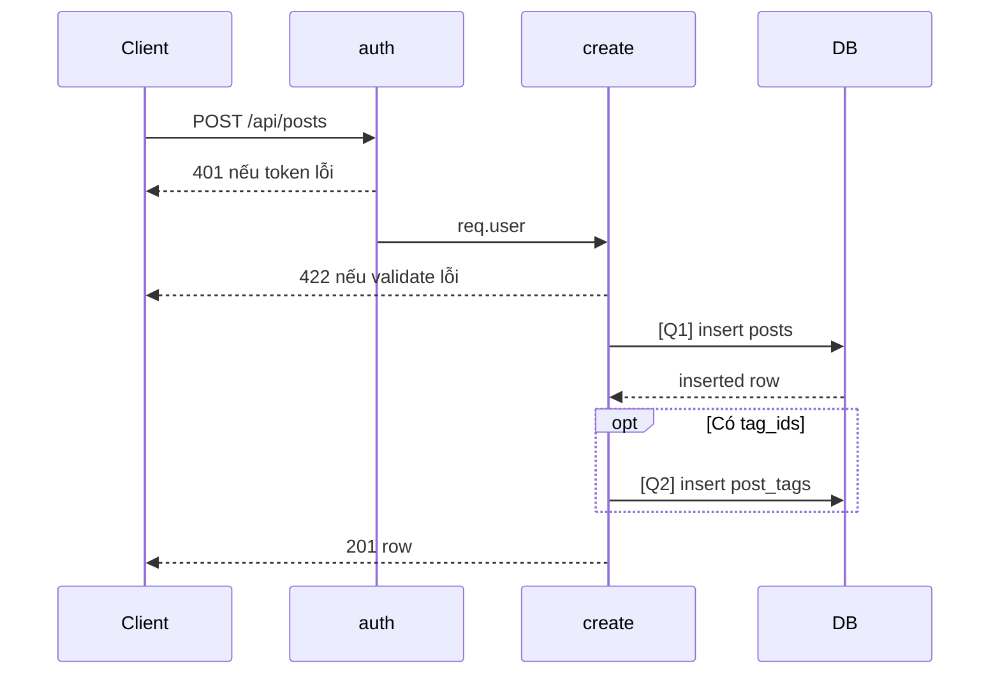

# [Design][API] API07_Posts_TaoBai

## Change Log
| Ver | Ngày | Nội dung | Người tạo |
|---|---|---|---|
| 1.1 | 2026-06-05 | Chuẩn hóa 10 sections, đồng bộ code `create` | docs-agent |
| 1.2 | 2026-06-06 | Bổ sung `tag_ids` vào request và logic insert `post_tags` | AI |

## 1. Tổng quan
Tạo bài viết mới cho user đang đăng nhập. Tham chiếu: API List, UTILS, MESSAGE_Catalog, DB Schema, `posts.controller.js`, `posts.routes.js`.

## 2. Thông tin chung
| Method | Endpoint | Auth | Role | Controller |
|---|---|---|---|---|
| POST | `/api/posts` | Bearer JWT | member/admin | `posts.controller.js#create` |

| Bảng DB | Mục đích |
|---|---|
| `posts` | Insert bài viết |
| `post_tags` | Insert liên kết tags |

## 3. Request
| Vị trí | Field | Kiểu | Bắt buộc | Mặc định | Mô tả |
|---|---|---|---|---|---|
| Header | Authorization | string | Có | - | `Bearer <token>` |

| Logical Name | Physical Field | Kiểu | Bắt buộc | Ràng buộc | Chuẩn hóa input | Mô tả |
|---|---|---|---|---|---|---|
| Tiêu đề | title | string | Có | min 5 | Không trim trong code | Tiêu đề bài |
| Slug | slug | string | Có | `/^[a-z0-9-]+$/` | Không tự sinh | Slug unique ở DB |
| Nội dung | content | string | Có | string | Không sanitize trong code | Nội dung |
| Ảnh | thumbnail_url | string | Không | - | Giữ nguyên | URL ảnh |
| Trạng thái | status | string | Không | `draft`/`published` | Default `draft` | Trạng thái |
| Danh mục | category_id | number | Có | number | Giữ nguyên | FK category |
| Tags | tag_ids | array | Không | array of numbers | Giữ nguyên | Danh sách ID của tags |

```json
{ "title": "Bài viết mới", "slug": "bai-viet-moi", "content": "Nội dung", "status": "draft", "category_id": 1, "tag_ids": [1, 2] }
```

## 4. Validation Rules
| ID | Đối tượng | Quy tắc | MessageId | HTTP Status |
|---|---|---|---|---|
| V-01 | Authorization | Token hợp lệ | POST-E-001 | 401 |
| V-02 | title | Bắt buộc, string, min 5 | POST-E-004 | 422 |
| V-03 | slug | Bắt buộc, string, lowercase/number/hyphen | POST-E-004 | 422 |
| V-04 | content | Bắt buộc, string | POST-E-004 | 422 |
| V-05 | status | Nếu có phải là `draft`/`published` | POST-E-004 | 422 |
| V-06 | category_id | Bắt buộc, number | POST-E-004 | 422 |
| V-07 | tag_ids | Nếu có phải là mảng số nguyên | POST-E-004 | 422 |

## 5. Response
| HTTP | Mô tả |
|---|---|
| 201 | Trả record `posts` vừa insert |

```json
{ "id": 10, "title": "Bài viết mới", "slug": "bai-viet-moi", "content": "Nội dung", "thumbnail_url": null, "status": "draft", "view_count": 0, "author_id": 2, "category_id": 1 }
```

| Error Code | HTTP | Contract hiện tại | Chuẩn messageId |
|---|---|---|---|
| ERR_UNAUTHORIZED | 401 | `{ "message": "Unauthorized" }` | POST-E-001 |
| ERR_VALIDATION | 422 | `{ "message": "Validation failed", "details": [...] }` | POST-E-004 |

## 6. Sequence Diagram


## 7. Logic xử lý
1. `auth` xác thực JWT.
2. Validate body bằng `validate([...], req.body)`.
3. Nếu lỗi trả 422 `{ message, details }`.
4. Bắt đầu DB Transaction.
5. [Q1] Insert `posts` với `author_id = req.user.id`, `status` default `draft`.
6. Nếu có `tag_ids` (mảng không rỗng), [Q2] Insert nhiều dòng vào `post_tags` với `post_id` vừa tạo và từng `tag_id`.
7. Commit Transaction.
8. Trả row đầu tiên từ `.returning('*')` của bảng `posts`.

## 8. Database Queries & Mapping
| Query ID | Điều kiện OK | Điều kiện NG | Knex.js snippet |
|---|---|---|---|
| Q1 | Insert thành công | DB constraint/FK/unique lỗi → 500 mặc định | `trx('posts').insert({ title, slug, content, thumbnail_url, status, category_id, author_id: req.user.id }).returning('*')` |
| Q2 | Insert thành công | DB constraint/FK lỗi → 500 mặc định | `trx('post_tags').insert(tag_ids.map(tag_id => ({ post_id: newPost.id, tag_id })))` |

| Source | Target |
|---|---|
| `req.body.*` | `posts.title/slug/content/thumbnail_url/status/category_id` |
| `req.user.id` | `posts.author_id` |
| `req.body.tag_ids` | `post_tags.tag_id` |

## 9. Message List
| MessageId | Loại | HTTP Status | Nội dung | Điều kiện |
|---|---|---|---|---|
| POST-E-001 | Error | 401 | `Unauthorized` | Token lỗi |
| POST-E-004 | Error | 422 | `Validation failed` | Validate lỗi |
| POST-S-001 | Success | 201 | `Tạo bài viết thành công` | FE success |

## 10. Side Effects
Tạo record mới trong `posts`; code hiện chưa set `created_by`.
