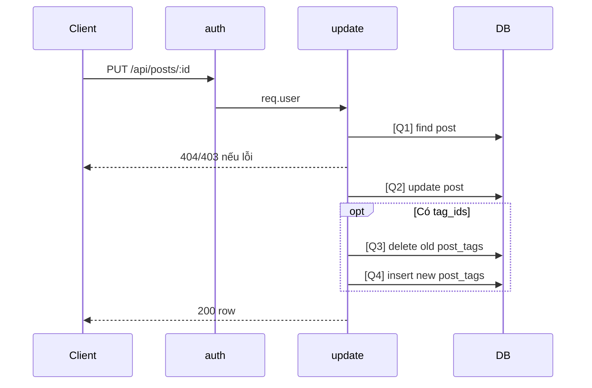

# [Design][API] API08_Posts_CapNhat

## Change Log
| Ver | Ngày | Nội dung | Người tạo |
|---|---|---|---|
| 1.1 | 2026-06-05 | Chuẩn hóa 10 sections, đồng bộ code `update` | docs-agent |
| 1.2 | 2026-06-06 | Bổ sung `tag_ids` vào request và logic update `post_tags` | AI |

## 1. Tổng quan
Cập nhật bài viết theo ID. Member chỉ sửa bài của mình; admin cũng đi qua cùng controller. Tham chiếu: API List, UTILS, MESSAGE_Catalog, DB Schema, `posts.controller.js`, `posts.routes.js`.

## 2. Thông tin chung
| Method | Endpoint | Auth | Role | Controller |
|---|---|---|---|---|
| PUT | `/api/posts/:id` | Bearer JWT | member/admin | `posts.controller.js#update` |

| Bảng DB | Mục đích |
|---|---|
| `posts` | Select quyền sở hữu và update |
| `post_tags` | Xóa tags cũ và insert tags mới |

## 3. Request
| Vị trí | Field | Kiểu | Bắt buộc | Mặc định | Mô tả |
|---|---|---|---|---|---|
| Header | Authorization | string | Có | - | `Bearer <token>` |
| Param | id | number/string | Có | - | ID bài viết; code chưa validate number |

| Logical Name | Physical Field | Kiểu | Bắt buộc | Ràng buộc | Chuẩn hóa input | Mô tả |
|---|---|---|---|---|---|---|
| Dữ liệu cập nhật | any | any | Không | Code không validate whitelist | Spread trực tiếp `req.body` | Contract hiện tại cho phép field bất kỳ |
| Tags | tag_ids | array | Không | array of numbers | Giữ nguyên | Danh sách ID của tags |

```json
{ "title": "Tiêu đề cập nhật", "status": "draft", "tag_ids": [1, 3] }
```

## 4. Validation Rules
| ID | Đối tượng | Quy tắc | MessageId | HTTP Status |
|---|---|---|---|---|
| V-01 | Authorization | Token hợp lệ | POST-E-001 | 401 |
| V-02 | id | Tồn tại bài viết | POST-E-003 | 404 |
| V-03 | ownership | Member chỉ sửa bài của mình; admin được phép | POST-E-002 | 403 |
| V-04 | body | Code hiện chưa validate schema/whitelist | - | 200 |
| V-05 | tag_ids | Nếu có phải là mảng số nguyên | POST-E-004 | 422 |

## 5. Response
| HTTP | Mô tả |
|---|---|
| 200 | Trả record `posts` sau update |

```json
{ "id": 1, "title": "Tiêu đề cập nhật", "slug": "slug", "status": "draft", "updated_at": "2026-06-05T00:00:00.000Z" }
```

| Error Code | HTTP | Contract hiện tại | Chuẩn messageId |
|---|---|---|---|
| ERR_UNAUTHORIZED | 401 | `{ "message": "Unauthorized" }` | POST-E-001 |
| ERR_FORBIDDEN | 403 | `{ "message": "Forbidden" }` | POST-E-002 |
| ERR_NOT_FOUND | 404 | `{ "message": "Post not found" }` | POST-E-003 |

## 6. Sequence Diagram


## 7. Logic xử lý
1. `auth` xác thực JWT.
2. [Q1] Tìm bài theo `req.params.id`.
3. Nếu không có trả 404; nếu member không phải chủ bài trả 403.
4. Tách `tag_ids` ra khỏi `req.body` (nếu có).
5. Bắt đầu DB Transaction.
6. [Q2] Update bảng `posts` bằng các field còn lại trong `req.body`, set `updated_at = now()`.
7. Nếu có `tag_ids`:
   - [Q3] Xóa toàn bộ record trong `post_tags` có `post_id = req.params.id`.
   - [Q4] Insert các record mới vào `post_tags` với `post_id` và từng `tag_id`.
8. Commit Transaction.
9. Trả row sau update.

## 8. Database Queries & Mapping
| Query ID | Điều kiện OK | Điều kiện NG | Knex.js snippet |
|---|---|---|---|
| Q1 | Có post | Không có → 404 | `db('posts').where({ id: req.params.id }).first()` |
| Q2 | Update thành công | DB error → 500 mặc định | `trx('posts').where({ id: req.params.id }).update({ ...postData, updated_at: db.fn.now() }).returning('*')` |
| Q3 | Xóa thành công | DB error → 500 mặc định | `trx('post_tags').where({ post_id: req.params.id }).del()` |
| Q4 | Insert thành công | DB error → 500 mặc định | `trx('post_tags').insert(tag_ids.map(tag_id => ({ post_id: req.params.id, tag_id })))` |

| Source | Target |
|---|---|
| `req.params.id` | `posts.id` |
| `req.body` (trừ tag_ids) | `posts.*` theo contract hiện tại |
| `req.body.tag_ids` | `post_tags.tag_id` |

## 9. Message List
| MessageId | Loại | HTTP Status | Nội dung | Điều kiện |
|---|---|---|---|---|
| POST-E-001 | Error | 401 | `Unauthorized` | Token lỗi |
| POST-E-002 | Error | 403 | `Forbidden` | Không sở hữu bài |
| POST-E-003 | Error | 404 | `Post not found` | Không tìm thấy |
| POST-S-002 | Success | 200 | `Cập nhật bài viết thành công` | FE success |

## 10. Side Effects
Cập nhật record `posts`; code hiện chưa set `updated_by`.
