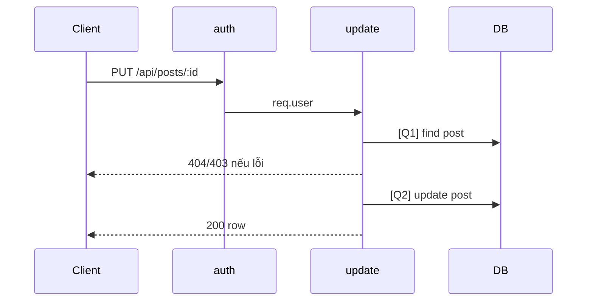

# [Design][API] API08_Posts_CapNhat

## Change Log
| Ver | Ngày | Nội dung | Người tạo |
|---|---|---|---|
| 1.1 | 2026-06-05 | Chuẩn hóa 10 sections, đồng bộ code `update` | docs-agent |

## 1. Tổng quan
Cập nhật bài viết theo ID. Member chỉ sửa bài của mình; admin cũng đi qua cùng controller. Tham chiếu: API List, UTILS, MESSAGE_Catalog, DB Schema, `posts.controller.js`, `posts.routes.js`.

## 2. Thông tin chung
| Method | Endpoint | Auth | Role | Controller |
|---|---|---|---|---|
| PUT | `/api/posts/:id` | Bearer JWT | member/admin | `posts.controller.js#update` |

| Bảng DB | Mục đích |
|---|---|
| `posts` | Select quyền sở hữu và update |

## 3. Request
| Vị trí | Field | Kiểu | Bắt buộc | Mặc định | Mô tả |
|---|---|---|---|---|---|
| Header | Authorization | string | Có | - | `Bearer <token>` |
| Param | id | number/string | Có | - | ID bài viết; code chưa validate number |

| Logical Name | Physical Field | Kiểu | Bắt buộc | Ràng buộc | Chuẩn hóa input | Mô tả |
|---|---|---|---|---|---|---|
| Dữ liệu cập nhật | any | any | Không | Code không validate whitelist | Spread trực tiếp `req.body` | Contract hiện tại cho phép field bất kỳ |

```json
{ "title": "Tiêu đề cập nhật", "status": "draft" }
```

## 4. Validation Rules
| ID | Đối tượng | Quy tắc | MessageId | HTTP Status |
|---|---|---|---|---|
| V-01 | Authorization | Token hợp lệ | POST-E-001 | 401 |
| V-02 | id | Tồn tại bài viết | POST-E-003 | 404 |
| V-03 | ownership | Member chỉ sửa bài của mình; admin được phép | POST-E-002 | 403 |
| V-04 | body | Code hiện chưa validate schema/whitelist | - | 200 |

## 5. Response
| HTTP | Mô tả |
|---|---|
| 200 | Trả record `posts` sau update |

```json
{ "id": 1, "title": "Tiêu đề cập nhật", "slug": "slug", "status": "draft", "updated_at": "2026-06-05T00:00:00.000Z" }
```

| Error Code | HTTP | Contract hiện tại | Chuẩn messageId |
|---|---|---|---|
| ERR_UNAUTHORIZED | 401 | `{ "message": "Unauthorized" }` | POST-E-001 |
| ERR_FORBIDDEN | 403 | `{ "message": "Forbidden" }` | POST-E-002 |
| ERR_NOT_FOUND | 404 | `{ "message": "Post not found" }` | POST-E-003 |

## 6. Sequence Diagram


## 7. Logic xử lý
1. `auth` xác thực JWT.
2. [Q1] Tìm bài theo `req.params.id`.
3. Nếu không có trả 404; nếu member không phải chủ bài trả 403.
4. [Q2] Update bằng `...req.body`, set `updated_at = now()`.
5. Trả row sau update.

## 8. Database Queries & Mapping
| Query ID | Điều kiện OK | Điều kiện NG | Knex.js snippet |
|---|---|---|---|
| Q1 | Có post | Không có → 404 | `db('posts').where({ id: req.params.id }).first()` |
| Q2 | Update thành công | DB error → 500 mặc định | `db('posts').where({ id: req.params.id }).update({ ...req.body, updated_at: db.fn.now() }).returning('*')` |

| Source | Target |
|---|---|
| `req.params.id` | `posts.id` |
| `req.body` | `posts.*` theo contract hiện tại |

## 9. Message List
| MessageId | Loại | HTTP Status | Nội dung | Điều kiện |
|---|---|---|---|---|
| POST-E-001 | Error | 401 | `Unauthorized` | Token lỗi |
| POST-E-002 | Error | 403 | `Forbidden` | Không sở hữu bài |
| POST-E-003 | Error | 404 | `Post not found` | Không tìm thấy |
| POST-S-002 | Success | 200 | `Cập nhật bài viết thành công` | FE success |

## 10. Side Effects
Cập nhật record `posts`; code hiện chưa set `updated_by`.# PUT /api/posts/:id — Cập Nhật Bài Viết

## Thông tin
- **Method**: PUT
- **Endpoint**: `/api/posts/:id`
- **Auth**: Bearer token (Member+)
- **Controller**: `src/controllers/postController.js` → `update`

## Path Parameters
| Param | Type | Mô tả |
|---|---|---|
| id | number | ID bài viết |

## Request

**Body** (`application/json`) — tất cả field đều optional, chỉ gửi field cần cập nhật:
```json
{
  "title": "Tiêu đề mới",
  "slug": "tieu-de-moi",
  "content": "<p>Nội dung mới...</p>",
  "thumbnail_url": "/uploads/new.jpg",
  "status": "published",
  "category_id": 2
}
```

| Field | Validation |
|---|---|
| title | Tối thiểu 5 ký tự nếu có |
| slug | Unique (trừ chính bài này), chỉ a-z, 0-9, `-` |
| status | `draft` hoặc `published` |
| category_id | ID tồn tại |

## Response

**200 OK**:
```json
{
  "id": 10,
  "title": "Tiêu đề mới",
  "slug": "tieu-de-moi",
  "status": "published",
  "updated_at": "2024-01-11T00:00:00.000Z"
}
```

**403 Forbidden** (không phải bài của mình):
```json
{ "message": "Bạn không có quyền chỉnh sửa bài viết này" }
```

**404 Not Found**:
```json
{ "message": "Bài viết không tồn tại" }
```

**409 Conflict** (slug trùng):
```json
{ "message": "Slug đã tồn tại" }
```

## Logic xử lý
1. Query bài theo `id`
2. Nếu không tìm thấy → 404
3. Nếu `post.author_id != req.user.id` và `req.user.role != 'admin'` → 403
4. Validate các field được gửi lên
5. Kiểm tra slug unique (loại trừ bài hiện tại)
6. Update `posts` SET ... WHERE `id = :id`, cập nhật `updated_at = NOW()`
