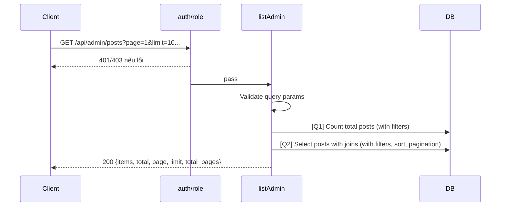

# [Design][API] API10_AdminPosts_DanhSach

## Change Log
| Ver | Ngày | Nội dung | Người tạo |
|---|---|---|---|
| 1.1 | 2026-06-05 | Chuẩn hóa 10 sections, đồng bộ code `listAdmin` | docs-agent |
| 1.2 | 2026-06-05 | Thêm filter, sort, pagination, join author & category | docs-agent |

## 1. Tổng quan
Admin lấy danh sách bài viết có hỗ trợ phân trang, tìm kiếm, lọc theo category/status/author, và sắp xếp. Tham chiếu: API List, UTILS, MESSAGE_Catalog, DB Schema, `posts.controller.js`, `admin.routes.js`.

## 2. Thông tin chung
| Method | Endpoint | Auth | Role | Controller |
|---|---|---|---|---|
| GET | `/api/admin/posts` | Bearer JWT | admin | `posts.controller.js#listAdmin` |

| Bảng DB | Mục đích |
|---|---|
| `posts` | Select danh sách bài viết |
| `users` | Join lấy thông tin tác giả |
| `categories` | Join lấy thông tin danh mục |

## 3. Request
| Vị trí | Field | Kiểu | Bắt buộc | Mặc định | Mô tả |
|---|---|---|---|---|---|
| Header | Authorization | string | Có | - | `Bearer <token>` |
| Query | search | string | Không | - | Tìm kiếm theo tiêu đề bài viết |
| Query | category_id | number | Không | - | Lọc theo ID danh mục |
| Query | status | string | Không | - | Lọc theo trạng thái (`draft`, `published`) |
| Query | author_id | number | Không | - | Lọc theo ID tác giả |
| Query | sort_by | string | Không | `created_at` | Trường sắp xếp (`created_at`, `view_count`) |
| Query | sort_order | string | Không | `desc` | Chiều sắp xếp (`asc`, `desc`) |
| Query | page | number | Không | 1 | Trang hiện tại |
| Query | limit | number | Không | 10 | Số lượng trên mỗi trang |

| Logical Name | Physical Field | Kiểu | Bắt buộc | Ràng buộc | Chuẩn hóa input | Mô tả |
|---|---|---|---|---|---|---|
| Không có | - | - | - | - | - | GET không có body |

```json
{}
```

## 4. Validation Rules
| ID | Đối tượng | Quy tắc | MessageId | HTTP Status |
|---|---|---|---|---|
| V-01 | Authorization | Token hợp lệ | POST-E-001 | 401 |
| V-02 | Role | Phải là admin | POST-E-002 | 403 |
| V-03 | Query `page` | Phải là số nguyên >= 1 | POST-E-003 | 400 |
| V-04 | Query `limit` | Phải là số nguyên >= 1 | POST-E-004 | 400 |
| V-05 | Query `status` | Phải thuộc `['draft', 'published']` | POST-E-005 | 400 |
| V-06 | Query `sort_by` | Phải thuộc `['created_at', 'view_count']` | POST-E-006 | 400 |
| V-07 | Query `sort_order` | Phải thuộc `['asc', 'desc']` | POST-E-007 | 400 |

## 5. Response
| HTTP | Mô tả |
|---|---|
| 200 | `{ items: Post[], total: number, page: number, limit: number, total_pages: number }` |

```json
{
  "items": [
    {
      "id": 1,
      "title": "Bài viết mẫu",
      "slug": "bai-viet-mau",
      "thumbnail_url": "https://example.com/image.jpg",
      "status": "published",
      "view_count": 100,
      "created_at": "2026-06-05T10:00:00Z",
      "updated_at": "2026-06-05T10:00:00Z",
      "author": {
        "id": 1,
        "name": "Admin User",
        "email": "admin@example.com"
      },
      "category": {
        "id": 1,
        "name": "Du lịch",
        "slug": "du-lich"
      }
    }
  ],
  "total": 1,
  "page": 1,
  "limit": 10,
  "total_pages": 1
}
```

| Error Code | HTTP | Contract hiện tại | Chuẩn messageId |
|---|---|---|---|
| ERR_UNAUTHORIZED | 401 | `{ "message": "Unauthorized" }` | POST-E-001 |
| ERR_FORBIDDEN | 403 | `{ "message": "Forbidden" }` | POST-E-002 |
| ERR_BAD_REQUEST | 400 | `{ "message": "Invalid query parameters" }` | POST-E-003 |

## 6. Sequence Diagram


## 7. Logic xử lý
1. `auth` xác thực JWT.
2. `role('admin')` kiểm tra quyền.
3. Parse và validate query params (`page`, `limit`, `search`, `category_id`, `status`, `author_id`, `sort_by`, `sort_order`).
4. [Q1] Đếm tổng số bài viết thỏa mãn điều kiện filter (`total`).
5. Tính toán `total_pages = Math.ceil(total / limit)`.
6. [Q2] Query danh sách bài viết:
   - Join bảng `users` để lấy thông tin tác giả.
   - Join bảng `categories` để lấy thông tin danh mục.
   - Áp dụng các điều kiện filter (`search` LIKE title, `category_id`, `status`, `author_id`).
   - Sắp xếp theo `sort_by` và `sort_order`.
   - Phân trang bằng `limit` và `offset = (page - 1) * limit`.
7. Format dữ liệu trả về: map các trường join thành object `author` và `category` lồng nhau.
8. Trả về response 200 với `{ items, total, page, limit, total_pages }`.

## 8. Database Queries & Mapping
| Query ID | Điều kiện OK | Điều kiện NG | Knex.js snippet |
|---|---|---|---|
| Q1 | Trả về số lượng | DB error → 500 | `db('posts').count('* as total').where(...)` |
| Q2 | Trả list, có thể rỗng | DB error → 500 | `db('posts').select('posts.*', 'users.id as author_id', 'users.name as author_name', 'users.email as author_email', 'categories.id as category_id', 'categories.name as category_name', 'categories.slug as category_slug').leftJoin('users', 'posts.author_id', 'users.id').leftJoin('categories', 'posts.category_id', 'categories.id').where(...).orderBy(sort_by, sort_order).limit(limit).offset(offset)` |

| Source | Target |
|---|---|
| `posts.id` | `items[].id` |
| `posts.title` | `items[].title` |
| `posts.slug` | `items[].slug` |
| `posts.thumbnail_url` | `items[].thumbnail_url` |
| `posts.status` | `items[].status` |
| `posts.view_count` | `items[].view_count` |
| `posts.created_at` | `items[].created_at` |
| `posts.updated_at` | `items[].updated_at` |
| `users.id`, `users.name`, `users.email` | `items[].author` (object) |
| `categories.id`, `categories.name`, `categories.slug` | `items[].category` (object) |

## 9. Message List
| MessageId | Loại | HTTP Status | Nội dung | Điều kiện |
|---|---|---|---|---|
| POST-E-001 | Error | 401 | `Unauthorized` | Token lỗi |
| POST-E-002 | Error | 403 | `Forbidden` | Không phải admin |
| POST-E-003 | Error | 400 | `Invalid page parameter` | `page` không hợp lệ |
| POST-E-004 | Error | 400 | `Invalid limit parameter` | `limit` không hợp lệ |
| POST-E-005 | Error | 400 | `Invalid status parameter` | `status` không hợp lệ |
| POST-E-006 | Error | 400 | `Invalid sort_by parameter` | `sort_by` không hợp lệ |
| POST-E-007 | Error | 400 | `Invalid sort_order parameter` | `sort_order` không hợp lệ |
| POST-I-001 | Info | N/A | `Chưa có bài viết nào.` | Empty state |

## 10. Side Effects
Không có.
