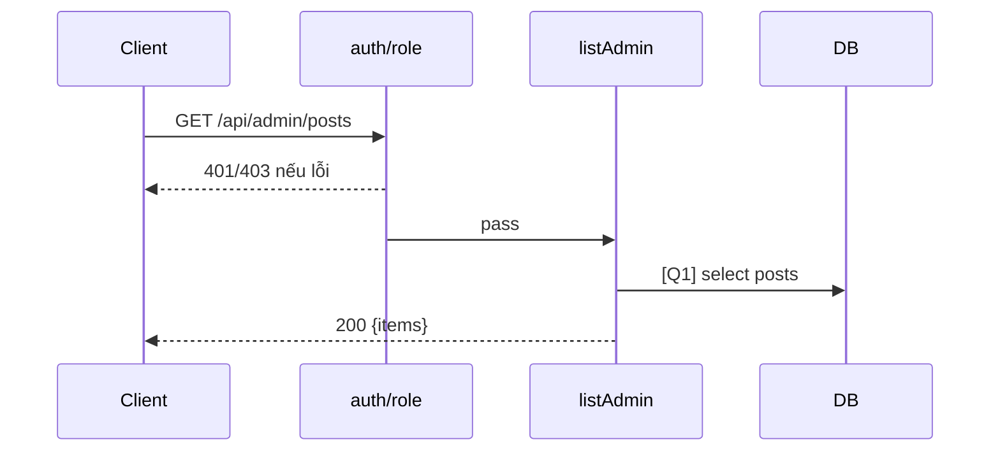

# [Design][API] API10_AdminPosts_DanhSach

## Change Log
| Ver | Ngày | Nội dung | Người tạo |
|---|---|---|---|
| 1.1 | 2026-06-05 | Chuẩn hóa 10 sections, đồng bộ code `listAdmin` | docs-agent |

## 1. Tổng quan
Admin lấy toàn bộ bài viết. Code hiện không phân trang/filter. Tham chiếu: API List, UTILS, MESSAGE_Catalog, DB Schema, `posts.controller.js`, `admin.routes.js`.

## 2. Thông tin chung
| Method | Endpoint | Auth | Role | Controller |
|---|---|---|---|---|
| GET | `/api/admin/posts` | Bearer JWT | admin | `posts.controller.js#listAdmin` |

| Bảng DB | Mục đích |
|---|---|
| `posts` | Select toàn bộ bài viết |

## 3. Request
| Vị trí | Field | Kiểu | Bắt buộc | Mặc định | Mô tả |
|---|---|---|---|---|---|
| Header | Authorization | string | Có | - | `Bearer <token>` |

| Logical Name | Physical Field | Kiểu | Bắt buộc | Ràng buộc | Chuẩn hóa input | Mô tả |
|---|---|---|---|---|---|---|
| Không có | - | - | - | - | - | GET không có body |

```json
{}
```

## 4. Validation Rules
| ID | Đối tượng | Quy tắc | MessageId | HTTP Status |
|---|---|---|---|---|
| V-01 | Authorization | Token hợp lệ | POST-E-001 | 401 |
| V-02 | Role | Phải là admin | POST-E-002 | 403 |

## 5. Response
| HTTP | Mô tả |
|---|---|
| 200 | `{ items: Post[] }` |

```json
{ "items": [{ "id": 1, "title": "Bài viết", "slug": "bai-viet", "status": "published", "author_id": 1, "category_id": 1 }] }
```

| Error Code | HTTP | Contract hiện tại | Chuẩn messageId |
|---|---|---|---|
| ERR_UNAUTHORIZED | 401 | `{ "message": "Unauthorized" }` | POST-E-001 |
| ERR_FORBIDDEN | 403 | `{ "message": "Forbidden" }` | POST-E-002 |

## 6. Sequence Diagram


## 7. Logic xử lý
1. `auth` xác thực JWT.
2. `role('admin')` kiểm tra quyền.
3. [Q1] Select toàn bộ `posts`, order `created_at desc`.
4. Trả `{ items }`.

## 8. Database Queries & Mapping
| Query ID | Điều kiện OK | Điều kiện NG | Knex.js snippet |
|---|---|---|---|
| Q1 | Trả list, có thể rỗng | DB error → 500 mặc định | `db('posts').orderBy('created_at', 'desc')` |

| Source | Target |
|---|---|
| `posts.*` | `items[]` |

## 9. Message List
| MessageId | Loại | HTTP Status | Nội dung | Điều kiện |
|---|---|---|---|---|
| POST-E-001 | Error | 401 | `Unauthorized` | Token lỗi |
| POST-E-002 | Error | 403 | `Forbidden` | Không phải admin |
| POST-I-001 | Info | N/A | `Chưa có bài viết nào.` | Empty state |

## 10. Side Effects
Không có.
