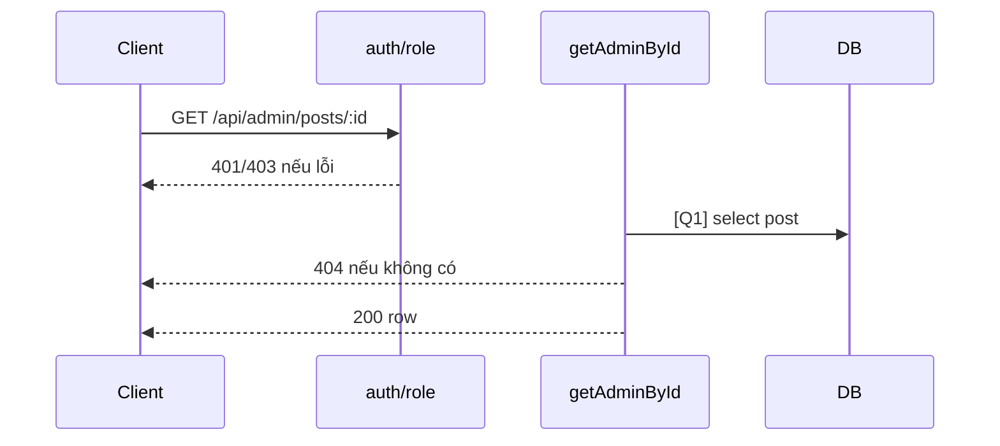

# [Design][API] API11_AdminPosts_ChiTiet

## Change Log
| Ver | Ngày | Nội dung | Người tạo |
|---|---|---|---|
| 1.1 | 2026-06-05 | Chuẩn hóa 10 sections, đồng bộ code `getAdminById` | docs-agent |

## 1. Tổng quan
Admin xem chi tiết bài theo ID, bao gồm cả draft. Tham chiếu: API List, UTILS, MESSAGE_Catalog, DB Schema, `posts.controller.js`, `admin.routes.js`.

## 2. Thông tin chung
| Method | Endpoint | Auth | Role | Controller |
|---|---|---|---|---|
| GET | `/api/admin/posts/:id` | Bearer JWT | admin | `posts.controller.js#getAdminById` |

| Bảng DB | Mục đích |
|---|---|
| `posts` | Select bài theo ID |

## 3. Request
| Vị trí | Field | Kiểu | Bắt buộc | Mặc định | Mô tả |
|---|---|---|---|---|---|
| Header | Authorization | string | Có | - | `Bearer <token>` |
| Param | id | number/string | Có | - | Code chưa validate number |

| Logical Name | Physical Field | Kiểu | Bắt buộc | Ràng buộc | Chuẩn hóa input | Mô tả |
|---|---|---|---|---|---|---|
| Không có | - | - | - | - | - | GET không có body |

```json
{}
```

## 4. Validation Rules
| ID | Đối tượng | Quy tắc | MessageId | HTTP Status |
|---|---|---|---|---|
| V-01 | Authorization | Token hợp lệ | POST-E-001 | 401 |
| V-02 | Role | Phải là admin | POST-E-002 | 403 |
| V-03 | id | Tồn tại bài viết | POST-E-003 | 404 |

## 5. Response
| HTTP | Mô tả |
|---|---|
| 200 | Trả record `posts` |

```json
{ "id": 1, "title": "Bài viết", "slug": "bai-viet", "content": "...", "status": "draft", "author_id": 2, "category_id": 1 }
```

| Error Code | HTTP | Contract hiện tại | Chuẩn messageId |
|---|---|---|---|
| ERR_UNAUTHORIZED | 401 | `{ "message": "Unauthorized" }` | POST-E-001 |
| ERR_FORBIDDEN | 403 | `{ "message": "Forbidden" }` | POST-E-002 |
| ERR_NOT_FOUND | 404 | `{ "message": "Post not found" }` | POST-E-003 |

## 6. Sequence Diagram


## 7. Logic xử lý
1. `auth` và `role('admin')` kiểm tra quyền.
2. [Q1] Tìm bài theo `req.params.id`.
3. Nếu không có trả 404 `{ message: 'Post not found' }`.
4. Trả row.

## 8. Database Queries & Mapping
| Query ID | Điều kiện OK | Điều kiện NG | Knex.js snippet |
|---|---|---|---|
| Q1 | Có post | Không có → 404 | `db('posts').where({ id: req.params.id }).first()` |

| Source | Target |
|---|---|
| `req.params.id` | `posts.id` |
| `posts.*` | response body |

## 9. Message List
| MessageId | Loại | HTTP Status | Nội dung | Điều kiện |
|---|---|---|---|---|
| POST-E-001 | Error | 401 | `Unauthorized` | Token lỗi |
| POST-E-002 | Error | 403 | `Forbidden` | Không phải admin |
| POST-E-003 | Error | 404 | `Post not found` | Không tìm thấy |

## 10. Side Effects
Không có.# GET /api/admin/posts/:id — Chi Tiết Bài Viết (Admin)

## Thông tin
- **Method**: GET
- **Endpoint**: `/api/admin/posts/:id`
- **Auth**: Bearer token (Admin only)
- **Controller**: `src/controllers/adminPostController.js` → `getById`

## Path Parameters
| Param | Type | Mô tả |
|---|---|---|
| id | number | ID bài viết |

## Response

**200 OK**:
```json
{
  "id": 3,
  "title": "Lễ hội đèn lồng",
  "slug": "le-hoi-den-long",
  "content": "<p>Nội dung đầy đủ...</p>",
  "thumbnail_url": null,
  "status": "draft",
  "created_at": "2024-01-03T00:00:00.000Z",
  "updated_at": "2024-01-03T00:00:00.000Z",
  "author": { "id": 2, "name": "Nguyễn Văn A" },
  "category": { "id": 3, "name": "Văn hóa", "slug": "van-hoa" }
}
```

**404 Not Found**:
```json
{ "message": "Bài viết không tồn tại" }
```

## Logic xử lý
1. Middleware `auth` + `role('admin')`
2. Query `posts` JOIN `users` JOIN `categories` WHERE `id = :id`
3. Trả về kể cả bài draft
