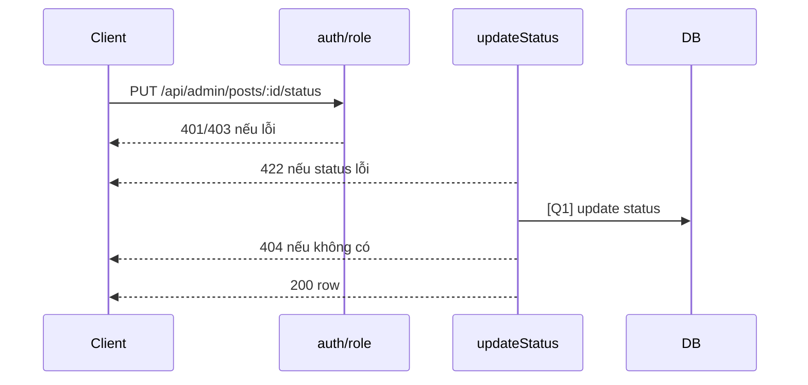

# [Design][API] API12_AdminPosts_DoiStatus

## Change Log
| Ver | Ngày | Nội dung | Người tạo |
|---|---|---|---|
| 1.1 | 2026-06-05 | Chuẩn hóa 10 sections, đồng bộ code `updateStatus` | docs-agent |

## 1. Tổng quan
Admin đổi trạng thái bài viết sang `draft` hoặc `published`. Tham chiếu: API List, UTILS, MESSAGE_Catalog, DB Schema, `posts.controller.js`, `admin.routes.js`.

## 2. Thông tin chung
| Method | Endpoint | Auth | Role | Controller |
|---|---|---|---|---|
| PUT | `/api/admin/posts/:id/status` | Bearer JWT | admin | `posts.controller.js#updateStatus` |

| Bảng DB | Mục đích |
|---|---|
| `posts` | Update status |

## 3. Request
| Vị trí | Field | Kiểu | Bắt buộc | Mặc định | Mô tả |
|---|---|---|---|---|---|
| Header | Authorization | string | Có | - | `Bearer <token>` |
| Param | id | number/string | Có | - | Code chưa validate number |

| Logical Name | Physical Field | Kiểu | Bắt buộc | Ràng buộc | Chuẩn hóa input | Mô tả |
|---|---|---|---|---|---|---|
| Trạng thái | status | string | Có | `draft`/`published` | Giữ nguyên | Status mới |

```json
{ "status": "published" }
```

## 4. Validation Rules
| ID | Đối tượng | Quy tắc | MessageId | HTTP Status |
|---|---|---|---|---|
| V-01 | Authorization | Token hợp lệ | POST-E-001 | 401 |
| V-02 | Role | Phải là admin | POST-E-002 | 403 |
| V-03 | status | Phải là `draft` hoặc `published` | POST-E-004 | 422 |
| V-04 | id | Tồn tại bài viết | POST-E-003 | 404 |

## 5. Response
| HTTP | Mô tả |
|---|---|
| 200 | Trả record sau update |

```json
{ "id": 1, "title": "Bài viết", "status": "published", "updated_at": "2026-06-05T00:00:00.000Z" }
```

| Error Code | HTTP | Contract hiện tại | Chuẩn messageId |
|---|---|---|---|
| ERR_UNAUTHORIZED | 401 | `{ "message": "Unauthorized" }` | POST-E-001 |
| ERR_FORBIDDEN | 403 | `{ "message": "Forbidden" }` | POST-E-002 |
| ERR_VALIDATION | 422 | `{ "message": "Validation failed", "details": [{ "field": "status", "message": "status must be draft or published" }] }` | POST-E-004 |
| ERR_NOT_FOUND | 404 | `{ "message": "Post not found" }` | POST-E-003 |

## 6. Sequence Diagram


## 7. Logic xử lý
1. `auth` và `role('admin')` kiểm tra quyền.
2. Validate `req.body.status` thuộc `draft|published`.
3. [Q1] Update `status`, `updated_at = now()` theo ID.
4. Nếu không có row trả 404.
5. Trả row sau update.

## 8. Database Queries & Mapping
| Query ID | Điều kiện OK | Điều kiện NG | Knex.js snippet |
|---|---|---|---|
| Q1 | Có row update | Không có → 404 | `db('posts').where({ id: req.params.id }).update({ status: req.body.status, updated_at: db.fn.now() }).returning('*')` |

| Source | Target |
|---|---|
| `req.params.id` | `posts.id` |
| `req.body.status` | `posts.status` |

## 9. Message List
| MessageId | Loại | HTTP Status | Nội dung | Điều kiện |
|---|---|---|---|---|
| POST-E-001 | Error | 401 | `Unauthorized` | Token lỗi |
| POST-E-002 | Error | 403 | `Forbidden` | Không phải admin |
| POST-E-003 | Error | 404 | `Post not found` | Không tìm thấy |
| POST-E-004 | Error | 422 | `Validation failed` | Status lỗi |
| POST-S-002 | Success | 200 | `Cập nhật bài viết thành công` | FE success |

## 10. Side Effects
Cập nhật `posts.status` và `updated_at`; code hiện chưa set `updated_by`.
