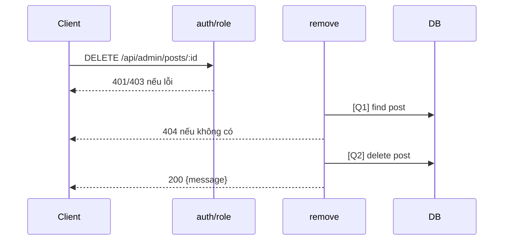

# [Design][API] API13_AdminPosts_Xoa

## Change Log
| Ver | Ngày | Nội dung | Người tạo |
|---|---|---|---|
| 1.1 | 2026-06-05 | Chuẩn hóa 10 sections, đồng bộ code `remove` qua admin route | docs-agent |

## 1. Tổng quan
Admin xóa bài viết bất kỳ theo ID. Contract code hiện là hard delete và dùng chung `posts.controller.js#remove`. Tham chiếu: API List, UTILS, MESSAGE_Catalog, DB Schema, `posts.controller.js`, `admin.routes.js`.

## 2. Thông tin chung
| Method | Endpoint | Auth | Role | Controller |
|---|---|---|---|---|
| DELETE | `/api/admin/posts/:id` | Bearer JWT | admin | `posts.controller.js#remove` |

| Bảng DB | Mục đích |
|---|---|
| `posts` | Select và delete bài |

## 3. Request
| Vị trí | Field | Kiểu | Bắt buộc | Mặc định | Mô tả |
|---|---|---|---|---|---|
| Header | Authorization | string | Có | - | `Bearer <token>` |
| Param | id | number/string | Có | - | Code chưa validate number |

| Logical Name | Physical Field | Kiểu | Bắt buộc | Ràng buộc | Chuẩn hóa input | Mô tả |
|---|---|---|---|---|---|---|
| Không có | - | - | - | - | - | DELETE không có body |

```json
{}
```

## 4. Validation Rules
| ID | Đối tượng | Quy tắc | MessageId | HTTP Status |
|---|---|---|---|---|
| V-01 | Authorization | Token hợp lệ | POST-E-001 | 401 |
| V-02 | Role | Phải là admin | POST-E-002 | 403 |
| V-03 | id | Tồn tại bài viết | POST-E-003 | 404 |

## 5. Response
| HTTP | Mô tả |
|---|---|
| 200 | `{ "message": "Deleted" }` |

```json
{ "message": "Deleted" }
```

| Error Code | HTTP | Contract hiện tại | Chuẩn messageId |
|---|---|---|---|
| ERR_UNAUTHORIZED | 401 | `{ "message": "Unauthorized" }` | POST-E-001 |
| ERR_FORBIDDEN | 403 | `{ "message": "Forbidden" }` | POST-E-002 |
| ERR_NOT_FOUND | 404 | `{ "message": "Post not found" }` | POST-E-003 |

## 6. Sequence Diagram


## 7. Logic xử lý
1. `auth` và `role('admin')` kiểm tra quyền.
2. [Q1] Tìm bài theo ID.
3. Nếu không có trả 404.
4. [Q2] Xóa bằng `.del()`.
5. Trả `{ message: 'Deleted' }`.

## 8. Database Queries & Mapping
| Query ID | Điều kiện OK | Điều kiện NG | Knex.js snippet |
|---|---|---|---|
| Q1 | Có post | Không có → 404 | `db('posts').where({ id: req.params.id }).first()` |
| Q2 | Delete thành công | DB error → 500 mặc định | `db('posts').where({ id: req.params.id }).del()` |

| Source | Target |
|---|---|
| `req.params.id` | `posts.id` |

## 9. Message List
| MessageId | Loại | HTTP Status | Nội dung | Điều kiện |
|---|---|---|---|---|
| POST-E-001 | Error | 401 | `Unauthorized` | Token lỗi |
| POST-E-002 | Error | 403 | `Forbidden` | Không phải admin |
| POST-E-003 | Error | 404 | `Post not found` | Không tìm thấy |
| POST-S-003 | Success | 200 | `Deleted` | Xóa thành công |

## 10. Side Effects
Xóa cứng record khỏi `posts`; không dùng `deleted_at/deleted_by` dù DB schema có soft-delete columns.
