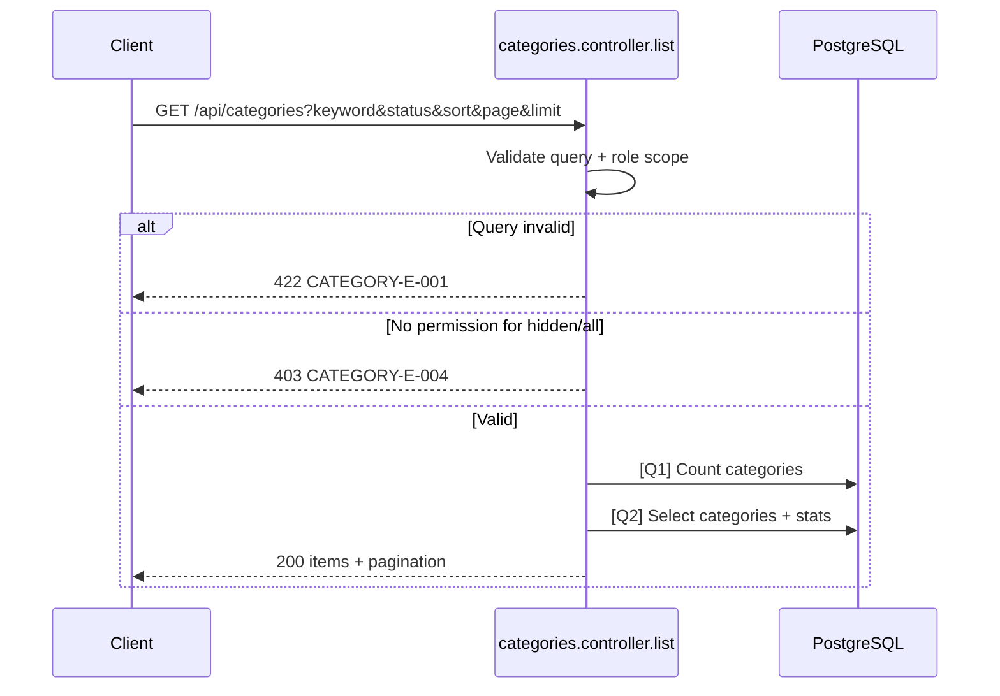

# [Design][API] API14_Categories_DanhSach

## Change Log
| Ver | Ngày | Nội dung | Người tạo |
|-----|------|----------|----------|
| 1.1 | 2026-06-04 | Bổ sung filter/sort/pagination, metadata thống kê, audit fields và loại trừ soft-delete | GitHub Copilot |

## 1. Tổng quan
API lấy danh sách danh mục bài viết. Public flow chỉ trả danh mục `active`; màn Admin có thể truyền filter để xem `active`/`hidden`. Response hỗ trợ phân trang, tìm kiếm, sắp xếp và các chỉ số quản trị như số bài, tổng lượt xem, người tạo, bài mới nhất.

Tài liệu tham chiếu:
| Loại | File |
|------|------|
| DB | `demo_docs/[Design][DB] DATABASE_Schema.md` |
| FE Screen | `demo_docs/fe/[Design][SCREEN] ADMIN_CATEGORY_LIST_QuanLyDanhMuc.md` |
| Message Catalog | `demo_docs/[Design][COMMON] MESSAGE_Catalog.md` |

## 2. Thông tin chung

| Thuộc tính | Giá trị |
|-----------|---------|
| Method | `GET` |
| Endpoint | `/api/categories` |
| Auth yêu cầu | Không với public; Bearer Token admin nếu cần xem `hidden` |
| Role cho phép | Public / Admin |
| Controller | `src/controllers/categories.controller.js` -> `list` |

DB liên quan:
| Bảng | Mục đích |
|------|----------|
| `categories` | Danh sách danh mục, trạng thái, audit fields |
| `posts` | Đếm bài, tổng lượt xem, bài mới nhất |
| `users` | Lấy tên người tạo danh mục |

## 3. Request

### 3.1 Headers & Parameters
| Logical Name | Physical Field | Vị trí | Kiểu | Bắt buộc | Ràng buộc | Chuẩn hóa input | Mô tả |
|--------------|----------------|--------|------|----------|-----------|------------------|-------|
| Token | Authorization | Header | String | ❌ | `Bearer <token>` | Trim | Cần khi Admin muốn xem `hidden` |
| Từ khóa | keyword | Query | String | ❌ | Max 100 ký tự | Trim | Tìm theo `name`, `slug` |
| Trạng thái | status | Query | String | ❌ | `active`, `hidden`, `all` | Default public: `active`; admin: `all` | Lọc trạng thái |
| Sắp xếp | sort | Query | String | ❌ | `created_at_desc`, `name_asc`, `post_count_desc`, `view_count_desc`, `latest_post_desc` | Default `created_at_desc` | Sort server-side |
| Trang | page | Query | Number | ❌ | `>= 1` | Default `1` | Trang hiện tại |
| Số dòng | limit | Query | Number | ❌ | `1..100` | Default `10` | Số item/trang |

### 3.2 Body Payload
Không có.

JSON example:
```json
{}
```

## 4. Validation Rules
| Rule ID | Đối tượng | Quy tắc | MessageId | HTTP Status |
|---------|-----------|---------|-----------|-------------|
| V-01 | `keyword` | Không vượt quá 100 ký tự | CATEGORY-E-001 | 422 |
| V-02 | `status` | Chỉ nhận `active`, `hidden`, `all` | CATEGORY-E-001 | 422 |
| V-03 | `sort` | Chỉ nhận danh sách sort cho phép | CATEGORY-E-001 | 422 |
| V-04 | `page` | Phải là số nguyên >= 1 | CATEGORY-E-001 | 422 |
| V-05 | `limit` | Phải là số nguyên từ 1 đến 100 | CATEGORY-E-001 | 422 |
| V-06 | `status=hidden/all` | Nếu không phải Admin thì không được xem danh mục ẩn | CATEGORY-E-004 | 403 |

## 5. Response

### Thành công (HTTP 200)
| Field | Kiểu dữ liệu | Có thể Null | Mô tả |
|-------|--------------|-------------|-------|
| items | Array | ❌ | Danh sách danh mục |
| items[].id | Number | ❌ | ID danh mục |
| items[].name | String | ❌ | Tên danh mục |
| items[].slug | String | ❌ | Slug URL |
| items[].description | String | ✅ | Mô tả |
| items[].status | String | ❌ | `active` hoặc `hidden` |
| items[].thumbnail_url | String | ✅ | Ảnh đại diện |
| items[].seo_title | String | ✅ | SEO title |
| items[].seo_description | String | ✅ | SEO description |
| items[].postCount | Number | ❌ | Số bài chưa xóa trong danh mục |
| items[].publishedPostCount | Number | ❌ | Số bài đã publish |
| items[].viewCount | Number | ❌ | Tổng lượt xem các bài chưa xóa |
| items[].createdByName | String | ✅ | Tên người tạo |
| items[].latestPost | Object | ✅ | Bài viết mới nhất trong danh mục |
| items[].created_at | String | ❌ | Thời điểm tạo |
| items[].updated_at | String | ❌ | Thời điểm cập nhật |
| pagination.page | Number | ❌ | Trang hiện tại |
| pagination.limit | Number | ❌ | Số item/trang |
| pagination.totalItems | Number | ❌ | Tổng số item |
| pagination.totalPages | Number | ❌ | Tổng số trang |

JSON example:
```json
{
  "items": [
    {
      "id": 1,
      "name": "Du lịch",
      "slug": "du-lich",
      "description": "Tin tức du lịch Việt Nam",
      "status": "active",
      "thumbnail_url": "/uploads/categories/du-lich.jpg",
      "seo_title": "Du lịch Việt Nam",
      "seo_description": "Tin tức và kinh nghiệm du lịch Việt Nam",
      "postCount": 8,
      "publishedPostCount": 5,
      "viewCount": 1200,
      "createdByName": "Admin",
      "latestPost": { "id": 10, "title": "Cầu Rồng về đêm", "slug": "cau-rong-ve-dem", "created_at": "2026-06-04T10:00:00.000Z" },
      "created_at": "2026-06-01T10:00:00.000Z",
      "updated_at": "2026-06-04T10:00:00.000Z"
    }
  ],
  "pagination": { "page": 1, "limit": 10, "totalItems": 1, "totalPages": 1 }
}
```

Lỗi:
| HTTP Code | Error Code | MessageId | Điều kiện |
|-----------|------------|-----------|-----------|
| 403 | ERR_CATEGORY_FORBIDDEN | CATEGORY-E-004 | Non-admin xem `hidden/all` |
| 422 | ERR_CATEGORY_VALIDATION | CATEGORY-E-001 | Query params không hợp lệ |

## 6. Sequence Diagram


## 7. Logic xử lý
1. Parse query params và apply default.
2. Validate query theo V-01 đến V-05.
3. Nếu request không phải Admin, ép `status = active` và luôn loại `hidden`.
4. Nếu Admin truyền `status=all`, lấy cả `active` và `hidden` nhưng vẫn loại record `deleted_at IS NOT NULL`.
5. Thực hiện [Q1] để đếm tổng danh mục theo filter.
6. Thực hiện [Q2] để lấy danh sách danh mục kèm thống kê.
7. Map dữ liệu trả về `{ items, pagination }`.

## 8. Database Queries & Mapping
| Query ID | Điều kiện OK/NG | Knex.js snippet |
|----------|-----------------|-----------------|
| Q1 | OK khi count theo filter thành công; NG khi DB error | `knex('categories as c').whereNull('c.deleted_at').modify(applyCategoryFilters).count('c.id as total').first()` |
| Q2 | OK khi select theo filter/sort/page thành công; NG khi DB error | `knex('categories as c').leftJoin('users as u','u.id','c.created_by').leftJoin('posts as p', function(){ this.on('p.category_id','=','c.id').andOnNull('p.deleted_at') }).whereNull('c.deleted_at').modify(applyCategoryFilters).groupBy('c.id','u.name').select('c.*','u.name as createdByName').count('p.id as postCount').sum('p.view_count as viewCount').limit(limit).offset(offset)` |

Data Mapping Request → SQL:
| Request | SQL |
|---------|-----|
| `keyword` | `WHERE c.name ILIKE %keyword% OR c.slug ILIKE %keyword%` |
| `status` | `WHERE c.status = :status` nếu khác `all` |
| `sort` | `ORDER BY` tương ứng |
| `page`, `limit` | `LIMIT`, `OFFSET` |

Data Mapping DB → Response:
| DB Field | Response Field |
|----------|----------------|
| `c.*` | `items[]` fields |
| `COUNT(p.id)` | `postCount` |
| `SUM(CASE WHEN p.status = 'published' THEN 1 ELSE 0 END)` | `publishedPostCount` |
| `SUM(p.view_count)` | `viewCount` |
| `u.name` | `createdByName` |
| latest post subquery | `latestPost` |

## 9. Message List
| MessageId | Loại | HTTP Status | Nội dung | Điều kiện |
|-----------|------|-------------|----------|-----------|
| CATEGORY-E-001 | E | 422 | Dữ liệu danh mục không hợp lệ | Query invalid |
| CATEGORY-E-004 | E | 403 | Bạn không có quyền quản lý danh mục | Xem `hidden/all` khi không phải admin |

## 10. Side Effects
Không có.
