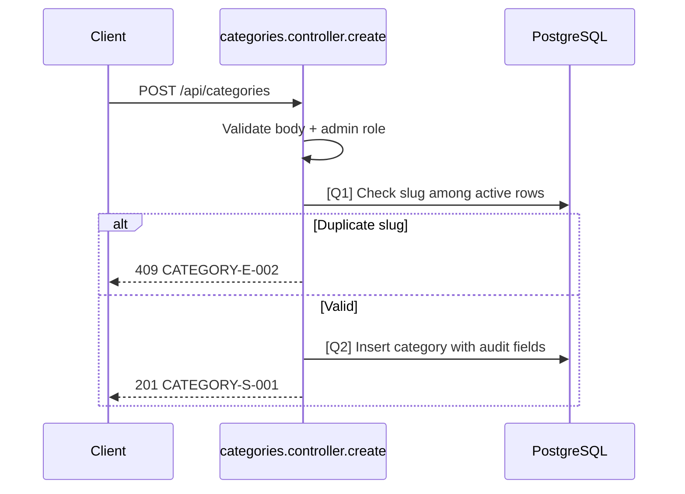

# [Design][API] API16_Categories_Tao

## Change Log
| Ver | Ngày | Nội dung | Người tạo |
|-----|------|----------|----------|
| 1.1 | 2026-06-04 | Bổ sung `status`, thumbnail, SEO fields và audit `created_by/updated_by` | GitHub Copilot |

## 1. Tổng quan
> API dùng để tạo mới một danh mục bài viết. Chỉ Admin mới có quyền thực hiện.

## 2. Thông tin chung

| Thuộc tính | Giá trị |
|-----------|---------|
| Method | `POST` |
| Endpoint | `/api/categories` |
| Auth yêu cầu | Có (Bearer Token) |
| Role cho phép | Admin |
| Controller | `src/controllers/categories.controller.js` -> `create` |

## 3. Request

### 3.1 Headers & Parameters
| Tên | Vị trí | Kiểu dữ liệu | Bắt buộc | Ràng buộc | Mô tả |
|-----|--------|--------------|----------|-----------|-------|
| Authorization | Header | String | ✅ | `Bearer <token>` | Token xác thực |

### 3.2 Body Payload

| Field | Kiểu dữ liệu | Bắt buộc | Ràng buộc (Min/Max/Format) | Mô tả |
|-------|--------------|----------|----------------------------|-------|
| name | String | ✅ | Min 2 ký tự | Tên danh mục |
| slug | String | ✅ | Chỉ a-z, 0-9, `-`, unique | Slug URL |
| description | String | ❌ | Max 500 ký tự | Mô tả danh mục |
| status | String | ❌ | `active` hoặc `hidden`, default `active` | Trạng thái hiển thị |
| thumbnail_url | String | ❌ | Max 255 ký tự | Ảnh đại diện danh mục |
| seo_title | String | ❌ | Max 70 ký tự | Tiêu đề SEO |
| seo_description | String | ❌ | Max 160 ký tự | Mô tả SEO |

**Ví dụ Request Body:**
```json
{
  "name": "Lễ hội",
  "slug": "le-hoi",
  "description": "Các lễ hội đặc sắc tại các điểm đến du lịch",
  "status": "active",
  "thumbnail_url": "/uploads/categories/le-hoi.jpg",
  "seo_title": "Lễ hội du lịch Việt Nam",
  "seo_description": "Tin tức lễ hội đặc sắc tại các điểm đến du lịch"
}
```

## 4. Response

### 4.1 Thành công (HTTP 201)
| Field | Kiểu dữ liệu | Có thể Null | Mô tả |
|-------|--------------|-------------|-------|
| id | Number | ❌ | ID danh mục |
| messageId | String | ❌ | `CATEGORY-S-001` |
| message | String | ❌ | Thông báo thành công |
| name | String | ❌ | Tên danh mục |
| slug | String | ❌ | Slug URL |
| description | String | ✅ | Mô tả danh mục |
| status | String | ❌ | Trạng thái hiển thị |
| thumbnail_url | String | ✅ | Ảnh đại diện |
| seo_title | String | ✅ | Tiêu đề SEO |
| seo_description | String | ✅ | Mô tả SEO |
| created_by | Number | ✅ | ID Admin tạo |

**Ví dụ Response:**
```json
{
  "messageId": "CATEGORY-S-001",
  "message": "Tạo danh mục thành công",
  "id": 4,
  "name": "Lễ hội",
  "slug": "le-hoi",
  "description": "Các lễ hội đặc sắc tại các điểm đến du lịch",
  "status": "active",
  "thumbnail_url": "/uploads/categories/le-hoi.jpg",
  "seo_title": "Lễ hội du lịch Việt Nam",
  "seo_description": "Tin tức lễ hội đặc sắc tại các điểm đến du lịch",
  "created_by": 1
}
```

### 4.2 Lỗi & Exceptions
| HTTP Code | Message / Error Code | Điều kiện xảy ra |
|-----------|----------------------|------------------|
| 400/422 | `CATEGORY-E-001` | Thiếu field bắt buộc hoặc sai format |
| 403 | `CATEGORY-E-004` | User không phải Admin |
| 409 | `CATEGORY-E-002` | Slug gửi lên đã có trong DB với `deleted_at IS NULL` |

## 5. Logic xử lý (Business Logic)
1. Validate request body (`name`, `slug`).
2. Thực hiện **[Q1]** để kiểm tra xem `slug` đã tồn tại chưa.
  - Nếu có -> throw `409 Conflict`.
3. Chuẩn hóa `status = active` nếu client không gửi.
4. Thực hiện **[Q2]** để insert danh mục mới vào DB, gắn `created_by` và `updated_by` từ `req.user.id`.
5. Trả về thông tin danh mục vừa tạo.

## 6. Database Queries & Mapping

| Query ID | Bảng (Table) | Hành động | Điều kiện (WHERE) / Data | Knex.js Snippet dự kiến |
|----------|--------------|-----------|--------------------------|-------------------------|
| **[Q1]** | `categories` | `SELECT` | `WHERE slug = ? AND deleted_at IS NULL` | `knex('categories').where({ slug }).whereNull('deleted_at').first()` |
| **[Q2]** | `categories` | `INSERT` | `name, slug, description, status, thumbnail_url, seo_title, seo_description, created_by, updated_by` | `knex('categories').insert({ name, slug, description, status, thumbnail_url, seo_title, seo_description, created_by: req.user.id, updated_by: req.user.id }).returning('*')` |

## 7. Side Effects (Tác động phụ)
> Không có.

## 8. Validation Rules
| Rule ID | Đối tượng | Quy tắc | MessageId | HTTP Status |
|---------|-----------|---------|-----------|-------------|
| V-01 | `name` | Bắt buộc, min 2 ký tự | CATEGORY-E-001 | 422 |
| V-02 | `slug` | Bắt buộc, chỉ a-z, 0-9, `-` | CATEGORY-E-001 | 422 |
| V-03 | `slug` | Unique trong danh mục chưa xóa | CATEGORY-E-002 | 409 |
| V-04 | `status` | Chỉ nhận `active`, `hidden` | CATEGORY-E-001 | 422 |
| V-05 | `description`, `thumbnail_url`, `seo_title`, `seo_description` | Không vượt quá max length tương ứng | CATEGORY-E-001 | 422 |
| V-06 | `Authorization` | Bắt buộc là Admin | CATEGORY-E-004 | 403 |

## 9. Message List
| MessageId | Loại | HTTP Status | Nội dung | Điều kiện |
|-----------|------|-------------|----------|-----------|
| CATEGORY-E-001 | E | 422 | Dữ liệu danh mục không hợp lệ | Validate fail |
| CATEGORY-E-002 | E | 409 | Slug danh mục đã tồn tại | Slug trùng |
| CATEGORY-E-004 | E | 403 | Bạn không có quyền quản lý danh mục | Không phải Admin |
| CATEGORY-S-001 | S | 201 | Tạo danh mục thành công | Insert thành công |

## 10. Sequence Diagram

