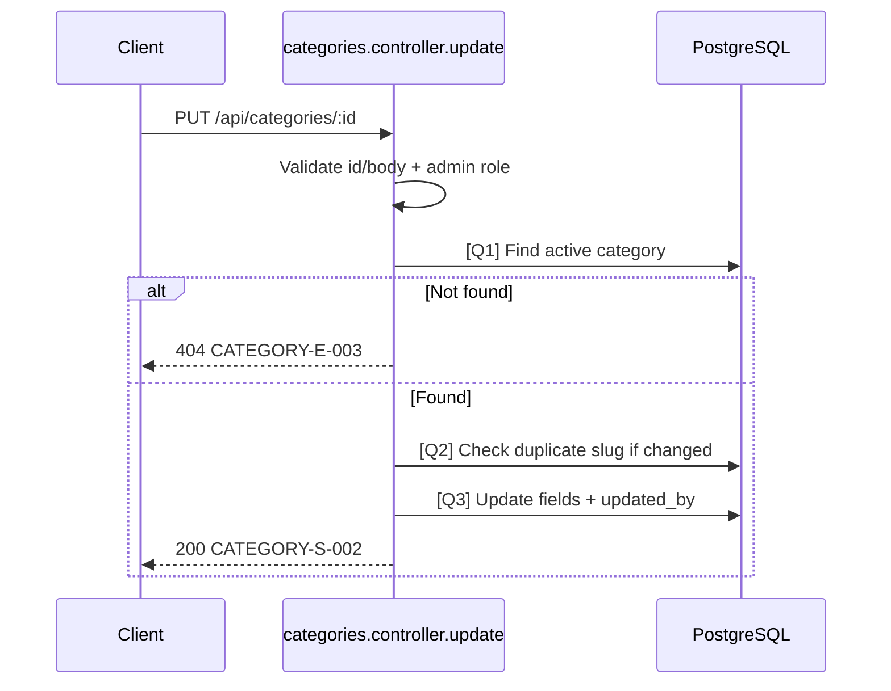

# [Design][API] API17_Categories_CapNhat

## Change Log
| Ver | Ngày | Nội dung | Người tạo |
|-----|------|----------|----------|
| 1.1 | 2026-06-04 | Bổ sung `status`, thumbnail, SEO fields, `updated_by` và loại trừ soft-delete | GitHub Copilot |

## 1. Tổng quan
> API dùng để cập nhật thông tin của một danh mục hiện có. Chỉ Admin mới có quyền thực hiện.

## 2. Thông tin chung

| Thuộc tính | Giá trị |
|-----------|---------|
| Method | `PUT` |
| Endpoint | `/api/categories/:id` |
| Auth yêu cầu | Có (Bearer Token) |
| Role cho phép | Admin |
| Controller | `src/controllers/categories.controller.js` -> `update` |

## 3. Request

### 3.1 Headers & Parameters
| Tên | Vị trí | Kiểu dữ liệu | Bắt buộc | Ràng buộc | Mô tả |
|-----|--------|--------------|----------|-----------|-------|
| Authorization | Header | String | ✅ | `Bearer <token>` | Token xác thực |
| id | Path | Number | ✅ | `> 0` | ID danh mục cần sửa |

### 3.2 Body Payload

| Field | Kiểu dữ liệu | Bắt buộc | Ràng buộc (Min/Max/Format) | Mô tả |
|-------|--------------|----------|----------------------------|-------|
| name | String | ❌ | Min 2 ký tự | Tên danh mục mới |
| slug | String | ❌ | Chỉ a-z, 0-9, `-`, unique | Slug URL mới |
| description | String | ❌ | Max 500 ký tự | Mô tả mới |
| status | String | ❌ | `active` hoặc `hidden` | Trạng thái hiển thị |
| thumbnail_url | String | ❌ | Max 255 ký tự | Ảnh đại diện |
| seo_title | String | ❌ | Max 70 ký tự | Tiêu đề SEO |
| seo_description | String | ❌ | Max 160 ký tự | Mô tả SEO |

**Ví dụ Request Body:**
```json
{
  "name": "Du lịch & Khám phá",
  "slug": "du-lich-kham-pha",
  "description": "Mô tả mới",
  "status": "active",
  "thumbnail_url": "/uploads/categories/du-lich.jpg",
  "seo_title": "Du lịch khám phá Việt Nam",
  "seo_description": "Cẩm nang du lịch và khám phá Việt Nam"
}
```

## 4. Response

### 4.1 Thành công (HTTP 200)
| Field | Kiểu dữ liệu | Có thể Null | Mô tả |
|-------|--------------|-------------|-------|
| id | Number | ❌ | ID danh mục |
| messageId | String | ❌ | `CATEGORY-S-002` |
| message | String | ❌ | Thông báo thành công |
| name | String | ❌ | Tên danh mục |
| slug | String | ❌ | Slug URL |
| description | String | ✅ | Mô tả danh mục |
| status | String | ❌ | Trạng thái hiển thị |
| thumbnail_url | String | ✅ | Ảnh đại diện |
| seo_title | String | ✅ | Tiêu đề SEO |
| seo_description | String | ✅ | Mô tả SEO |
| updated_by | Number | ✅ | ID Admin cập nhật |

**Ví dụ Response:**
```json
{
  "messageId": "CATEGORY-S-002",
  "message": "Cập nhật danh mục thành công",
  "id": 1,
  "name": "Du lịch & Khám phá",
  "slug": "du-lich-kham-pha",
  "description": "Mô tả mới",
  "status": "active",
  "thumbnail_url": "/uploads/categories/du-lich.jpg",
  "seo_title": "Du lịch khám phá Việt Nam",
  "seo_description": "Cẩm nang du lịch và khám phá Việt Nam",
  "updated_by": 1
}
```

### 4.2 Lỗi & Exceptions
| HTTP Code | Message / Error Code | Điều kiện xảy ra |
|-----------|----------------------|------------------|
| 400/422 | `CATEGORY-E-001` | Sai format dữ liệu gửi lên |
| 403 | `CATEGORY-E-004` | User không phải Admin |
| 404 | `CATEGORY-E-003` | Không tìm thấy danh mục active theo ID |
| 409 | `CATEGORY-E-002` | Slug gửi lên trùng với một danh mục active khác |

## 5. Logic xử lý (Business Logic)
1. Validate request body.
2. Thực hiện **[Q1]** để kiểm tra danh mục có tồn tại không.
   - Nếu không -> throw `404 Not Found`.
3. Nếu có gửi lên `slug`, thực hiện **[Q2]** để kiểm tra slug có bị trùng với danh mục khác không.
   - Nếu trùng -> throw `409 Conflict`.
4. Thực hiện **[Q3]** để cập nhật thông tin danh mục, gắn `updated_at` và `updated_by = req.user.id`.
5. Trả về thông tin danh mục sau khi cập nhật.

## 6. Database Queries & Mapping

| Query ID | Bảng (Table) | Hành động | Điều kiện (WHERE) / Data | Knex.js Snippet dự kiến |
|----------|--------------|-----------|--------------------------|-------------------------|
| **[Q1]** | `categories` | `SELECT` | `WHERE id = ? AND deleted_at IS NULL` | `knex('categories').where({ id }).whereNull('deleted_at').first()` |
| **[Q2]** | `categories` | `SELECT` | `WHERE slug = ? AND id != ? AND deleted_at IS NULL` | `knex('categories').where({ slug }).whereNull('deleted_at').andWhere('id', '!=', id).first()` |
| **[Q3]** | `categories` | `UPDATE` | `WHERE id = ? AND deleted_at IS NULL` | `knex('categories').where({ id }).whereNull('deleted_at').update({ ...data, updated_at: knex.fn.now(), updated_by: req.user.id }).returning('*')` |

## 7. Side Effects (Tác động phụ)
> Không có.

## 8. Validation Rules
| Rule ID | Đối tượng | Quy tắc | MessageId | HTTP Status |
|---------|-----------|---------|-----------|-------------|
| V-01 | `id` | Phải là số nguyên > 0 | CATEGORY-E-001 | 422 |
| V-02 | Category tồn tại | Phải tồn tại và `deleted_at IS NULL` | CATEGORY-E-003 | 404 |
| V-03 | `slug` | Nếu gửi lên, chỉ a-z, 0-9, `-` và unique trong danh mục chưa xóa khác | CATEGORY-E-001 / CATEGORY-E-002 | 422 / 409 |
| V-04 | `status` | Chỉ nhận `active`, `hidden` | CATEGORY-E-001 | 422 |
| V-05 | Body | Có ít nhất một field được cập nhật | CATEGORY-E-001 | 422 |
| V-06 | `Authorization` | Bắt buộc là Admin | CATEGORY-E-004 | 403 |

## 9. Message List
| MessageId | Loại | HTTP Status | Nội dung | Điều kiện |
|-----------|------|-------------|----------|-----------|
| CATEGORY-E-001 | E | 422 | Dữ liệu danh mục không hợp lệ | Validate fail |
| CATEGORY-E-002 | E | 409 | Slug danh mục đã tồn tại | Slug trùng |
| CATEGORY-E-003 | E | 404 | Danh mục không tồn tại | Không tìm thấy active row |
| CATEGORY-E-004 | E | 403 | Bạn không có quyền quản lý danh mục | Không phải Admin |
| CATEGORY-S-002 | S | 200 | Cập nhật danh mục thành công | Update thành công |

## 10. Sequence Diagram

