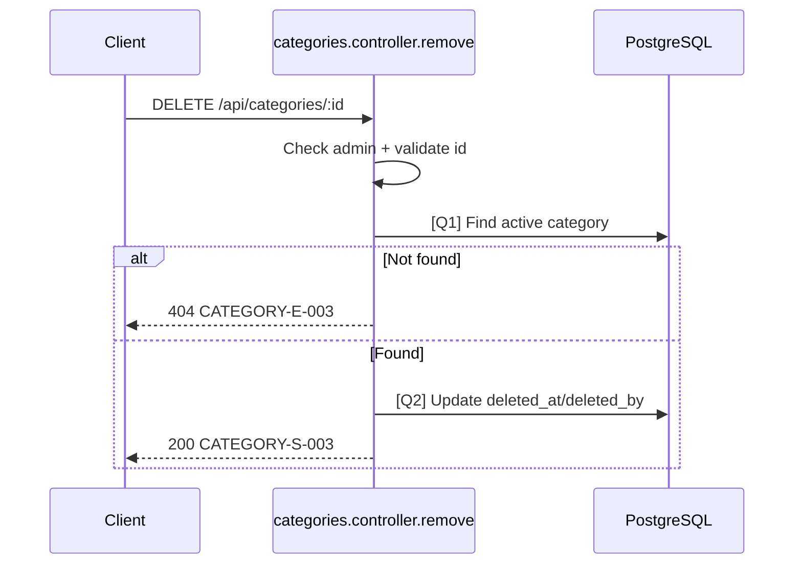

# [Design][API] API18_Categories_Xoa

## Change Log
| Ver | Ngày | Nội dung | Người tạo |
|-----|------|----------|----------|
| 1.1 | 2026-06-04 | Chuyển từ hard delete sang soft delete bằng `deleted_at`, `deleted_by` | GitHub Copilot |

## 1. Tổng quan
API xóa mềm một danh mục. Record không bị xóa khỏi DB; hệ thống set `deleted_at`, `deleted_by`, `updated_at`, `updated_by`. Các bài viết vẫn giữ `category_id`, nhưng public/admin list mặc định loại danh mục đã xóa.

Tài liệu tham chiếu:
| Loại | File |
|------|------|
| DB | `demo_docs/[Design][DB] DATABASE_Schema.md` |
| FE Screen | `demo_docs/fe/[Design][SCREEN] ADMIN_CATEGORY_LIST_QuanLyDanhMuc.md` |
| Message Catalog | `demo_docs/[Design][COMMON] MESSAGE_Catalog.md` |

## 2. Thông tin chung
| Thuộc tính | Giá trị |
|-----------|---------|
| Method | `DELETE` |
| Endpoint | `/api/categories/:id` |
| Auth yêu cầu | Có (Bearer Token) |
| Role cho phép | Admin |
| Controller | `src/controllers/categories.controller.js` -> `remove` |

DB liên quan:
| Bảng | Mục đích |
|------|----------|
| `categories` | Soft delete danh mục |
| `users` | `deleted_by`, `updated_by` tham chiếu user thao tác |

## 3. Request

### 3.1 Headers & Parameters
| Logical Name | Physical Field | Vị trí | Kiểu | Bắt buộc | Ràng buộc | Chuẩn hóa input | Mô tả |
|--------------|----------------|--------|------|----------|-----------|------------------|-------|
| Token | Authorization | Header | String | ✅ | `Bearer <token>` | Trim | Token Admin |
| Category ID | id | Path | Number | ✅ | `> 0` | Parse integer | ID danh mục cần xóa mềm |

### 3.2 Body Payload
Không có.

JSON example:
```json
{}
```

## 4. Validation Rules
| Rule ID | Đối tượng | Quy tắc | MessageId | HTTP Status |
|---------|-----------|---------|-----------|-------------|
| V-01 | `Authorization` | Bắt buộc là Admin | CATEGORY-E-004 | 403 |
| V-02 | `id` | Phải là số nguyên > 0 | CATEGORY-E-001 | 422 |
| V-03 | Category tồn tại | Phải tồn tại và `deleted_at IS NULL` | CATEGORY-E-003 | 404 |

## 5. Response

### Thành công (HTTP 200)
| Field | Kiểu dữ liệu | Có thể Null | Mô tả |
|-------|--------------|-------------|-------|
| messageId | String | ❌ | `CATEGORY-S-003` |
| message | String | ❌ | Thông báo thành công |
| id | Number | ❌ | ID danh mục đã xóa mềm |
| deleted_at | String | ❌ | Thời điểm xóa mềm |

JSON example:
```json
{
  "messageId": "CATEGORY-S-003",
  "message": "Xóa danh mục thành công",
  "id": 4,
  "deleted_at": "2026-06-04T10:00:00.000Z"
}
```

Lỗi:
| HTTP Code | Error Code | MessageId | Điều kiện |
|-----------|------------|-----------|-----------|
| 403 | ERR_CATEGORY_FORBIDDEN | CATEGORY-E-004 | User không phải Admin |
| 404 | ERR_CATEGORY_NOT_FOUND | CATEGORY-E-003 | Không tìm thấy category active |
| 422 | ERR_CATEGORY_VALIDATION | CATEGORY-E-001 | `id` không hợp lệ |

## 6. Sequence Diagram


## 7. Logic xử lý
1. Middleware `auth` và `role(['admin'])` xác thực quyền Admin.
2. Validate path param `id` theo V-02.
3. Thực hiện [Q1] tìm danh mục có `id` và `deleted_at IS NULL`.
4. Nếu không có, trả 404 `CATEGORY-E-003`.
5. Thực hiện [Q2] update soft-delete fields.
6. Trả response thành công.

## 8. Database Queries & Mapping
| Query ID | Điều kiện OK/NG | Knex.js snippet |
|----------|-----------------|-----------------|
| Q1 | OK khi tìm thấy category active; NG khi không có row | `knex('categories').where({ id }).whereNull('deleted_at').first()` |
| Q2 | OK khi update 1 row; NG khi DB error | `knex('categories').where({ id }).update({ deleted_at: knex.fn.now(), deleted_by: req.user.id, updated_at: knex.fn.now(), updated_by: req.user.id }).returning(['id','deleted_at'])` |

Data Mapping Request → SQL:
| Request | SQL |
|---------|-----|
| `params.id` | `WHERE id = :id AND deleted_at IS NULL` |
| `req.user.id` | `deleted_by`, `updated_by` |

Data Mapping DB → Response:
| DB Field | Response Field |
|----------|----------------|
| `id` | `id` |
| `deleted_at` | `deleted_at` |

## 9. Message List
| MessageId | Loại | HTTP Status | Nội dung | Điều kiện |
|-----------|------|-------------|----------|-----------|
| CATEGORY-E-001 | E | 422 | Dữ liệu danh mục không hợp lệ | ID invalid |
| CATEGORY-E-003 | E | 404 | Danh mục không tồn tại | Không tìm thấy active row |
| CATEGORY-E-004 | E | 403 | Bạn không có quyền quản lý danh mục | Không phải admin |
| CATEGORY-S-003 | S | 200 | Xóa danh mục thành công | Soft delete thành công |

## 10. Side Effects
- Không set `posts.category_id = NULL`.
- Các API public phải loại danh mục có `deleted_at IS NOT NULL`.
- Slug của danh mục đã xóa mềm có thể được dùng lại nếu DB dùng partial unique index `slug WHERE deleted_at IS NULL`.
