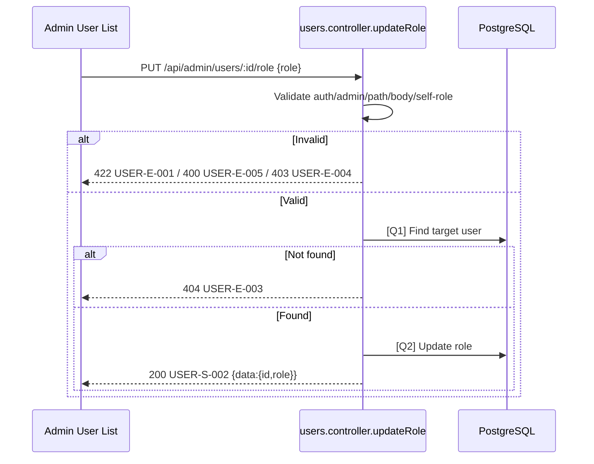

# [Design][API] API20_AdminUsers_DoiRole

## Change Log
| Ver | Ngày | Nội dung | Người tạo |
|-----|------|----------|----------|
| 1.0 | 2026-06-03 | Tạo tài liệu ban đầu | GitHub Copilot |
| 2.0 | 2026-06-04 | Chuẩn hóa 10 sections, success envelope và MessageId errors | GitHub Copilot |

## 1. Tổng quan
API cho Admin thay đổi role của người dùng giữa `admin` và `member`. API không cho admin tự đổi role của chính mình.

| Tài liệu tham chiếu | Đường dẫn |
|---|---|
| FE Screen | `demo_docs/fe/[Design][SCREEN] ADMIN_USER_LIST_QuanLyNguoiDung.md` |
| Message Catalog | `demo_docs/[Design][COMMON] MESSAGE_Catalog.md` |
| DB Schema | `demo_docs/[Design][DB] DATABASE_Schema.md` |
| Target Controller | `demo_source_be/src/controllers/users.controller.js` |

## 2. Thông tin chung
| Thuộc tính | Giá trị |
|---|---|
| Method | `PUT` |
| Endpoint | `/api/admin/users/:id/role` |
| Auth yêu cầu | Có (`Bearer Token`) |
| Role cho phép | `admin` |
| Controller | `src/controllers/users.controller.js` -> `updateRole` |

| DB liên quan | Mục đích |
|---|---|
| `users` | Kiểm tra user target và cập nhật `role` |

## 3. Request
### 3.1 Headers & Parameters
| Logical Name | Physical Field | Vị trí | Kiểu | Bắt buộc | Ràng buộc | Chuẩn hóa input | Mô tả |
|---|---|---|---|---|---|---|---|
| Token | `Authorization` | Header | String | ✅ | `Bearer <token>` | Trim | JWT của admin |
| User ID | `id` | Path | Number | ✅ | Integer > 0 | Parse int | User cần đổi role |

### 3.2 Body Payload
| Logical Name | Physical Field | Kiểu | Bắt buộc | Ràng buộc | Chuẩn hóa input | Mô tả |
|---|---|---|---|---|---|---|
| Role mới | `role` | String | ✅ | `admin`, `member` | Trim/lowercase | Role mới của user |

**Ví dụ Request Body:**
```json
{ "role": "admin" }
```

## 4. Validation Rules
| Rule ID | Đối tượng | Quy tắc | MessageId | HTTP Status |
|---|---|---|---|---|
| V-01 | Auth | Thiếu/sai token | COMMON-E-001 | 401 |
| V-02 | Role caller | Caller phải là admin | USER-E-004 | 403 |
| V-03 | `id` | Integer > 0 | USER-E-001 | 422 |
| V-04 | `role` | Bắt buộc, chỉ nhận `admin` hoặc `member` | USER-E-001 | 422 |
| V-05 | Self role change | `id` không được trùng `req.user.id` | USER-E-005 | 400 |
| V-06 | User tồn tại | User target tồn tại và chưa soft delete | USER-E-003 | 404 |

## 5. Response
### 5.1 Thành công (HTTP 200)
```json
{
  "messageId": "USER-S-002",
  "message": "Cập nhật role thành công",
  "data": { "id": 2, "role": "admin" }
}
```

### 5.2 Lỗi
| Error Code | HTTP Status | MessageId | Điều kiện |
|---|---|---|---|
| ERR_UNAUTHORIZED | 401 | COMMON-E-001 | Thiếu/sai token |
| ERR_FORBIDDEN | 403 | USER-E-004 | Không phải admin |
| ERR_VALIDATION | 422 | USER-E-001 | Path/body invalid |
| ERR_SELF_ROLE | 400 | USER-E-005 | Admin tự đổi role chính mình |
| ERR_NOT_FOUND | 404 | USER-E-003 | User không tồn tại |
| ERR_INTERNAL | 500 | COMMON-E-001 | Lỗi hệ thống |

## 6. Sequence Diagram


## 7. Logic xử lý
1. Middleware xác thực JWT và role admin.
2. Parse `id` path param; validate integer > 0.
3. Chuẩn hóa `role` từ body; validate thuộc `admin|member`.
4. Nếu `id === req.user.id`, trả `400 USER-E-005`.
5. Thực hiện **[Q1]** tìm user target chưa soft delete.
6. Nếu không có user, trả `404 USER-E-003`.
7. Thực hiện **[Q2]** cập nhật `users.role` và audit `updated_at/updated_by` nếu schema hỗ trợ.
8. Trả success envelope `{ messageId, message, data: { id, role } }`.

## 8. Database Queries & Mapping
| Query ID | Điều kiện OK/NG | Knex.js snippet |
|---|---|---|
| [Q1] Find user | OK: có user; NG: không có -> `USER-E-003` | `db('users').where({ id }).whereNull('deleted_at').first('id','role')` |
| [Q2] Update role | OK: trả row updated; NG: lỗi DB -> `COMMON-E-001` | `db('users').where({ id }).update({ role, updated_at: db.fn.now(), updated_by: req.user.id }).returning(['id','role'])` |

### Request → SQL Mapping
| Request field | SQL mapping |
|---|---|
| `id` | `WHERE users.id = :id` |
| `role` | `UPDATE users SET role = :role` |
| `req.user.id` | `updated_by = :adminId`; dùng để chặn self-role |

### DB → Response Mapping
| DB field | Response field |
|---|---|
| `users.id` | `data.id` |
| `users.role` | `data.role` |
| Constant | `messageId = USER-S-002` |
| Constant | `message = Cập nhật role thành công` |

## 9. Message List
| MessageId | Loại | HTTP Status | Nội dung | Điều kiện |
|---|---|---|---|---|
| USER-S-002 | S | 200 | Cập nhật role thành công | Cập nhật role OK |
| USER-E-001 | E | 422 | Dữ liệu người dùng không hợp lệ | Path/body invalid |
| USER-E-003 | E | 404 | Người dùng không tồn tại | Không tìm thấy user target |
| USER-E-004 | E | 403 | Bạn không có quyền quản lý người dùng | Caller không phải admin |
| USER-E-005 | E | 400 | Không thể đổi role của chính mình | Admin tự đổi role |
| COMMON-E-001 | E | 401/500 | Có lỗi xảy ra | Thiếu/sai token hoặc lỗi hệ thống |

## 10. Side Effects
Không revoke JWT/token hiện có. Nếu user bị đổi role khi đang đăng nhập, quyền mới có hiệu lực theo cơ chế xác thực/refresh token của BE.
