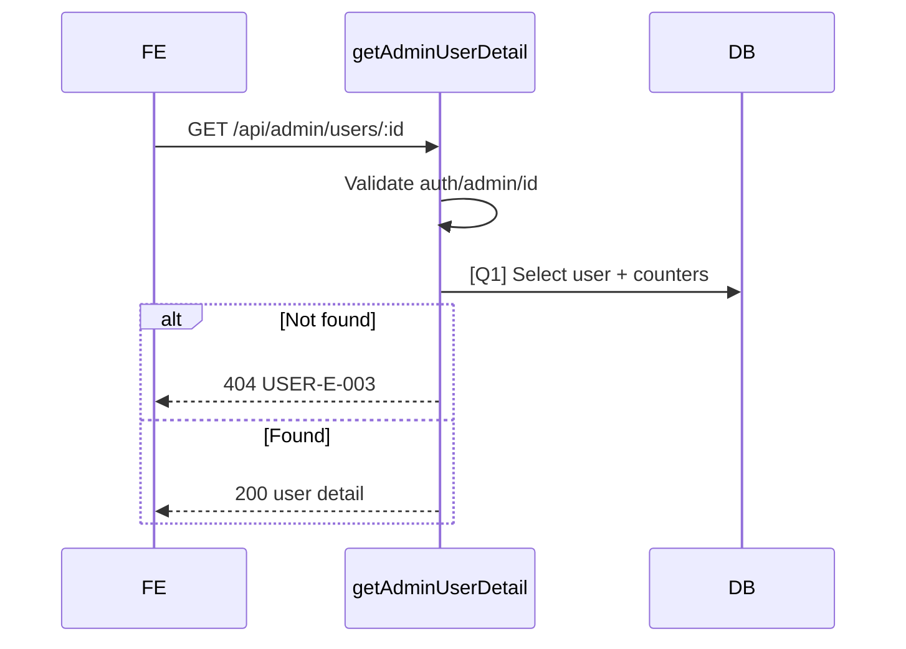

# [Design][API] API23_AdminUsers_ChiTiet

## Change Log
| Ver | Ngày | Nội dung | Người tạo |
|-----|------|----------|----------|
| 1.0 | 2026-06-04 | Tạo API target design lấy chi tiết người dùng | GitHub Copilot |

## 1. Tổng quan
API lấy chi tiết một người dùng cho modal xem chi tiết admin, gồm profile, trạng thái tài khoản, audit và thống kê bài viết. Target design; cần migration/code bổ sung nếu DB hiện tại chưa đủ field.

## 2. Thông tin chung
| Thuộc tính | Giá trị |
|---|---|
| Method | `GET` |
| Endpoint | `/api/admin/users/:id` |
| Auth yêu cầu | Có |
| Role cho phép | `admin` |
| Controller | `src/controllers/users.controller.js` -> `getAdminUserDetail` (target) |

| DB liên quan | Mục đích |
|---|---|
| `users` | Thông tin user |
| `posts` | Đếm bài viết theo trạng thái |

## 3. Request
### 3.1 Headers & Parameters
| Logical Name | Physical Field | Vị trí | Kiểu | Bắt buộc | Ràng buộc | Chuẩn hóa input | Mô tả |
|---|---|---|---|---|---|---|---|
| Token | `Authorization` | Header | String | ✅ | `Bearer <token>` | Trim | JWT admin |
| User ID | `id` | Path | Number | ✅ | Integer > 0 | Parse int | User cần xem |

### 3.2 Body Payload
| Logical Name | Physical Field | Kiểu | Bắt buộc | Ràng buộc | Chuẩn hóa input | Mô tả |
|---|---|---|---|---|---|---|
| Không có | N/A | N/A | ❌ | N/A | N/A | GET không có body |

## 4. Validation Rules
| Rule ID | Đối tượng | Quy tắc | MessageId | HTTP Status |
|---|---|---|---|---|
| V-01 | Auth | Thiếu/sai token | COMMON-E-001 | 401 |
| V-02 | Role caller | Caller phải là admin | USER-E-004 | 403 |
| V-03 | `id` | Integer > 0 | USER-E-001 | 422 |
| V-04 | User tồn tại | User target tồn tại và chưa soft delete | USER-E-003 | 404 |

## 5. Response
### 5.1 Thành công (HTTP 200)
Trả object gồm `id`, `name`, `email`, `phone`, `address`, `avatar_url`, `role`, `status`, `bio`, `birthdate`, `gender`, `locked_reason`, `last_login_at`, `created_at`, `updated_at`, `postCount`, `publishedPostCount`, `draftPostCount`.

```json
{ "id": 2, "name": "Nguyễn Văn A", "email": "member@hoianblog.vn", "phone": "0912345678", "address": "Đà Nẵng", "avatar_url": null, "role": "member", "status": "active", "bio": "Yêu du lịch Việt Nam", "birthdate": "1995-01-20", "gender": "male", "locked_reason": null, "last_login_at": null, "created_at": "2026-06-03T00:00:00.000Z", "updated_at": "2026-06-04T00:00:00.000Z", "postCount": 3, "publishedPostCount": 2, "draftPostCount": 1 }
```

### 5.2 Lỗi
| Error Code | HTTP Status | MessageId | Điều kiện |
|---|---|---|---|
| ERR_UNAUTHORIZED | 401 | COMMON-E-001 | Thiếu/sai token |
| ERR_FORBIDDEN | 403 | USER-E-004 | Không phải admin |
| ERR_VALIDATION | 422 | USER-E-001 | ID invalid |
| ERR_NOT_FOUND | 404 | USER-E-003 | User không tồn tại |
| ERR_INTERNAL | 500 | COMMON-E-001 | Lỗi hệ thống |

## 6. Sequence Diagram


## 7. Logic xử lý
1. Xác thực JWT và role admin.
2. Validate `id`.
3. [Q1] lấy user và counters.
4. Nếu không có user trả `404 USER-E-003`.
5. Trả object, không trả `password_hash`.

## 8. Database Queries & Mapping
| Query ID | Điều kiện OK | Điều kiện NG | Knex.js snippet |
|---|---|---|---|
| [Q1] | Trả một user | Không có row -> 404 | `knex('users').where('users.id', id).whereNull('users.deleted_at').leftJoin('posts','posts.author_id','users.id').select(...).count('posts.id as postCount').groupBy('users.id').first()` |

### Data Mapping
| DB | Response |
|---|---|
| `users` target fields | Field cùng tên |
| `posts.status` aggregate | `postCount`, `publishedPostCount`, `draftPostCount` |

## 9. Message List
| MessageId | Loại | HTTP Status | Nội dung | Điều kiện |
|---|---|---|---|---|
| USER-E-001 | Error | 422 | Dữ liệu người dùng không hợp lệ | ID invalid |
| USER-E-003 | Error | 404 | Người dùng không tồn tại | Not found |
| USER-E-004 | Error | 403 | Bạn không có quyền quản lý người dùng | Non-admin |
| COMMON-E-001 | Error | 401/500 | Có lỗi xảy ra | Auth/system fallback |

## 10. Side Effects
Không có.