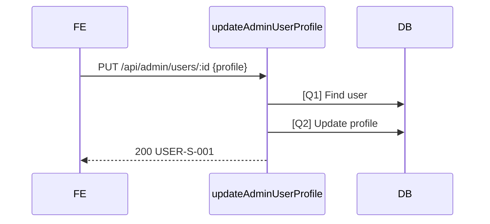

# [Design][API] API24_AdminUsers_CapNhat

## Change Log
| Ver | Ngày | Nội dung | Người tạo |
|-----|------|----------|----------|
| 1.0 | 2026-06-04 | Tạo API target design cập nhật profile người dùng bởi admin | GitHub Copilot |

## 1. Tổng quan
API cho Admin cập nhật profile user: `name`, `phone`, `address`, `avatar_url`, `bio`, `birthdate`, `gender`. Không cập nhật `email`, `role`, `status`, `password_hash`.

## 2. Thông tin chung
| Thuộc tính | Giá trị |
|---|---|
| Method | `PUT` |
| Endpoint | `/api/admin/users/:id` |
| Auth yêu cầu | Có |
| Role cho phép | `admin` |
| Controller | `src/controllers/users.controller.js` -> `updateAdminUserProfile` (target) |

| DB liên quan | Mục đích |
|---|---|
| `users` | Cập nhật profile fields và audit |

## 3. Request
### 3.1 Headers & Parameters
| Logical Name | Physical Field | Vị trí | Kiểu | Bắt buộc | Ràng buộc | Chuẩn hóa input | Mô tả |
|---|---|---|---|---|---|---|---|
| Token | `Authorization` | Header | String | ✅ | `Bearer <token>` | Trim | JWT admin |
| User ID | `id` | Path | Number | ✅ | Integer > 0 | Parse int | User cần cập nhật |

### 3.2 Body Payload
| Logical Name | Physical Field | Kiểu | Bắt buộc | Ràng buộc | Chuẩn hóa input | Mô tả |
|---|---|---|---|---|---|---|
| Họ tên | `name` | String | ✅ | Min 2, max 100 | Trim | Tên hiển thị |
| Số điện thoại | `phone` | String | ❌ | Max 20, format VN | Trim; empty -> null | Số điện thoại |
| Địa chỉ | `address` | String | ❌ | Max 255 | Trim; empty -> null | Địa chỉ |
| Avatar URL | `avatar_url` | String | ❌ | Max 255 | Trim; empty -> null | Avatar |
| Giới thiệu | `bio` | String | ❌ | Max 500 | Trim; empty -> null | Bio |
| Ngày sinh | `birthdate` | String | ❌ | `YYYY-MM-DD`, <= hôm nay | Empty -> null | Ngày sinh |
| Giới tính | `gender` | String | ❌ | `male`, `female`, `other`, `unknown` | Default `unknown` | Giới tính |

## 4. Validation Rules
| Rule ID | Đối tượng | Quy tắc | MessageId | HTTP Status |
|---|---|---|---|---|
| V-01 | Auth | Thiếu/sai token | COMMON-E-001 | 401 |
| V-02 | Role caller | Caller phải là admin | USER-E-004 | 403 |
| V-03 | `id` | Integer > 0 | USER-E-001 | 422 |
| V-04 | User tồn tại | User target tồn tại | USER-E-003 | 404 |
| V-05 | `name` | Bắt buộc, 2..100 ký tự | USER-E-001 | 422 |
| V-06 | Profile fields | Các field optional đúng max length/enum/date | USER-E-001 | 422 |

## 5. Response
### 5.1 Thành công (HTTP 200)
```json
{ "messageId": "USER-S-001", "message": "Cập nhật người dùng thành công", "data": { "id": 2, "name": "Nguyễn Văn A", "phone": "0912345678", "address": "Đà Nẵng", "avatar_url": null, "bio": "Yêu du lịch Việt Nam", "birthdate": "1995-01-20", "gender": "male", "updated_at": "2026-06-04T09:00:00.000Z" } }
```

### 5.2 Lỗi
| Error Code | HTTP Status | MessageId | Điều kiện |
|---|---|---|---|
| ERR_UNAUTHORIZED | 401 | COMMON-E-001 | Thiếu/sai token |
| ERR_FORBIDDEN | 403 | USER-E-004 | Không phải admin |
| ERR_VALIDATION | 422 | USER-E-001 | Body/path invalid |
| ERR_NOT_FOUND | 404 | USER-E-003 | User không tồn tại |
| ERR_INTERNAL | 500 | COMMON-E-001 | Lỗi hệ thống |

## 6. Sequence Diagram


## 7. Logic xử lý
1. Xác thực JWT và role admin.
2. Validate path/body.
3. Chuẩn hóa optional empty string thành `null`, gender default `unknown`.
4. [Q1] kiểm tra user tồn tại.
5. [Q2] cập nhật profile fields, `updated_at`, `updated_by`.
6. Trả message success và data cập nhật.

## 8. Database Queries & Mapping
| Query ID | Điều kiện OK | Điều kiện NG | Knex.js snippet |
|---|---|---|---|
| [Q1] | User tồn tại | Không có row -> 404 | `knex('users').where({ id }).whereNull('deleted_at').first()` |
| [Q2] | Update 1 row | Lỗi DB -> 500 | `knex('users').where({ id }).update({ name, phone, address, avatar_url, bio, birthdate, gender, updated_at: knex.fn.now(), updated_by: req.user.id }).returning(['id','name','phone','address','avatar_url','bio','birthdate','gender','updated_at'])` |

### Data Mapping
| Request | DB/Response |
|---|---|
| `body.name/phone/address/avatar_url/bio/birthdate/gender` | `users` cùng tên và `data` cùng tên |
| `req.user.id` | `updated_by` |

## 9. Message List
| MessageId | Loại | HTTP Status | Nội dung | Điều kiện |
|---|---|---|---|---|
| USER-S-001 | Success | 200 | Cập nhật người dùng thành công | Update OK |
| USER-E-001 | Error | 422 | Dữ liệu người dùng không hợp lệ | Validate fail |
| USER-E-003 | Error | 404 | Người dùng không tồn tại | Not found |
| USER-E-004 | Error | 403 | Bạn không có quyền quản lý người dùng | Non-admin |
| COMMON-E-001 | Error | 401/500 | Có lỗi xảy ra | Auth/system fallback |

## 10. Side Effects
Không có. Không đổi email/role/status/password.