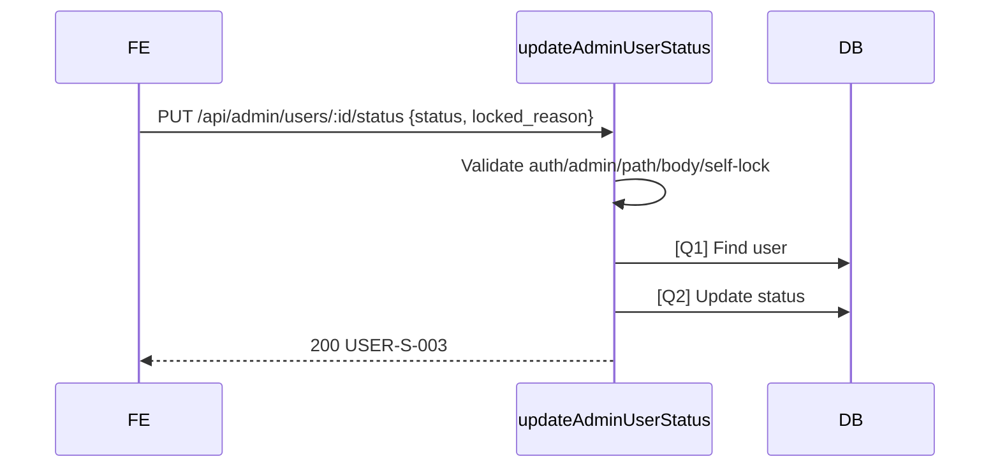

# [Design][API] API25_AdminUsers_DoiStatus

## Change Log
| Ver | Ngày | Nội dung | Người tạo |
|-----|------|----------|----------|
| 1.0 | 2026-06-04 | Tạo API target design khóa/mở khóa tài khoản người dùng | GitHub Copilot |

## 1. Tổng quan
API cho Admin đổi trạng thái tài khoản `active|locked`. Khi khóa (`locked`) bắt buộc nhập `locked_reason`. Không cho admin tự khóa chính mình.

## 2. Thông tin chung
| Thuộc tính | Giá trị |
|---|---|
| Method | `PUT` |
| Endpoint | `/api/admin/users/:id/status` |
| Auth yêu cầu | Có |
| Role cho phép | `admin` |
| Controller | `src/controllers/users.controller.js` -> `updateAdminUserStatus` (target) |

| DB liên quan | Mục đích |
|---|---|
| `users` | Cập nhật `status`, `locked_reason`, audit |

## 3. Request
### 3.1 Headers & Parameters
| Logical Name | Physical Field | Vị trí | Kiểu | Bắt buộc | Ràng buộc | Chuẩn hóa input | Mô tả |
|---|---|---|---|---|---|---|---|
| Token | `Authorization` | Header | String | ✅ | `Bearer <token>` | Trim | JWT admin |
| User ID | `id` | Path | Number | ✅ | Integer > 0 | Parse int | User cần đổi status |

### 3.2 Body Payload
| Logical Name | Physical Field | Kiểu | Bắt buộc | Ràng buộc | Chuẩn hóa input | Mô tả |
|---|---|---|---|---|---|---|
| Trạng thái | `status` | String | ✅ | `active`, `locked` | Trim/lowercase | Trạng thái mới |
| Lý do khóa | `locked_reason` | String | Khi `status=locked` | 5..255 khi locked | Trim; active -> null | Lý do khóa |

## 4. Validation Rules
| Rule ID | Đối tượng | Quy tắc | MessageId | HTTP Status |
|---|---|---|---|---|
| V-01 | Auth | Thiếu/sai token | COMMON-E-001 | 401 |
| V-02 | Role caller | Caller phải là admin | USER-E-004 | 403 |
| V-03 | `id` | Integer > 0 | USER-E-001 | 422 |
| V-04 | `status` | Bắt buộc, `active` hoặc `locked` | USER-E-001 | 422 |
| V-05 | `locked_reason` | Bắt buộc khi `status=locked`, 5..255 ký tự | USER-E-001 | 422 |
| V-06 | Self lock | Không được khóa chính mình | USER-E-006 | 400 |
| V-07 | User tồn tại | User target tồn tại | USER-E-003 | 404 |

## 5. Response
### 5.1 Thành công (HTTP 200)
```json
{ "messageId": "USER-S-003", "message": "Cập nhật trạng thái tài khoản thành công", "data": { "id": 2, "status": "locked", "locked_reason": "Vi phạm quy định cộng đồng", "updated_at": "2026-06-04T09:00:00.000Z" } }
```

### 5.2 Lỗi
| Error Code | HTTP Status | MessageId | Điều kiện |
|---|---|---|---|
| ERR_UNAUTHORIZED | 401 | COMMON-E-001 | Thiếu/sai token |
| ERR_FORBIDDEN | 403 | USER-E-004 | Không phải admin |
| ERR_VALIDATION | 422 | USER-E-001 | Body/path invalid, thiếu `locked_reason` |
| ERR_SELF_LOCK | 400 | USER-E-006 | Tự khóa chính mình |
| ERR_NOT_FOUND | 404 | USER-E-003 | User không tồn tại |
| ERR_INTERNAL | 500 | COMMON-E-001 | Lỗi hệ thống |

## 6. Sequence Diagram


## 7. Logic xử lý
1. Xác thực JWT và role admin.
2. Validate `id`, `status`, `locked_reason`.
3. Nếu `status=locked` và `Number(id) === req.user.id`, trả `400 USER-E-006`.
4. [Q1] kiểm tra user target.
5. [Q2] cập nhật `status`; nếu `active` thì set `locked_reason=null`.
6. Trả success message và data.

## 8. Database Queries & Mapping
| Query ID | Điều kiện OK | Điều kiện NG | Knex.js snippet |
|---|---|---|---|
| [Q1] | User tồn tại | Không có row -> 404 | `knex('users').where({ id }).whereNull('deleted_at').first()` |
| [Q2] | Update 1 row | Lỗi DB -> 500 | `knex('users').where({ id }).update({ status, locked_reason: status === 'locked' ? locked_reason : null, updated_at: knex.fn.now(), updated_by: req.user.id }).returning(['id','status','locked_reason','updated_at'])` |

### Data Mapping
| Request | DB/Response |
|---|---|
| `body.status` | `users.status`, `data.status` |
| `body.locked_reason` | `users.locked_reason`, `data.locked_reason` |
| `req.user.id` | `updated_by`; self-lock check |

## 9. Message List
| MessageId | Loại | HTTP Status | Nội dung | Điều kiện |
|---|---|---|---|---|
| USER-S-003 | Success | 200 | Cập nhật trạng thái tài khoản thành công | Update OK |
| USER-E-001 | Error | 422 | Dữ liệu người dùng không hợp lệ | Validate fail |
| USER-E-003 | Error | 404 | Người dùng không tồn tại | Not found |
| USER-E-004 | Error | 403 | Bạn không có quyền quản lý người dùng | Non-admin |
| USER-E-006 | Error | 400 | Không thể khóa tài khoản của chính mình | Self lock |
| COMMON-E-001 | Error | 401/500 | Có lỗi xảy ra | Auth/system fallback |

## 10. Side Effects
User bị khóa sẽ bị chặn đăng nhập/xác thực ở auth flow sau khi BE implement kiểm tra `users.status`. Token đã phát trước đó cần được xử lý ở auth middleware trong phase implement.