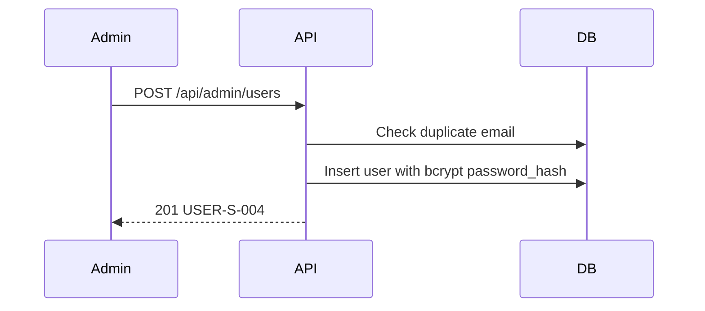

# [Design][API] API26_AdminUsers_Tao

## Change Log
| Ver | Ngày | Nội dung | Người tạo |
|-----|------|----------|-----------|
| 1.0 | 2026-06-04 | Tạo tài liệu ban đầu | GitHub Copilot |
| 1.1 | 2026-06-06 | Chuẩn hóa 10 sections | docs-agent |

## 1. Tổng quan
API cho Admin tạo mới user trong màn quản lý người dùng.

## 2. Thông tin chung
| Thuộc tính | Giá trị |
|-----------|---------|
| Method | `POST` |
| Endpoint | `/api/admin/users` |
| Auth yêu cầu | Có (Bearer Token) |
| Role cho phép | Admin |
| Controller | `src/controllers/users.controller.js` -> `createAdminUser` |

**Bảng DB liên quan:**
| Bảng | Hành động | Mục đích |
|------|-----------|----------|
| `users` | READ, INSERT | Kiểm tra email tồn tại và tạo user mới |

## 3. Request
### 3.1 Headers & Parameters
Không có.

### 3.2 Body Payload
| Logical Name | Physical Field | Kiểu dữ liệu | Bắt buộc | Ràng buộc | Chuẩn hóa input | Mô tả |
|-------------|---------------|--------------|----------|-----------|----------------|-------|
| Tên hiển thị | `name` | String | ✅ | 2..100 ký tự | Trim | Tên người dùng |
| Email | `email` | String | ✅ | Format email | Trim, toLowerCase | Email đăng nhập |
| Mật khẩu | `password` | String | ✅ | Min 6 ký tự | Không | Mật khẩu chưa hash |
| Role | `role` | String | ❌ | `admin`, `member` | Mặc định `member` | Quyền hạn |
| Trạng thái | `status` | String | ❌ | `active`, `locked` | Mặc định `active` | Trạng thái tài khoản |
| Lý do khóa | `locked_reason` | String | ❌ | Bắt buộc khi `status=locked` | Trim | Lý do khóa tài khoản |

## 4. Validation Rules
| Rule ID | Đối tượng | Quy tắc | MessageId | HTTP Status |
|---------|----------|---------|-----------|-------------|
| V-01 | `name`, `email`, `password` | Bắt buộc nhập, đúng định dạng | `USER-E-001` | 422 |
| V-02 | `email` | Email không được trùng trong DB (chưa soft delete) | `USER-E-002` | 409 |
| V-03 | `locked_reason` | Bắt buộc khi `status=locked`, 5..255 ký tự | `USER-E-001` | 422 |

## 5. Response
### 5.1 Thành công (HTTP 201)
| Field | Kiểu dữ liệu | Có thể Null | Mô tả |
|-------|--------------|-------------|-------|
| `id` | Number | ❌ | ID người dùng |
| `name` | String | ❌ | Tên hiển thị |
| `email` | String | ❌ | Email người dùng |
| `role` | String | ❌ | Role |
| `status` | String | ❌ | Trạng thái |

### 5.2 Lỗi
| HTTP Code | Error Code | MessageId | Mô tả |
|-----------|------------|-----------|-------|
| 422 | `VALIDATION_ERROR` | `USER-E-001` | Dữ liệu không hợp lệ |
| 409 | `CONFLICT` | `USER-E-002` | Email đã tồn tại |

## 6. Sequence Diagram

## 7. Logic xử lý
1. Middleware `auth` và `role` xác thực admin.
2. Validate request body.
3. Thực hiện **[Q1]** kiểm tra email duplicate với `deleted_at IS NULL`. Nếu có -> throw 409.
4. Hash password bằng bcrypt.
5. Thực hiện **[Q2]** insert user, audit `created_by`, `updated_by`.
6. Trả về thông tin user (không trả `password_hash`).

## 8. Database Queries & Mapping
| Query ID | Bảng | Hành động | Điều kiện / Data | Knex.js Snippet |
|----------|------|-----------|------------------|-----------------|
| **[Q1]** | `users` | `SELECT` | `WHERE email = ? AND deleted_at IS NULL` | `knex('users').where({ email }).whereNull('deleted_at').first()` |
| **[Q2]** | `users` | `INSERT` | `name, email, password_hash, role, status...` | `knex('users').insert({...}).returning('*')` |

## 9. Message List
| MessageId | Loại | HTTP Status | Nội dung | Điều kiện |
|-----------|------|-------------|----------|-----------|
| `USER-S-004` | S | 201 | Tạo người dùng thành công | Tạo thành công |
| `USER-E-001` | E | 422 | Dữ liệu người dùng không hợp lệ | Lỗi validation |
| `USER-E-002` | E | 409 | Email người dùng đã tồn tại | Trùng email |

## 10. Side Effects
Không có.
