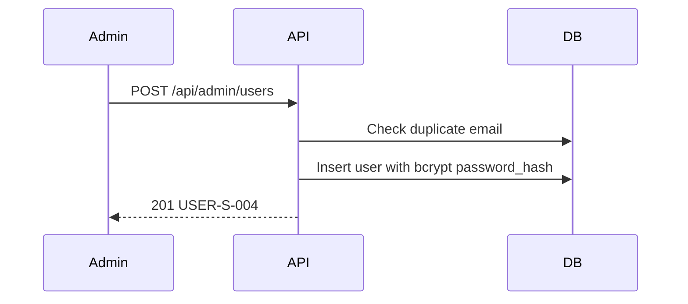

# [Design][API] API26_AdminUsers_Tao

## 1. Tổng quan
API cho Admin tạo mới user trong màn quản lý người dùng.

## 2. Thông tin chung
| Method | Endpoint | Auth | Role | Controller |
|---|---|---|---|---|
| POST | `/api/admin/users` | Bearer Token | admin | `users.controller.createAdminUser` |

## 3. Request
Body: `name`, `email`, `password`, `role`, `status`, `phone`, `address`, `avatar_url`, `bio`, `birthdate`, `gender`.

## 4. Validation Rules
- `name`: bắt buộc, 2..100 ký tự.
- `email`: bắt buộc, email hợp lệ, không trùng user chưa soft delete.
- `password`: bắt buộc, tối thiểu 6 ký tự.
- `role`: `admin|member`, default `member`.
- `status`: `active|locked`, default `active`.
- `locked_reason`: bắt buộc khi `status=locked`, 5..255 ký tự.
- Profile fields theo rule API24.

## 5. Response
### 201
```json
{ "messageId": "USER-S-004", "message": "Tạo người dùng thành công", "data": { "id": 3, "email": "new@hoianblog.vn", "name": "New User", "role": "member", "status": "active" } }
```

## 6. Sequence Diagram


## 7. Logic xử lý
1. Auth admin.
2. Validate body.
3. Check email duplicate với `deleted_at IS NULL`.
4. Hash password bằng bcrypt.
5. Insert user, audit `created_by`, `updated_by`.
6. Không trả `password_hash`.

## 8. Database Queries & Mapping
- `users.email` từ body email.
- `users.password_hash` từ bcrypt hash.
- Profile/status/role fields map cùng tên.

## 9. Errors
| Status | MessageId | Điều kiện |
|---|---|---|
| 422 | USER-E-001 | Dữ liệu không hợp lệ |
| 409 | USER-E-002 | Email đã tồn tại |
| 500 | COMMON-E-001 | Lỗi hệ thống |
