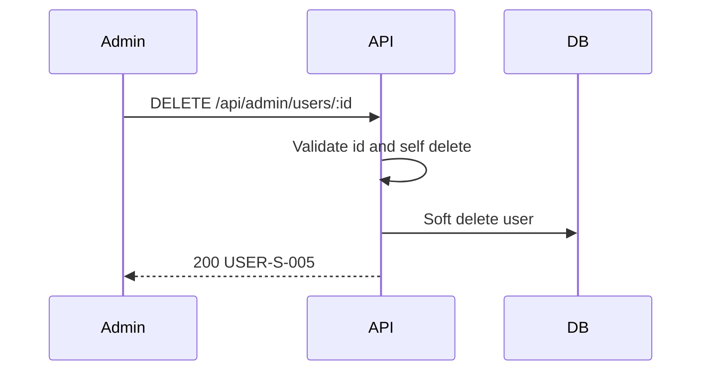

# [Design][API] API27_AdminUsers_Xoa

## Change Log
| Ver | Ngày | Nội dung | Người tạo |
|-----|------|----------|-----------|
| 1.0 | 2026-06-04 | Tạo tài liệu ban đầu | GitHub Copilot |
| 1.1 | 2026-06-06 | Chuẩn hóa 10 sections | docs-agent |

## 1. Tổng quan
API cho Admin xóa mềm user trong màn quản lý người dùng. Không cho admin tự xóa chính mình.

## 2. Thông tin chung
| Thuộc tính | Giá trị |
|-----------|---------|
| Method | `DELETE` |
| Endpoint | `/api/admin/users/:id` |
| Auth yêu cầu | Có (Bearer Token) |
| Role cho phép | Admin |
| Controller | `src/controllers/users.controller.js` -> `deleteAdminUser` |

**Bảng DB liên quan:**
| Bảng | Hành động | Mục đích |
|------|-----------|----------|
| `users` | UPDATE | Xóa mềm user (cập nhật `deleted_at`) |

## 3. Request
### 3.1 Headers & Parameters
| Tên | Vị trí | Kiểu dữ liệu | Bắt buộc | Ràng buộc | Mô tả |
|-----|--------|--------------|----------|-----------|-------|
| `id` | Path | Number | ✅ | > 0 | ID của user cần xóa |

### 3.2 Body Payload
Không có.

## 4. Validation Rules
| Rule ID | Đối tượng | Quy tắc | MessageId | HTTP Status |
|---------|----------|---------|-----------|-------------|
| V-01 | `id` | Phải là số nguyên dương | `USER-E-001` | 422 |
| V-02 | `id` | Không được trùng với `req.user.id` | `USER-E-007` | 400 |
| V-03 | `id` | User phải tồn tại và chưa bị xóa mềm | `USER-E-003` | 404 |

## 5. Response
### 5.1 Thành công (HTTP 200)
| Field | Kiểu dữ liệu | Có thể Null | Mô tả |
|-------|--------------|-------------|-------|
| `id` | Number | ❌ | ID người dùng |
| `deleted_at` | String | ❌ | Thời điểm xóa |

### 5.2 Lỗi
| HTTP Code | Error Code | MessageId | Mô tả |
|-----------|------------|-----------|-------|
| 400 | `BAD_REQUEST` | `USER-E-007` | Không thể tự xóa chính mình |
| 404 | `NOT_FOUND` | `USER-E-003` | User không tồn tại |
| 422 | `VALIDATION_ERROR` | `USER-E-001` | ID không hợp lệ |

## 6. Sequence Diagram

## 7. Logic xử lý
1. Middleware `auth` và `role` xác thực admin.
2. Validate path `id`.
3. Nếu `id == req.user.id` -> throw 400.
4. Thực hiện **[Q1]** kiểm tra user tồn tại. Nếu không -> throw 404.
5. Thực hiện **[Q2]** update `deleted_at`, `deleted_by`, `updated_at`, `updated_by`.
6. Trả về kết quả.

## 8. Database Queries & Mapping
| Query ID | Bảng | Hành động | Điều kiện / Data | Knex.js Snippet |
|----------|------|-----------|------------------|-----------------|
| **[Q1]** | `users` | `SELECT` | `WHERE id = ? AND deleted_at IS NULL` | `knex('users').where({ id }).whereNull('deleted_at').first()` |
| **[Q2]** | `users` | `UPDATE` | `SET deleted_at = NOW(), deleted_by = ?` | `knex('users').where({ id }).update({ deleted_at: knex.fn.now(), deleted_by: req.user.id })` |

## 9. Message List
| MessageId | Loại | HTTP Status | Nội dung | Điều kiện |
|-----------|------|-------------|----------|-----------|
| `USER-S-005` | S | 200 | Xóa người dùng thành công | Xóa thành công |
| `USER-E-007` | E | 400 | Không thể tự xóa chính mình | Admin tự xóa |
| `USER-E-003` | E | 404 | Người dùng không tồn tại | Sai ID |

## 10. Side Effects
Không có.
