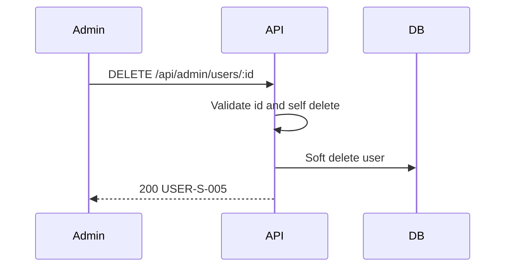

# [Design][API] API27_AdminUsers_Xoa

## 1. Tổng quan
API cho Admin xóa mềm user trong màn quản lý người dùng. Không cho admin tự xóa chính mình.

## 2. Thông tin chung
| Method | Endpoint | Auth | Role | Controller |
|---|---|---|---|---|
| DELETE | `/api/admin/users/:id` | Bearer Token | admin | `users.controller.deleteAdminUser` |

## 3. Request
Path `id`: integer > 0.

## 4. Validation Rules
- `id`: integer > 0.
- User tồn tại và `deleted_at IS NULL`.
- `id !== req.user.id`.

## 5. Response
### 200
```json
{ "messageId": "USER-S-005", "message": "Xóa người dùng thành công", "data": { "id": 3, "deleted_at": "2026-06-04T09:00:00.000Z" } }
```

## 6. Sequence Diagram


## 7. Logic xử lý
1. Auth admin.
2. Validate path id.
3. Nếu tự xóa chính mình trả `400 USER-E-007`.
4. Check user tồn tại.
5. Update `deleted_at`, `deleted_by`, `updated_at`, `updated_by`.

## 8. Database Queries & Mapping
- `users.deleted_at`: current timestamp.
- `users.deleted_by`: `req.user.id`.

## 9. Errors
| Status | MessageId | Điều kiện |
|---|---|---|
| 400 | USER-E-007 | Không thể tự xóa chính mình |
| 404 | USER-E-003 | User không tồn tại |
| 422 | USER-E-001 | ID không hợp lệ |
| 500 | COMMON-E-001 | Lỗi hệ thống |
