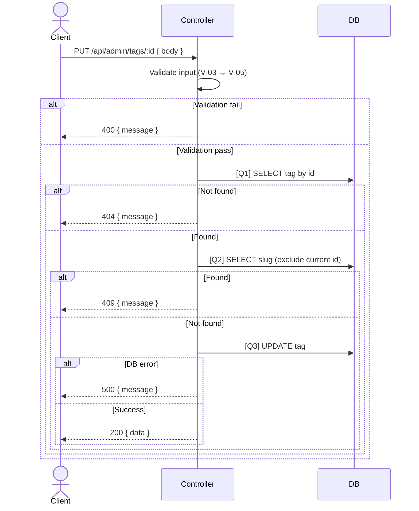

# [Design][API] API31_AdminTags_CapNhat

## Lịch sử thay đổi

| Ver | Ngày | Nội dung thay đổi | Người tạo |
|-----|------|-------------------|-----------|
| 1.0 | 2026-06-06 | Tạo mới | GitHub Copilot |

## 1. Tổng quan
> API cập nhật thông tin tag dành cho Admin.

**Tài liệu tham chiếu:**

| Loại | File | Mục đích |
|------|------|----------|
| API List | `demo_docs/api/[Design][LIST] API_DanhSachEndpoint.md` | Danh sách toàn bộ endpoint |
| DB Schema | `demo_docs/[Design][DB] DATABASE_Schema.md` | Cấu trúc bảng |

## 2. Thông tin chung

| Thuộc tính | Giá trị |
|-----------|---------|
| Method | `PUT` |
| Endpoint | `/api/admin/tags/:id` |
| Auth yêu cầu | Có (Bearer Token) |
| Role cho phép | Admin |
| Controller | `src/controllers/admin.tags.controller.js` → `updateTag` |

**Bảng DB liên quan:**

| Bảng | Hành động | Mục đích |
|------|-----------|----------|
| `tags` | READ | Kiểm tra tồn tại tag và slug |
| `tags` | WRITE | Cập nhật tag |

## 3. Request

### 3.1 Headers & Parameters
| Tên | Vị trí | Kiểu dữ liệu | Bắt buộc | Ràng buộc | Mô tả |
|-----|--------|--------------|----------|-----------|-------|
| Authorization | Header | String | ✅ | `Bearer <token>` | Token xác thực |
| id | Path | Number | ✅ | `> 0` | ID của tag cần cập nhật |

### 3.2 Body Payload

| Logical Name | Physical Field | Kiểu dữ liệu | Bắt buộc | Ràng buộc (Min/Max/Format) | Chuẩn hóa input | Mô tả |
|-------------|---------------|--------------|----------|----------------------------|----------------|-------|
| Tên tag | `name` | String | ✅ | Max 255 ký tự | `trim()` | Tên hiển thị của tag |
| Slug | `slug` | String | ✅ | Max 255 ký tự, format slug | `trim()`, `toLowerCase()` | Đường dẫn thân thiện |
| Mô tả | `description` | String | ❌ | | `trim()` | Mô tả chi tiết |

**Ví dụ Request Body:**
```json
{
  "name": "Du lịch biển",
  "slug": "du-lich-bien",
  "description": "Các bài viết về du lịch biển"
}
```

## 4. Validation Rules

| Rule ID | Đối tượng | Quy tắc | MessageId | HTTP Status |
|---------|----------|---------|-----------|-------------|
| V-01 | Auth | Token hợp lệ và chưa hết hạn | E-401 | 401 |
| V-02 | Auth | Role có quyền thực hiện (Admin) | E-403 | 403 |
| V-03 | `id` | Phải là số nguyên dương | E-003 | 400 |
| V-04 | `name` | Bắt buộc, không được rỗng | E-001 | 400 |
| V-05 | `slug` | Bắt buộc, không được rỗng | E-001 | 400 |
| V-06 | `slug` | Không trùng với tag khác đã tồn tại | E-409 | 409 |

## 5. Response

### 5.1 Thành công (HTTP 200)
| Field | Kiểu dữ liệu | Có thể Null | Mô tả |
|-------|--------------|-------------|-------|
| `message` | String | ❌ | Thông báo thành công |
| `data` | Object | ❌ | Dữ liệu tag vừa cập nhật |
| `data.id` | Number | ❌ | ID tag |

**Ví dụ Response:**
```json
{
  "message": "Cập nhật tag thành công",
  "data": {
    "id": 1
  }
}
```

### 5.2 Lỗi & Exceptions
| HTTP Code | Error Code | Message | Điều kiện xảy ra |
|-----------|-----------|---------|------------------|
| 400 | `ERR_VALIDATION` | `"Validation failed"` | Thiếu field bắt buộc |
| 401 | `ERR_UNAUTHORIZED` | `"Unauthorized"` | Token không hợp lệ hoặc hết hạn |
| 403 | `ERR_FORBIDDEN` | `"Forbidden"` | Không đủ quyền truy cập |
| 404 | `ERR_NOT_FOUND` | `"Not found"` | Không tìm thấy tag |
| 409 | `ERR_CONFLICT` | `"Already exists"` | Slug đã tồn tại ở tag khác |

## 6. Sequence Diagram



## 7. Logic xử lý (Business Logic)
1. Chuẩn hóa input: `trim` các field, `toLowerCase` cho `slug`.
2. Validate theo thứ tự V-03 → V-05.
3. Thực hiện **[Q1]** để kiểm tra tag có tồn tại không.
   - Nếu không tìm thấy → throw `404 Not Found`.
4. Thực hiện **[Q2]** để kiểm tra `slug` đã tồn tại ở tag khác chưa (V-06).
   - Nếu đã tồn tại → throw `409 Conflict`.
5. Thực hiện **[Q3]** để cập nhật tag vào database, lưu `updated_by` là ID của Admin đang đăng nhập, `updated_at` là thời gian hiện tại.
6. Chuẩn hóa response và trả về.

## 8. Database Queries & Mapping

| Query ID | Bảng (Table) | Hành động | Điều kiện (WHERE) / Data | Điều kiện OK/NG | Knex.js Snippet |
|----------|--------------|-----------|--------------------------|----------------|----------------|
| **[Q1]** | `tags` | `SELECT` | `WHERE id = :id` | 0 record → 404 | `knex('tags').where({ id }).first()` |
| **[Q2]** | `tags` | `SELECT` | `WHERE slug = :slug AND id != :id` | > 0 record → 409 | `knex('tags').where({ slug }).whereNot({ id }).first()` |
| **[Q3]** | `tags` | `UPDATE` | Data từ body + `updated_by`, `updated_at` | Lỗi DB → 500 | `knex('tags').where({ id }).update(data)` |

**Data Mapping — Request → SQL:**

| API Field | SQL Param | Transform |
|-----------|-----------|-----------|
| `name` | `name` | `trim()` |
| `slug` | `slug` | `trim()`, `toLowerCase()` |
| `description` | `description` | `trim()` |
| `user.id` | `updated_by` | Lấy từ token |

**Data Mapping — DB Column → Response:**

| DB Column | Response Field | Transform/Format |
|-----------|---------------|-----------------|
| `id` | `data.id` | Không |

## 9. Message List

| MessageId | Loại | HTTP Status | Nội dung | Điều kiện |
|-----------|------|-------------|----------|-----------|
| E-001 | Error | 400 | `"Field {field} là bắt buộc"` | Thiếu field required |
| E-003 | Error | 400 | `"Tham số không hợp lệ"` | ID không hợp lệ |
| E-401 | Error | 401 | `"Unauthorized"` | Token không hợp lệ |
| E-403 | Error | 403 | `"Forbidden"` | Không có quyền Admin |
| E-404 | Error | 404 | `"Không tìm thấy dữ liệu"` | Tag không tồn tại |
| E-409 | Error | 409 | `"Slug đã tồn tại"` | Duplicate slug |
| S-001 | Success | 200 | `"Cập nhật tag thành công"` | API thành công |

## 10. Side Effects (Tác động phụ)
- Không có.