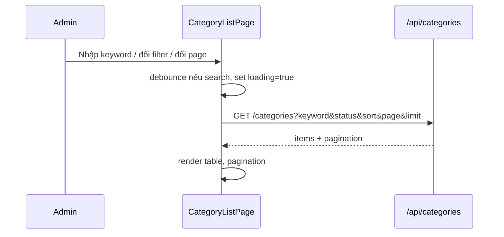
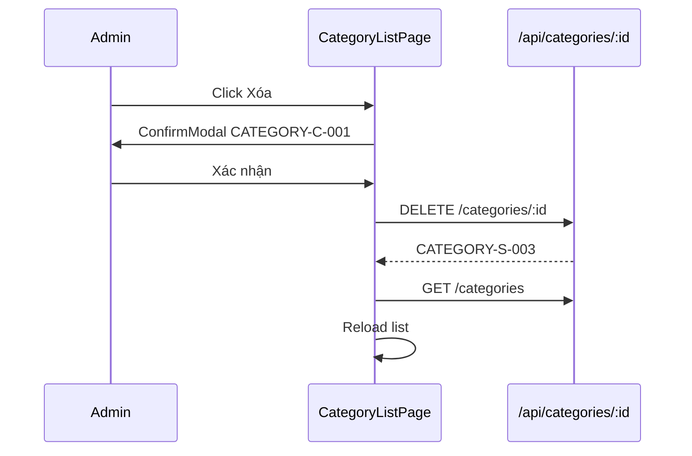

# [Design][SCREEN] ADMIN_CATEGORY_LIST_QuanLyDanhMuc

## Change Log
| Ver | Ngày | Nội dung | Người tạo |
|-----|------|----------|----------|
| 1.1 | 2026-06-04 | Bổ sung filter/sort/pagination, metadata danh mục, SEO, trạng thái hiển thị và soft delete | GitHub Copilot |
| 1.2 | 2026-06-04 | Điều chỉnh toolbar Search/Reset thủ công, chuyển AddForm sang modal, bổ sung Export CSV theo điều kiện hiện tại bằng cách tải tuần tự page `limit=100` | GitHub Copilot |
| 1.3 | 2026-06-04 | Đổi page size mặc định màn quản lý danh mục từ 10 xuống 5 record/page để pagination hiển thị rõ hơn | GitHub Copilot |
| 1.4 | 2026-06-05 | Đồng bộ layout code: bỏ checkbox chọn dòng, rút gọn cột table để tránh scroll ngang, chuẩn hóa nút `Export CSV` và `+ Tạo mới`, dùng popup `Xem` cho thông tin chi tiết | GitHub Copilot |

## 1. Tổng quan
Trang quản lý danh mục bài viết. Chỉ Admin mới truy cập được. Cho phép xem danh sách có filter/sort/phân trang, thêm mới bằng modal, sửa inline, xem chi tiết bằng popup, xóa mềm và export CSV theo điều kiện tìm kiếm hiện tại. Grid chỉ hiển thị các cột chính để hạn chế scroll ngang; field đầy đủ xem trong popup `Xem`.

## 2. Thông tin chung

| Thuộc tính | Giá trị |
|-----------|---------|
| Route | `/admin/categories` |
| Auth yêu cầu | Có (role: admin) |
| Redirect nếu chưa login | `/admin/login` |
| URL Params | Không có |

## 3. Navigation

### Vào từ đâu
| Nguồn | Điều kiện |
|-------|----------|
| Sidebar Admin | Click "Danh Mục" |
| `ProtectedRoute` | Đã login với role `admin` |

### Đi đến đâu
| Hành động | Destination |
|----------|------------|
| Member truy cập | Redirect `/admin/dashboard` (403 guard) |
| Token hết hạn / Lỗi 401 | Redirect `/admin/login` |

## 4. Layout & Components

```jsx
<AdminLayout>
  <AdminPageLayout title="Quản Lý Danh Mục">
    <HeaderActions />     {/* Export CSV, + Tạo mới */}
    <DataToolbar />       {/* Search input + filter status */}
    <DataTable />         {/* Cột chính: Tên, Slug, Trạng thái, Số bài, Hành động */}
    <AddCategoryModal />  {/* Modal tạo mới */}
    <CategoryDetailModal /> {/* Popup Xem thông tin đầy đủ */}
    <DeleteModal />       {/* Modal xác nhận xóa */}
  </AdminPageLayout>
</AdminLayout>
```

Components dùng lại: `AdminLayout`, `AdminPageLayout`, `DataToolbar`, `DataTable`, `ProtectedRoute` (role: admin), `ConfirmModal`, `ErrorBanner`, `LoadingSpinner`.

## 5. Ma trận trạng thái UI

| Trạng thái | Search/Filter | Export CSV | Nút `+ Tạo mới` | Nút Xem | Nút Sửa | Nút Xóa | Pagination |
|------------|---------------|------------|-----------------|---------|---------|--------|------------|
| Init | Enable | Enable nếu có dữ liệu | Enable nút mở modal | Enable | Enable | Enable | Enable nếu `totalPages > 1` |
| Loading list | Disable | Disable | Disable | Disable | Disable | Disable | Disable |
| Submitting add/edit/delete | Disable | Disable | Disable | Disable | Disable | Disable | Disable |
| Empty | Enable | Disable | Enable | Ẩn | Ẩn | Ẩn | Ẩn |
| No permission | Ẩn | Ẩn | Ẩn | Ẩn | Ẩn | Ẩn | Ẩn |

## 6. Chi tiết UI từng section

### 6.1 CategoryToolbar
| UI Control | Loại | I/O | Ràng buộc | Giá trị khởi tạo | Nguồn dữ liệu | Event ID | JSON Field mapping | Ghi chú |
|------------|------|-----|-----------|------------------|---------------|----------|--------------------|---------|
| Tìm kiếm | Input text | Input | Max 100 ký tự | `''` | User input | E01 | `keyword` | Tìm theo `name`, `slug` |
| Trạng thái | Select | Input | `all`, `active`, `hidden` | `all` | Static options | E02 | `status` | Lọc trạng thái hiển thị |
| Sắp xếp | Select | Input | `created_at_desc`, `name_asc`, `post_count_desc`, `view_count_desc`, `latest_post_desc` | `created_at_desc` | Static options | E03 | `sort` | Sort server-side |
| Nút Search | Button | Input | Disabled khi loading | N/A | N/A | E04 | N/A | Áp dụng keyword/filter/sort và page về 1 |
| Nút Reset | Button | Input | N/A | N/A | N/A | E05 | N/A | Clear keyword/filter/sort về mặc định rồi gọi lại API14 page 1 |
| Nút Export CSV | Button | Input | Disabled khi loading/submitting | N/A | N/A | E11 | Query hiện tại | Export danh sách theo điều kiện search/filter/sort hiện tại |
| Nút `+ Tạo mới` | Button | Input | Disabled khi loading/submitting | N/A | N/A | E06 | N/A | Mở AddCategoryModal |

### 6.2 AddCategoryModal
| UI Control | Loại | I/O | Ràng buộc | Giá trị khởi tạo | Nguồn dữ liệu | Event ID | JSON Field mapping | Ghi chú |
|------------|------|-----|-----------|------------------|---------------|----------|--------------------|---------|
| Tên | Input text | Input | Bắt buộc, min 2 ký tự | `''` | User input | E06 | `name` | |
| Slug | Input text | Input | Bắt buộc, a-z, 0-9, `-` | `''` | Auto `toSlug(name)` | E06 | `slug` | Auto-generate từ Tên, cho phép sửa tay |
| Mô tả | Textarea | Input | Max 500 ký tự | `''` | User input | E06 | `description` | |
| Trạng thái | Select | Input | `active`, `hidden` | `active` | Static options | E06 | `status` | `hidden` không hiển thị public |
| Thumbnail | Input URL | Input | Max 255 ký tự | `''` | User input/upload URL | E06 | `thumbnail_url` | Ảnh đại diện danh mục |
| SEO Title | Input text | Input | Max 70 ký tự | `''` | User input | E06 | `seo_title` | Tối ưu title trang danh mục |
| SEO Description | Textarea | Input | Max 160 ký tự | `''` | User input | E06 | `seo_description` | Tối ưu meta description |
| Nút Thêm | Button | Input | Disabled khi loading/form invalid | N/A | N/A | E06 | N/A | Create xong đóng modal, reload page hiện tại theo điều kiện search hiện tại |
| Nút Hủy | Button | Input | Disabled khi submitting | N/A | N/A | E06 | N/A | Đóng modal |

### 6.3 CategoryTable & Inline Edit
| UI Control | Loại | I/O | Ràng buộc | Giá trị khởi tạo | Nguồn dữ liệu | Event ID | JSON Field mapping | Ghi chú |
|------------|------|-----|-----------|------------------|---------------|----------|--------------------|---------|
| Tên (View) | Text | Output | N/A | N/A | API14 | N/A | `name` | |
| Slug (View) | Text | Output | N/A | N/A | API14 | N/A | `slug` | |
| Trạng thái (View/Edit) | Badge/Select | Input/Output | `active`, `hidden` | Row value | API14/User input | E07 | `status` | Badge xanh/xám |
| Số bài | Text | Output | N/A | N/A | API14 | N/A | `postCount` | Tổng bài chưa xóa |
| Hành động: Xem | Button | Input | Disabled khi busy | N/A | Row | E12 | Row object | Mở popup chi tiết chứa mô tả, lượt xem, người tạo, bài mới nhất, SEO, ngày tạo/cập nhật |
| Hành động: Sửa | Button | Input | Disabled khi busy | N/A | Row | E07 | Row object | Sửa inline các field chính/metadata |
| Hành động: Xóa | Button | Input | Disabled khi busy | N/A | Row | E10 | `id` | Mở DeleteModal |

### 6.4 DeleteModal
- Text dùng `CATEGORY-C-001`: "Xóa mềm danh mục này? Danh mục sẽ bị ẩn khỏi danh sách public nhưng dữ liệu bài viết vẫn được giữ."
- Nút "Xóa" (`bg-red-500`) + Nút "Hủy"

## 7. API Calls

| # | Endpoint | Method | Khi nào gọi | Auth |
|---|---------|--------|------------|------|
| 1 | `/api/categories?keyword=&status=&sort=&page=&limit=` | GET | On mount, đổi filter/sort/page | Admin cho màn admin |
| 2 | `/api/categories` | POST | Submit AddForm | Admin |
| 3 | `/api/categories/:id` | PUT | Submit inline edit | Admin |
| 4 | `/api/categories/:id` | DELETE | Confirm xóa mềm | Admin |
| 5 | `/api/categories?keyword=&status=&sort=&page=n&limit=100` | GET | Click Export CSV, tải tuần tự các page theo `pagination.totalPages` | Admin |

```js
// Load danh sách
const { data } = await api.get('/categories', { params: { keyword, status, sort, page, limit } });
// data: { items: [{ id, name, slug, description, status, thumbnail_url, seo_title, seo_description, postCount, viewCount, createdByName, latestPost, created_at, updated_at }], pagination: { page, limit, totalItems, totalPages } }

// Thêm mới trong modal
await api.post('/categories', { name, slug, description, status, thumbnail_url, seo_title, seo_description });

// Cập nhật
await api.put(`/categories/${id}`, { name, slug, description, status, thumbnail_url, seo_title, seo_description });

// Xóa mềm
await api.delete(`/categories/${id}`);
```

> API14 Danh sách: [[Design][API] API14_Categories_DanhSach.md](../api/[Design][API]%20API14_Categories_DanhSach.md)
> API16 Tạo: [[Design][API] API16_Categories_Tao.md](../api/[Design][API]%20API16_Categories_Tao.md)
> API17 Cập nhật: [[Design][API] API17_Categories_CapNhat.md](../api/[Design][API]%20API17_Categories_CapNhat.md)
> API18 Xóa: [[Design][API] API18_Categories_Xoa.md](../api/[Design][API]%20API18_Categories_Xoa.md)

### Request Mapping
| Event ID | API | Query/Body mapping |
|----------|-----|--------------------|
| E01/E02/E03/E04/E09 | API14 | `keyword`, `status`, `sort`, `page`, `limit` |
| E06 | API16 | `addForm` -> body |
| E08 | API17 | `editForm` -> body |
| E10 | API18 | `id` -> path param |

### Response Mapping
| API | UI State |
|-----|----------|
| API14 | `categories`, `pagination` |
| API16/API17/API18 | Toast success, reload list theo điều kiện search/filter/sort hiện tại |

## 8. State Management

```js
const [categories, setCategories] = useState([]);
const [loading, setLoading] = useState(true);
const [keyword, setKeyword] = useState('');
const [searchDraft, setSearchDraft] = useState('');
const [statusFilter, setStatusFilter] = useState('all');
const [sort, setSort] = useState('created_at_desc');
const [pagination, setPagination] = useState({ page: 1, limit: 5, totalItems: 0, totalPages: 1 });
const [addModalOpen, setAddModalOpen] = useState(false);
const [editingId, setEditingId] = useState(null);
const [editForm, setEditForm] = useState({ name: '', slug: '', description: '', status: 'active', thumbnail_url: '', seo_title: '', seo_description: '' });
const [addForm, setAddForm] = useState({ name: '', slug: '', description: '', status: 'active', thumbnail_url: '', seo_title: '', seo_description: '' });
const [deleteModal, setDeleteModal] = useState({ open: false, id: null });
```

## 9. Xử lý lỗi & Edge Cases

| Tình huống | HTTP Status | Component hiển thị | Xử lý |
|-----------|-------------|--------------------|-------|
| Slug trùng | 409 | InlineError dưới field slug | Dùng `CATEGORY-E-002` |
| Validate fail | 400/422 | InlineError/Toast | Dùng `CATEGORY-E-001`, highlight field lỗi |
| Xóa danh mục có bài | 200 | ConfirmModal/Toast | Soft delete category, bài viết vẫn giữ `category_id`; public API bỏ qua category đã xóa |
| API lỗi 403 | 403 | Toast + Redirect | Dùng `CATEGORY-E-004`, redirect `/admin/dashboard` |
| Danh sách rỗng | 200 | EmptyState | Dùng `CATEGORY-I-001` |
| Inline edit đang mở, click Sửa dòng khác | N/A | Row state | Hủy edit cũ, mở edit mới |
| Filter không có kết quả | 200 | EmptyState | Hiển thị "Không tìm thấy danh mục phù hợp" |

## 10. Responsive

| Breakpoint | Layout |
|-----------|--------|
| Mobile (< 768px) | Toolbar stack dọc, table chỉ giữ cột chính; chi tiết xem qua popup `Xem` |
| Tablet (768–1024px) | Toolbar 2 hàng, table không dùng checkbox chọn dòng |
| Desktop (> 1024px) | Full layout với AdminLayout sidebar |

## 11. Events & Actions

| Event ID | Tên | Control | Trigger | API | Mô tả |
|----------|-----|---------|---------|-----|-------|
| E01 | Change search draft | Tìm kiếm | `onChange` | N/A | Chỉ cập nhật input, chưa gọi API |
| E02 | Filter status | Trạng thái | `onChange` | N/A | Cập nhật filter, chờ bấm Search |
| E03 | Sort list | Sắp xếp | `onChange` | N/A | Cập nhật sort, chờ bấm Search |
| E04 | Search category | Nút Search / Enter | `onClick` / `onKeyDown` | API14 | Áp dụng điều kiện, page về 1 |
| E05 | Reset filter | Nút Reset | `onClick` | API14 | Clear filter/sort mặc định rồi search lại |
| E06 | Create category | Modal Thêm | `onSubmit` | API16 | Tạo mới, đóng modal, reload page hiện tại theo điều kiện hiện tại |
| E07 | Start edit | Nút Sửa | `onClick` | N/A | Copy row vào editForm |
| E08 | Save edit | Nút Lưu | `onClick` | API17 | Cập nhật, reload page hiện tại theo điều kiện hiện tại |
| E09 | Change page | Pagination | `onPageChange` | API14 | Load trang mới |
| E10 | Soft delete | Modal Xóa | `onConfirm` | API18 | Soft delete, reload page hiện tại theo điều kiện hiện tại |
| E11 | Export CSV | Nút Export CSV | `onClick` | API14 | Export CSV danh sách theo điều kiện hiện tại; gọi tuần tự API14 với `limit=100` để tuân thủ validate BE |





## 12. Message List

**Master action sync**

- Table action chuẩn cho master: `Xem`, `Sửa`, `Xóa`.
- Button `Xem` mở detail modal từ dữ liệu row hiện tại hoặc API detail nếu cần.
- Toolbar/header actions giữ cùng pattern với User/Post: Search, filter, Export CSV, `+ Tạo mới`.


| MessageId | Loại | Nội dung | Component hiển thị | Điều kiện |
|-----------|------|----------|--------------------|-----------|
| CATEGORY-E-001 | E | Dữ liệu danh mục không hợp lệ | InlineError / Toast | Validate fail |
| CATEGORY-E-002 | E | Slug danh mục đã tồn tại | InlineError | API 409 |
| CATEGORY-E-003 | E | Danh mục không tồn tại | Toast | API 404 |
| CATEGORY-E-004 | E | Bạn không có quyền quản lý danh mục | Toast / Redirect | API 403 |
| CATEGORY-S-001 | S | Tạo danh mục thành công | Toast | API16 success |
| CATEGORY-S-002 | S | Cập nhật danh mục thành công | Toast | API17 success |
| CATEGORY-S-003 | S | Xóa danh mục thành công | Toast | API18 success |
| CATEGORY-C-001 | C | Xóa mềm danh mục này? Danh mục sẽ bị ẩn khỏi danh sách public nhưng dữ liệu bài viết vẫn được giữ. | ConfirmModal | Click xóa |
| CATEGORY-I-001 | I | Chưa có danh mục nào. Hãy thêm danh mục đầu tiên! | EmptyState | Danh sách rỗng |
