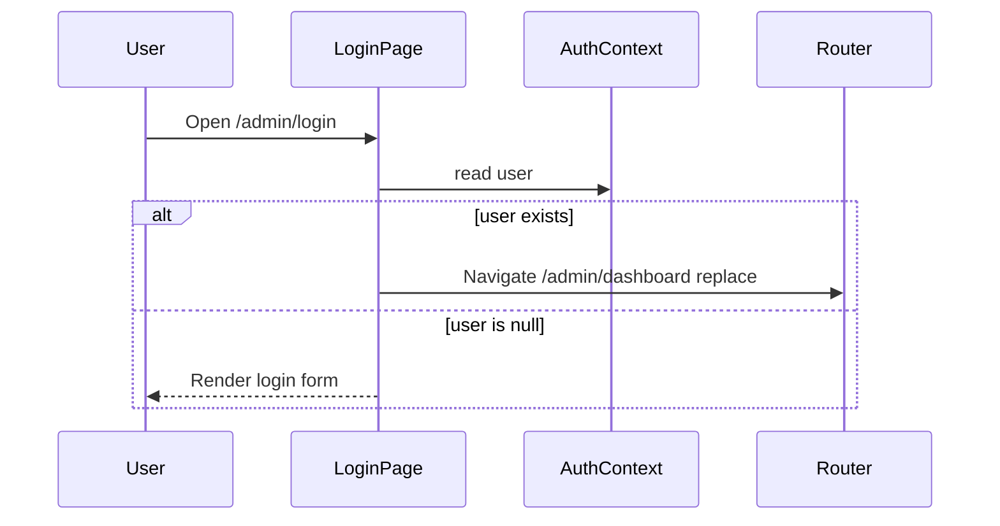
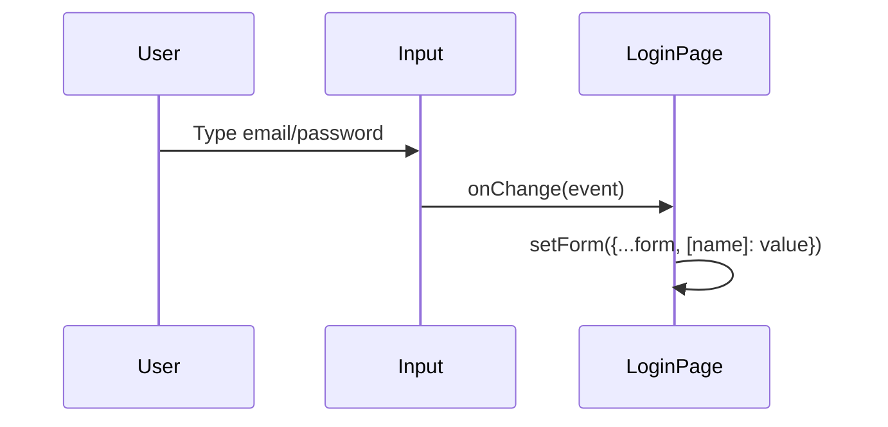
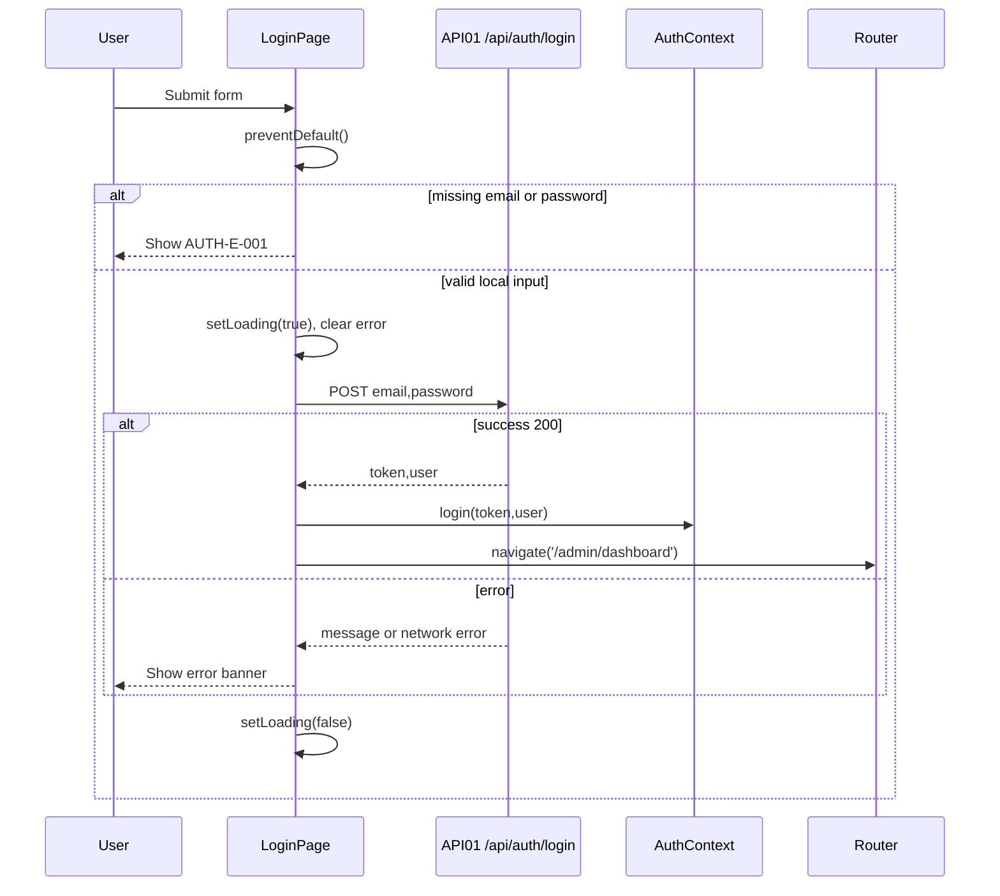

# [Design][SCREEN] ADMIN_LOGIN_DangNhap

## Change Log

| Ver | Nội dung | Ngày | Người tạo |
|-----|----------|------|-----------|
| 1.0 | Tạo tài liệu ban đầu cho màn hình đăng nhập | 2026-06-03 | GitHub Copilot |
| 1.1 | Chuẩn hóa 12 sections, bổ sung state matrix, mappings, events, message list | 2026-06-04 | GitHub Copilot |
| 1.2 | Đồng bộ Message List với common Message Catalog và API `messageId` | 2026-06-04 | GitHub Copilot |
| 1.3 | Làm rõ component registry là định hướng tái sử dụng, code hiện tại render inline Tailwind | 2026-06-04 | GitHub Copilot |
| 1.4 | Tắt native browser validation tiếng Anh, chuyển sang validation message tiếng Việt qua Message Catalog | 2026-06-04 | GitHub Copilot |
| 1.5 | Đồng bộ mô tả input constraint với code `noValidate` và custom validation trong React | 2026-06-04 | GitHub Copilot |

## 1. Tổng quan

Màn hình `ADMIN_LOGIN` cho phép người dùng role `admin` hoặc `member` đăng nhập vào khu vực quản trị Blog Du Lịch. Khi đăng nhập thành công, frontend lưu JWT và thông tin user thông qua `AuthContext`, sau đó điều hướng tới `/admin/dashboard`. Nếu người dùng đã có trạng thái đăng nhập trong context, màn hình tự redirect và không hiển thị form.

## 2. Thông tin chung

| Thuộc tính | Giá trị |
|------------|---------|
| Route | `/admin/login` |
| Auth yêu cầu | Không |
| Redirect | Nếu `user` tồn tại trong `AuthContext` → `/admin/dashboard`; đăng nhập thành công → `/admin/dashboard` |
| Params | Không có URL params, query params hoặc route state bắt buộc |

## 3. Navigation

### Vào từ đâu

| Nguồn | Điều kiện | Ghi chú |
|-------|-----------|---------|
| Direct URL | Người dùng truy cập `/admin/login` | Public route |
| `ProtectedRoute` | Người dùng chưa đăng nhập khi truy cập route `/admin/*` được bảo vệ | Guard redirect về `/admin/login` |
| Logout từ admin area | Sau khi token/user bị xóa khỏi client state | Code hiện tại `logout()` điều hướng về `/`, sau đó user có thể vào lại login |

### Đi đến đâu

| Hành động | Destination | Điều kiện |
|-----------|-------------|-----------|
| Auto redirect | `/admin/dashboard` | `user` đã tồn tại trong `AuthContext` |
| Đăng nhập thành công | `/admin/dashboard` | API `POST /api/auth/login` trả `token` và `user` hợp lệ |
| Tiếp tục ở màn hình hiện tại | `/admin/login` | Validation client fail hoặc API trả lỗi |

## 4. Layout & Components

```jsx
<main className="min-h-screen bg-gray-50 flex items-center justify-center px-4">
  <section className="bg-white rounded-2xl shadow-lg p-10 w-full max-w-md">
    <header className="text-center mb-8">
      <h1>Blog Du Lịch</h1>
      <p>Quản lý nội dung</p>
    </header>
    <ErrorBanner message={error} />
    <form onSubmit={handleSubmit}>
      <input name="email" type="email" />
      <input name="password" type="password" />
      <button type="submit">
        <LoadingSpinner />
        Đăng Nhập
      </button>
    </form>
  </section>
</main>
```

Ghi chú implementation: JSX tree trên thể hiện cấu trúc logic và các component tái sử dụng theo registry. Code hiện tại trong `LoginPage.jsx` vẫn render phần lỗi và spinner trực tiếp bằng Tailwind; khi tách UI dùng chung, có thể thay bằng `ErrorBanner` và `LoadingSpinner` mà không đổi luồng xử lý.

| Component / Hook | Registry | Cách dùng trong màn hình |
|------------------|----------|--------------------------|
| `AuthContext` / `useAuth()` | `demo_docs/fe/[Design][LIST] COMPONENT_DanhSach.md` | Lấy `user`, gọi `login(token, user)` sau khi API thành công |
| `ErrorBanner` | `demo_docs/fe/[Design][LIST] COMPONENT_DanhSach.md` | Component registry dự kiến/tái sử dụng để hiển thị lỗi phía trên form; implementation hiện tại tương đương bằng markup Tailwind inline |
| `LoadingSpinner` | `demo_docs/fe/[Design][LIST] COMPONENT_DanhSach.md` | Component registry dự kiến/tái sử dụng để hiển thị spinner khi `loading=true`; implementation hiện tại tương đương bằng `<span>` Tailwind inline |
| `Navigate`, `useNavigate` | React Router v6 | Redirect khi đã login hoặc login thành công |
| `api` | `demo_docs/fe/[Design][LIST] UTILS_DanhSach.md` | Axios instance gọi `api.post('/auth/login', form)` |

## 5. Ma trận trạng thái UI

| Trạng thái | Email input | Password input | Button Đăng Nhập | Error Banner | Spinner | Điều hướng |
|------------|-------------|----------------|------------------|--------------|---------|------------|
| Init | Enable | Enable | Enable | Ẩn | Ẩn | Không |
| Client validation error | Enable | Enable | Enable | Hiện message `AUTH-E-001`, `AUTH-E-004` hoặc `AUTH-E-005` | Ẩn | Không |
| Loading | Enable | Enable | Disabled | Ẩn nếu chưa có lỗi mới | Hiện | Không |
| API error | Enable | Enable | Enable | Hiện message từ API hoặc fallback | Ẩn | Không |
| Authenticated | Không render | Không render | Không render | Không render | Không render | Redirect `/admin/dashboard` |
| No-permission | Không áp dụng | Không áp dụng | Không áp dụng | Không áp dụng | Không áp dụng | Phân quyền xử lý ở các route sau login |

## 6. Chi tiết UI từng section

| Control | Loại | I/O | Ràng buộc | Giá trị khởi tạo | Nguồn dữ liệu | Event ID | JSON Field | Ghi chú |
|---------|------|-----|-----------|------------------|---------------|----------|------------|---------|
| Page Container | Layout | Output | Full height, căn giữa, nền `bg-gray-50`, padding ngang `px-4` | Render mặc định | Static JSX | Không có | N/A | Wrapper toàn màn hình |
| Login Card | Layout | Output | `rounded-2xl`, `shadow-lg`, `p-10`, `w-full`, `max-w-md` | Render mặc định | Static JSX | Không có | N/A | Card chứa logo, lỗi và form |
| Logo Title | Text | Output | Text `Blog Du Lịch`, màu amber, font bold | `Blog Du Lịch` | Static content | Không có | N/A | Tiêu đề thương hiệu |
| Logo Subtitle | Text | Output | Text `Quản lý nội dung`, màu xám | `Quản lý nội dung` | Static content | Không có | N/A | Mô tả khu vực quản trị |
| Error Banner | Alert | Output | Chỉ hiển thị khi `error` khác rỗng | `''` | State `error` | Không có | N/A | Hiển thị validation/API error |
| Email Label | Label | Output | Gắn với input email về mặt hiển thị | `Email` | Static content | Không có | N/A | Label hiện tại chưa dùng `htmlFor` |
| Email Input | Input text/email | Input | Bắt buộc, format email do React validate; native browser validation bị tắt bằng `noValidate` | `''` | State `form.email` | E01 | `email` | Placeholder `admin@hoianblog.vn` |
| Password Label | Label | Output | Gắn với input password về mặt hiển thị | `Mật khẩu` | Static content | Không có | N/A | Label hiện tại chưa dùng `htmlFor` |
| Password Input | Input password | Input | Bắt buộc, tối thiểu 6 ký tự do React validate; không dùng tooltip native browser | `''` | State `form.password` | E01 | `password` | Placeholder `••••••••` |
| Button Đăng Nhập | Button submit | Input | Disabled khi `loading=true` | Text `Đăng Nhập` | State `loading` | E02 | N/A | Khi loading đổi text `Đang đăng nhập...` |
| Button Spinner | Icon | Output | Hiển thị khi `loading=true` | Ẩn | State `loading` | Không có | N/A | Spinner CSS Tailwind |

## 7. API Calls

| API ID | Endpoint | Method | Event ID | Auth | API Doc |
|--------|----------|--------|----------|------|---------|
| API01 | `/api/auth/login` | POST | E02 | Không | [[Design][API] API01_Auth_DangNhap.md](../api/[Design][API]%20API01_Auth_DangNhap.md) |

### Request Mapping

| UI Field / State | JSON Field | Kiểu dữ liệu | Bắt buộc | Ràng buộc | Ghi chú |
|------------------|------------|--------------|----------|-----------|---------|
| `form.email` | `email` | String | Có | Không rỗng, format email hợp lệ theo custom React validation | API trả 400 nếu thiếu; FE chặn format sai trước khi gọi API |
| `form.password` | `password` | String | Có | Không rỗng, tối thiểu 6 ký tự theo custom React validation | API trả 400 nếu thiếu; FE chặn password ngắn trước khi gọi API |

```js
await api.post('/auth/login', {
  email: form.email,
  password: form.password,
});
```

### Response Mapping

| API Field | UI/State đích | Kiểu dữ liệu | Ghi chú |
|-----------|---------------|--------------|---------|
| `token` | `localStorage.token` thông qua `login(data.token, data.user)` | String | JWT access token |
| `user.id` | `AuthContext.user.id`, `localStorage.user.id` | Number | ID người dùng |
| `user.name` | `AuthContext.user.name`, `localStorage.user.name` | String | Tên hiển thị |
| `user.email` | `AuthContext.user.email`, `localStorage.user.email` | String | Email người dùng |
| `user.role` | `AuthContext.user.role`, `localStorage.user.role` | String | `admin` hoặc `member` |
| `messageId` khi lỗi | `parseApiError(err)` → text hiển thị | String | Ưu tiên map theo Message Catalog |
| `message` khi lỗi | `parseApiError(err)` fallback | String | Dùng khi `messageId` chưa có mapping |

## 8. State Management

```js
const { user, login } = useAuth();
const navigate = useNavigate();
const [form, setForm] = useState({ email: '', password: '' });
const [loading, setLoading] = useState(false);
const [error, setError] = useState('');

if (user) return <Navigate to="/admin/dashboard" replace />;

const handleChange = (e) => {
  setForm((f) => ({ ...f, [e.target.name]: e.target.value }));
};

const handleSubmit = async (e) => {
  e.preventDefault();
  if (!form.email || !form.password) {
    setError(parseApiError({ response: { data: { messageId: 'AUTH-E-001' } } }));
    return;
  }
  if (!emailPattern.test(form.email)) {
    setError(getMessage('AUTH-E-004'));
    return;
  }
  if (form.password.length < 6) {
    setError(getMessage('AUTH-E-005'));
    return;
  }
  setLoading(true);
  setError('');
  try {
    const { data } = await api.post('/auth/login', form);
    login(data.token, data.user);
    navigate('/admin/dashboard');
  } catch (err) {
    setError(parseApiError(err, 'AUTH-E-003'));
  } finally {
    setLoading(false);
  }
};
```

## 9. Xử lý lỗi & Edge Cases

| HTTP Status | Nguồn xử lý | Tình huống | Component hiển thị | Message ID | Xử lý |
|-------------|-------------|------------|--------------------|------------|-------|
| N/A | Màn hình tự xử lý | Thiếu `email` hoặc `password` trước khi submit | Error Banner | AUTH-E-001 | Không gọi API, giữ nguyên màn hình |
| N/A | Màn hình tự xử lý | `email` sai định dạng trước khi submit | Error Banner | AUTH-E-004 | Không gọi API, giữ nguyên màn hình |
| N/A | Màn hình tự xử lý | `password` dưới 6 ký tự trước khi submit | Error Banner | AUTH-E-005 | Không gọi API, giữ nguyên màn hình |
| 400 | Màn hình tự xử lý từ API response | API báo thiếu email/password | Error Banner | AUTH-E-001 | Hiển thị text từ Message Catalog |
| 401 | Màn hình tự xử lý từ API response | Email không tồn tại hoặc sai mật khẩu | Error Banner | AUTH-E-002 | Hiển thị text từ Message Catalog |
| 500 | Màn hình tự xử lý fallback | Lỗi server hoặc lỗi không có `response.data.message` | Error Banner | AUTH-E-003 | Hiển thị fallback từ Message Catalog |
| Network error | Axios/interceptor + màn hình fallback | Không kết nối được API | Error Banner | AUTH-E-003 | Hiển thị fallback từ Message Catalog |
| N/A | React Router | `user` đã tồn tại | Không hiển thị form | AUTH-I-001 | `<Navigate to="/admin/dashboard" replace />` |
| N/A | Button state | Double submit khi đang loading | Button | Không có | Button disabled khi `loading=true` |

Ghi chú phân tách trách nhiệm: interceptor trong `api` gắn token cho request có auth; riêng màn hình này là public API nên tự xử lý toàn bộ lỗi hiển thị bằng state `error`.

## 10. Responsive

| Breakpoint | Layout | Card | Form Controls | Ghi chú |
|------------|--------|------|---------------|---------|
| Mobile `< 768px` | Căn giữa, padding ngang `16px` | `w-full`, tối đa theo viewport | Input/button full width | Phù hợp code `px-4`, `w-full`, `max-w-md` |
| Tablet `768px - 1024px` | Căn giữa | `max-w-md` | Input/button full width | Không cần layout hai cột |
| Desktop `> 1024px` | Căn giữa trên nền xám | `max-w-md`, padding `p-10` | Input/button full width | Ưu tiên tập trung vào form |

## 11. Events & Actions

| Event ID | Tên | Control | Trigger | API | Mô tả |
|----------|-----|---------|---------|-----|-------|
| E00 | Auto redirect nếu đã login | Page | Render | Không | Nếu `user` tồn tại, trả về `<Navigate />` |
| E01 | Cập nhật form | Email Input, Password Input | `onChange` | Không | Cập nhật state theo `e.target.name` |
| E02 | Submit đăng nhập | Form/Button | `onSubmit` | API01 | Validate client, gọi API, lưu auth state, redirect |

### E00 — Auto redirect nếu đã login



### E01 — Cập nhật form



### E02 — Submit đăng nhập



## 12. Message List

| MessageId | Loại (E/C/S/I) | Nội dung | Component hiển thị | Điều kiện |
|-----------|----------------|----------|--------------------|-----------|
| AUTH-E-001 | E | `Email và mật khẩu là bắt buộc` | Error Banner | User submit thiếu field hoặc API trả HTTP 400 |
| AUTH-E-002 | E | `Email hoặc mật khẩu không đúng` | Error Banner | API trả HTTP 401 |
| AUTH-E-003 | E | `Đăng nhập thất bại` | Error Banner | API/network error không có message chi tiết |
| AUTH-E-004 | E | `Email không đúng định dạng` | Error Banner | User submit email sai định dạng phía client |
| AUTH-E-005 | E | `Mật khẩu tối thiểu 6 ký tự` | Error Banner | User submit password dưới 6 ký tự phía client |
| AUTH-I-001 | I | `Tự động chuyển tới dashboard` | Router redirect | `user` đã tồn tại trong `AuthContext` |
| AUTH-S-001 | S | `Đăng nhập thành công` | Không hiển thị toast; redirect tới dashboard | API trả HTTP 200 |
| AUTH-C-001 | C | `Xác nhận gửi thông tin đăng nhập` | Không hiển thị confirm | User submit form |

Nguồn chuẩn: [`[Design][COMMON] MESSAGE_Catalog.md`](../[Design][COMMON]%20MESSAGE_Catalog.md).
