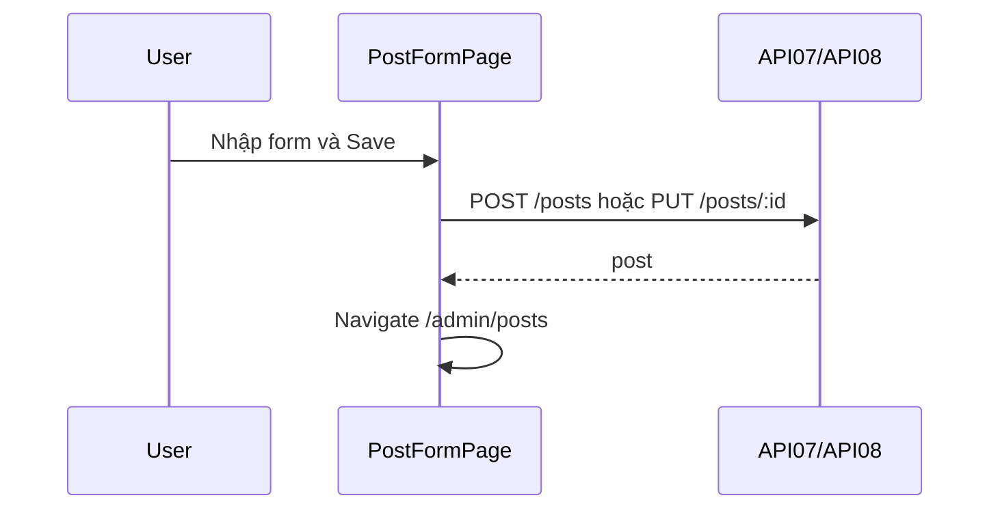

# [Design][SCREEN] ADMIN_POST_FORM_TaoSuaBai

## Change Log
| Ver | Ngày | Nội dung | Người tạo |
|---|---|---|---|
| 1.1 | 2026-06-05 | Chuẩn hóa 12 sections, đồng bộ `PostFormPage.jsx` | docs-agent |
| 1.2 | 2026-06-06 | Bổ sung Category và Tags vào form | AI |

## 1. Tổng quan
Form tạo/sửa bài viết. Code hiện tại dùng input title, slug, textarea content HTML, select status, select category và multi-select tags; submit về API07 hoặc API08.

## 2. Thông tin chung
| Thuộc tính | Giá trị |
|---|---|
| Route tạo | `/admin/posts/new` |
| Route sửa | `/admin/posts/:id/edit` |
| Auth yêu cầu | Có (admin/member) |
| Redirect sau submit | `/admin/posts` |
| URL Params | `id` khi sửa |

## 3. Navigation
| Vào từ đâu | Điều kiện |
|---|---|
| ADMIN_POST_LIST New/Edit | Đã login |

| Đi đến đâu | Destination |
|---|---|
| Submit thành công | `/admin/posts` |

## 4. Layout & Components
```jsx
<AdminLayout>
  <PostForm>
    <TitleInput />
    <SlugInput />
    <CategorySelect />
    <TagsMultiSelect />
    <ContentTextarea />
    <StatusSelect />
    <SaveButton />
  </PostForm>
</AdminLayout>
```
Components dùng lại theo target master: `AdminLayout`, `ProtectedRoute`, `ErrorBanner`, `LoadingSpinner`. Code hiện tại render form trực tiếp.

## 5. Ma trận trạng thái UI
| Trạng thái | Input | Save | Loading |
|---|---|---|---|
| Create init | Enable | Enable | Ẩn |
| Edit loading | Disable target | Disable target | Hiển thị target |
| Editing loaded | Enable | Enable | Ẩn |
| Saving | Disable target | Disable target | Hiển thị target |
| Error | Enable | Enable | Ẩn |

## 6. Chi tiết UI từng section
| Control | Loại | I/O | Ràng buộc | Giá trị khởi tạo | Nguồn dữ liệu | Event ID | JSON Field | Ghi chú |
|---|---|---|---|---|---|---|---|---|
| Title | Input | Input | API07 min 5 | `''` | User/API11 | E01 | `title` | Không auto slug trong code |
| Slug | Input | Input | lowercase/number/hyphen ở API07 | `''` | User/API11 | E01 | `slug` | |
| Category | Select | Input | Required ở API07 | `''` | User/API11/API14 | E01 | `category_id` | Lấy danh sách từ API14 |
| Tags | MultiSelect | Input | Array of numbers | `[]` | User/API11/API29 | E01 | `tag_ids` | Lấy danh sách từ API29 |
| Content | Textarea | Input | Required ở API07 | `''` | User/API11 | E01 | `content` | HTML string |
| Status | Select | Input | `draft/published` | `draft` | User/API11 | E01 | `status` | |
| Save | Button | Input | N/A | N/A | User | E03 | form | Submit |

## 7. API Calls
| Event ID | API | Endpoint | Khi gọi | Link |
|---|---|---|---|---|
| E02 | API11 | `GET /api/admin/posts/:id` | Khi edit để lấy chi tiết bài | [[Design][API] API11_AdminPosts_ChiTiet.md](../api/[Design][API]%20API11_AdminPosts_ChiTiet.md) |
| E03 | API07 | `POST /api/posts` | Submit create | [[Design][API] API07_Posts_TaoBai.md](../api/[Design][API]%20API07_Posts_TaoBai.md) |
| E04 | API08 | `PUT /api/posts/:id` | Submit edit | [[Design][API] API08_Posts_CapNhat.md](../api/[Design][API]%20API08_Posts_CapNhat.md) |
| E05 | API14 | `GET /api/categories` | Lấy danh sách danh mục | [[Design][API] API14_Categories_DanhSach.md](../api/[Design][API]%20API14_Categories_DanhSach.md) |
| E06 | API29 | `GET /api/admin/tags` | Lấy danh sách tags | [[Design][API] API29_AdminTags_DanhSach.md](../api/[Design][API]%20API29_AdminTags_DanhSach.md) |

### Request Mapping
| Event ID | Body/Path |
|---|---|
| E02 | Path `id` |
| E03 | `{ title, slug, content, status, category_id, tag_ids }` |
| E04 | Path `id`, body `form` |

### Response Mapping
| API Field | UI State |
|---|---|
| API11 response | `form` khi edit |
| API07/API08 response | Redirect `/admin/posts` |
| API14 response | Options cho CategorySelect |
| API29 response | Options cho TagsMultiSelect |

## 8. State Management
```js
const { id } = useParams();
const isEdit = Boolean(id);
const [form, setForm] = useState({ title: '', slug: '', content: '', status: 'draft', category_id: '', tag_ids: [] });
const [categories, setCategories] = useState([]);
const [tags, setTags] = useState([]);
```

## 9. Xử lý lỗi & Edge Cases
| Tình huống | HTTP Status | Component | Xử lý |
|---|---|---|---|
| Validate fail | 422 | Error target | `POST-E-004` |
| Không tìm thấy bài khi edit | 404 | Error target | Redirect về list hoặc báo lỗi |
| Submit thành công | 200/201 | Redirect | `/admin/posts` |

## 10. Responsive
| Breakpoint | Layout |
|---|---|
| Mobile | Form stack 1 cột |
| Desktop | Target theo master admin, form max width hiện tại `max-w-2xl` |

## 11. Events & Actions
| Event ID | Tên | Control | Trigger | API | Mô tả |
|---|---|---|---|---|---|
| E01 | Change form | Inputs | onChange | N/A | Cập nhật form |
| E02 | Load edit data | Page | Mount edit | API10 | Lấy list rồi find id |
| E03 | Create post | Save | Submit create | API07 | Tạo bài |
| E04 | Update post | Save | Submit edit | API08 | Cập nhật bài |



## 12. Message List
| MessageId | Loại | Nội dung | Component hiển thị | Điều kiện |
|---|---|---|---|---|
| POST-E-004 | E | Validation failed | InlineError/ErrorBanner target | Form invalid/API 422 |
| POST-E-005 | E | Không thể tải bài viết. Vui lòng thử lại. | ErrorBanner target | API lỗi |
| POST-S-001 | S | Tạo bài viết thành công | Toast target | Create success |
| POST-S-002 | S | Cập nhật bài viết thành công | Toast target | Update success |
