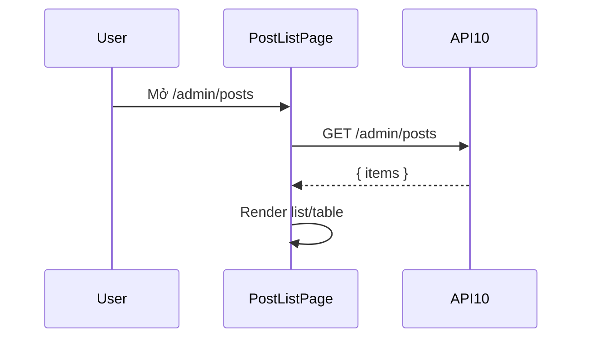

# [Design][SCREEN] ADMIN_POST_LIST_DanhSachBai

## Change Log
| Ver | Ngày | Nội dung | Người tạo |
|---|---|---|---|
| 1.1 | 2026-06-05 | Chuẩn hóa 12 sections, đồng bộ layout master và `PostListPage.jsx` | docs-agent |

## 1. Tổng quan
Màn quản lý bài viết trong admin. Code hiện tại hiển thị danh sách đơn giản từ API10 và link tạo/sửa bài. Layout target giữ pattern master: `AdminLayout`, toolbar, table/list, actions.

## 2. Thông tin chung
| Thuộc tính | Giá trị |
|---|---|
| Route | `/admin/posts` |
| Auth yêu cầu | Có (admin/member) |
| Redirect nếu chưa login | `/admin/login` |
| URL Params | Không có |

## 3. Navigation
| Vào từ đâu | Điều kiện |
|---|---|
| Sidebar Admin | Đã login |

| Đi đến đâu | Destination |
|---|---|
| Click New | `/admin/posts/new` |
| Click title | `/admin/posts/:id/edit` |

## 4. Layout & Components
```jsx
<AdminLayout>
  <PageHeader title="Quản Lý Bài Viết" />
  <PostToolbar />
  <PostTable>
    <PostRow />
  </PostTable>
  <Pagination />
</AdminLayout>
```
Components dùng lại: `AdminLayout`, `ProtectedRoute`, `Pagination`, `ConfirmModal`, `ErrorBanner`, `LoadingSpinner` theo pattern `ADMIN_CATEGORY_LIST`/`ADMIN_USER_LIST`. Code hiện tại đang render list đơn giản trong page.

## 5. Ma trận trạng thái UI
| Trạng thái | Toolbar | New | Row edit link | Pagination |
|---|---|---|---|---|
| Init | Enable | Enable | Enable nếu có row | Target ẩn nếu chưa phân trang |
| Loading | Disable | Disable | Disable | Disable |
| Empty | Enable | Enable | Ẩn | Ẩn |
| No permission | Ẩn | Ẩn | Ẩn | Ẩn |

## 6. Chi tiết UI từng section
| Control | Loại | I/O | Ràng buộc | Giá trị khởi tạo | Nguồn dữ liệu | Event ID | JSON Field | Ghi chú |
|---|---|---|---|---|---|---|---|---|
| Tiêu đề màn | Text | Output | N/A | `Posts` hiện tại | Static | N/A | N/A | Target text `Quản Lý Bài Viết` |
| New button | Link | Input | N/A | N/A | Static | E02 | N/A | `/admin/posts/new` |
| Post row title | Link | Output/Input | N/A | N/A | API10 | E03 | `title`, `id` | Link edit |
| Status | Text/Badge | Output | `draft/published` | N/A | API10 | N/A | `status` | Code hiện text |

## 7. API Calls
| Event ID | API | Endpoint | Khi gọi | Link |
|---|---|---|---|---|
| E01 | API10 | `GET /api/admin/posts` | On mount | [[Design][API] API10_AdminPosts_DanhSach.md](../api/[Design][API]%20API10_AdminPosts_DanhSach.md) |

### Request Mapping
| Event ID | Query |
|---|---|
| E01 | Không truyền query trong code hiện tại |

### Response Mapping
| API Field | UI State |
|---|---|
| `items` | `items` |

## 8. State Management
```js
const [items, setItems] = useState([]);
```

## 9. Xử lý lỗi & Edge Cases
| Tình huống | HTTP Status | Component | Xử lý |
|---|---|---|---|
| Chưa login | 401 | ProtectedRoute | Redirect login |
| Danh sách rỗng | 200 | EmptyState target | Dùng `POST-I-001` |
| API lỗi | 500/N/A | ErrorBanner target | Dùng `POST-E-005` |

## 10. Responsive
| Breakpoint | Layout |
|---|---|
| Mobile | List/table scroll ngang theo master target |
| Desktop | AdminLayout sidebar, table full width |

## 11. Events & Actions
| Event ID | Tên | Control | Trigger | API | Mô tả |
|---|---|---|---|---|---|
| E01 | Load admin posts | Page | Mount | API10 | Load danh sách |
| E02 | Create post | New | Click | N/A | Điều hướng form tạo |
| E03 | Edit post | Row title | Click | N/A | Điều hướng form sửa |



## 12. Message List
| MessageId | Loại | Nội dung | Component hiển thị | Điều kiện |
|---|---|---|---|---|
| POST-I-001 | I | Chưa có bài viết nào. | EmptyState | List rỗng |
| POST-E-005 | E | Không thể tải bài viết. Vui lòng thử lại. | ErrorBanner | API lỗi |
