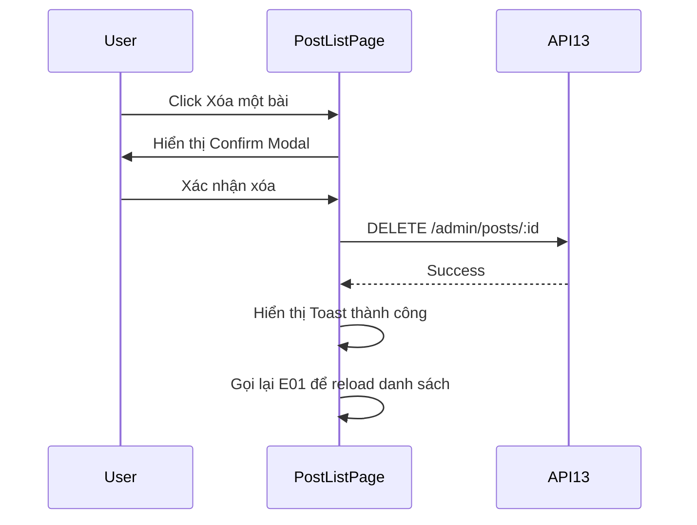

# [Design][SCREEN] ADMIN_POST_LIST_DanhSachBai

## Change Log
| Ver | Ngày | Nội dung | Người tạo |
|---|---|---|---|
| 1.1 | 2026-06-05 | Chuẩn hóa 12 sections, đồng bộ layout master và `PostListPage.jsx` | docs-agent |
| 1.2 | 2026-06-05 | Thêm các tính năng CMS ban đầu: Table columns, Filters, Row Actions, Bulk Actions | docs-agent |
| 1.3 | 2026-06-05 | Đồng bộ code hiện tại: bỏ checkbox/bulk actions, rút gọn cột table, thêm popup `Xem`, đổi `+ Tạo mới` sang modal tạo bài ngay tại list, thêm Export CSV | GitHub Copilot |

## 1. Tổng quan
Màn quản lý bài viết trong admin. Hiển thị danh sách bài viết dưới dạng bảng rút gọn gồm thông tin chính (Thumbnail, Title/Slug, Category, Status, Actions) để hạn chế scroll ngang. Hỗ trợ tìm kiếm, lọc, sắp xếp, phân trang, export CSV, xem chi tiết bằng popup, tạo mới bằng popup tại trang list, preview, edit, toggle status và xóa từng bài. Không hiển thị checkbox/bulk actions trong UI hiện tại.

## 2. Thông tin chung
| Thuộc tính | Giá trị |
|---|---|
| Route | `/admin/posts` |
| Auth yêu cầu | Có (admin/member) |
| Redirect nếu chưa login | `/admin/login` |
| URL Params | Không có |

## 3. Navigation
| Vào từ đâu | Điều kiện |
|---|---|
| Sidebar Admin | Đã login |

| Đi đến đâu | Destination |
|---|---|
| Click `+ Tạo mới` | Mở modal tạo bài tại `/admin/posts` |
| Click Edit | `/admin/posts/:id/edit` |
| Click Preview | `/posts/:slug` (Mở tab mới) |

## 4. Layout & Components
```jsx
<AdminLayout>
  <AdminPageLayout title="Quản Lý Bài Viết">
    <HeaderActions />     {/* Export CSV, + Tạo mới */}
    <DataToolbar />       {/* Search, category/status/author filters */}
    <DataTable />         {/* Cột chính: Bài viết, Danh mục, Trạng thái, Thao tác */}
    <CreatePostModal />
    <PostDetailModal />
  </AdminPageLayout>
</AdminLayout>
```
Components dùng lại: `AdminLayout`, `AdminPageLayout`, `DataToolbar`, `DataTable`, `ProtectedRoute`, `ConfirmModal`, `ErrorBanner`, `Toast`, `Pagination`.

## 5. Ma trận trạng thái UI
| Trạng thái | Toolbar (Search/Filter) | Export CSV | `+ Tạo mới` | Row Actions | Pagination |
|---|---|---|---|---|
| Init | Enable | Enable nếu có dữ liệu | Enable | Enable | Enable |
| Loading | Disable | Disable | Enable | Disable | Disable |
| Empty | Enable | Disable | Enable | Ẩn | Ẩn |
| Submitting create/delete/status | Disable | Disable | Disable | Disable | Disable |
| No permission | Ẩn | Ẩn | Ẩn | Ẩn | Ẩn |

## 6. Chi tiết UI từng section
| Control | Loại | I/O | Ràng buộc | Giá trị khởi tạo | Nguồn dữ liệu | Event ID | JSON Field | Ghi chú |
|---|---|---|---|---|---|---|---|---|
| Tiêu đề màn | Text | Output | N/A | `Quản Lý Bài Viết` | Static | N/A | N/A | |
| `+ Tạo mới` button | Button | Input | N/A | N/A | Static | E02 | N/A | Mở `CreatePostModal` tại trang list |
| Export CSV | Button | Input | Disabled khi loading/empty | N/A | Current list | E11 | Current list rows | Export các dòng đang hiển thị |
| Search input | Input | Input | N/A | Rỗng | User | E09 | `search` | Tìm theo tiêu đề |
| Category filter | Select | Input | N/A | `All` | API14 | E09 | `category_id` | Lọc theo danh mục |
| Status filter | Select | Input | N/A | `All` | Static | E09 | `status` | `draft`, `published` |
| Author filter | Select | Input | Chỉ Admin thấy | `All` | API19 | E09 | `author_id` | Lọc theo tác giả |
| Sort by | Select | Input | N/A | `created_at` | Static | E09 | `sort_by` | `created_at`, `view_count` |
| Sort order | Select | Input | N/A | `desc` | Static | E09 | `sort_order` | `desc`, `asc` |
| Thumbnail | Image | Output | N/A | N/A | API10 | N/A | `thumbnail_url` | Ảnh đại diện bài viết |
| Title & Slug | Text | Output | N/A | N/A | API10 | N/A | `title`, `slug` | Tiêu đề và slug bên dưới |
| Category | Text | Output | N/A | N/A | API10 | N/A | `category.name` | Tên danh mục |
| Status | Badge | Output | `draft/published` | N/A | API10 | N/A | `status` | Màu sắc theo trạng thái |
| Action: Xem | Button | Input | N/A | N/A | Row | E12 | Row object | Mở popup chi tiết gồm author/email/views/date/thumbnail |
| Action: Preview | Button | Input | N/A | N/A | Static | E08 | `slug` | Mở trang chi tiết public |
| Action: Edit | Button | Input | N/A | N/A | Static | E03 | `id` | Mở trang sửa bài |
| Action: Status | Button | Input | N/A | N/A | Static | E05 | `id`, `status` | Toggle Draft/Published |
| Action: Delete | Button | Input | N/A | N/A | Static | E04 | `id` | Xóa bài viết |

## 7. API Calls
| Event ID | API | Endpoint | Khi gọi | Link |
|---|---|---|---|---|
| E01 | API10 | `GET /api/admin/posts` | On mount, filter, page change | [[Design][API] API10_AdminPosts_DanhSach.md](../api/[Design][API]%20API10_AdminPosts_DanhSach.md) |
| E02 | API07 | `POST /api/posts` | Submit modal tạo bài | [[Design][API] API07_Posts_TaoBai.md](../api/[Design][API]%20API07_Posts_TaoBai.md) |
| E04 | API13 | `DELETE /api/admin/posts/:id` | Confirm xóa 1 bài | [[Design][API] API13_AdminPosts_Xoa.md](../api/[Design][API]%20API13_AdminPosts_Xoa.md) |
| E05 | API12 | `PUT /api/admin/posts/:id/status` | Click toggle status | [[Design][API] API12_AdminPosts_DoiStatus.md](../api/[Design][API]%20API12_AdminPosts_DoiStatus.md) |
| N/A | API14 | `GET /api/categories` | On mount | [[Design][API] API14_Categories_DanhSach.md](../api/[Design][API]%20API14_Categories_DanhSach.md) |
| N/A | API19 | `GET /api/admin/users` | On mount (nếu là Admin) | [[Design][API] API19_AdminUsers_DanhSach.md](../api/[Design][API]%20API19_AdminUsers_DanhSach.md) |

### Request Mapping
| Event ID | Query/Body |
|---|---|
| E01/E09/E10 | Query: `search`, `category_id`, `status`, `author_id`, `sort_by`, `sort_order`, `page`, `limit` |
| E02 | Body: `{ title, slug, content, status, category_id, thumbnail_url }` |
| E04 | Path: `id` |
| E05 | Path: `id`, Body: `{ status }` |

### Response Mapping
| API Field | UI State |
|---|---|
| `items` | `items` |
| `total` | `pagination.total` |

## 8. State Management
```js
const [items, setItems] = useState([]);
const [filters, setFilters] = useState({ search: '', category: '', status: '', author: '', sort: 'newest' });
const [pagination, setPagination] = useState({ page: 1, total: 0, limit: 10 });
const [categories, setCategories] = useState([]);
const [authors, setAuthors] = useState([]);
const [createOpen, setCreateOpen] = useState(false);
const [createForm, setCreateForm] = useState({ title: '', slug: '', content: '', status: 'draft', category_id: '', thumbnail_url: '' });
const [detailPost, setDetailPost] = useState(null);
```

## 9. Xử lý lỗi & Edge Cases
| Tình huống | HTTP Status | Component | Xử lý |
|---|---|---|---|
| Chưa login | 401 | ProtectedRoute | Redirect login |
| Danh sách rỗng | 200 | EmptyState | Dùng `POST-I-001` |
| Filter không kết quả | 200 | EmptyState | Dùng `POST-I-002` |
| API tải danh sách lỗi | 500/N/A | ErrorBanner | Dùng `POST-E-005` |
| Xóa bài thất bại | 403/500 | Toast | Hiển thị lỗi từ API hoặc `COMMON-E-001` |
| Đổi trạng thái thất bại | 403/500 | Toast | Hiển thị lỗi từ API hoặc `COMMON-E-001` |

## 10. Responsive
| Breakpoint | Layout |
|---|---|
| Mobile | Toolbar stack dọc, table chỉ giữ cột chính; chi tiết xem qua popup `Xem` |
| Desktop | AdminLayout sidebar, table rút gọn không có checkbox/bulk action để tránh scroll ngang |

## 11. Events & Actions
| Event ID | Tên | Control | Trigger | API | Mô tả |
|---|---|---|---|---|---|
| E01 | Load admin posts | Page | Mount | API10 | Load danh sách bài viết |
| E02 | Create post | `+ Tạo mới` / CreatePostModal | Click / Submit | API07 | Mở modal, submit tạo bài, đóng modal và reload list |
| E03 | Edit post | Edit button | Click | N/A | Điều hướng form sửa |
| E04 | Delete post | Delete button | Click | API13 | Hiển thị confirm, gọi API xóa, reload list |
| E05 | Toggle status | Status button | Click | API12 | Gọi API đổi trạng thái, cập nhật UI |
| E08 | Preview post | Preview button | Click | N/A | Mở tab mới `/posts/:slug` |
| E09 | Change filters | Filter controls | Change | API10 | Cập nhật state `filters`, reset `page=1`, gọi E01 |
| E10 | Change page | Pagination | Click | API10 | Cập nhật state `page`, gọi E01 |
| E11 | Export CSV | Export CSV | Click | N/A | Export các dòng đang hiển thị |
| E12 | Open detail | Xem | Click | N/A | Mở popup chi tiết từ row hiện tại |



## 12. Message List
| MessageId | Loại | Nội dung | Component hiển thị | Điều kiện |
|---|---|---|---|---|
| POST-I-001 | I | Chưa có bài viết nào. | EmptyState | List rỗng |
| POST-I-002 | I | Không tìm thấy bài viết phù hợp với bộ lọc. | EmptyState | Filter không có kết quả |
| POST-E-005 | E | Không thể tải bài viết. Vui lòng thử lại. | ErrorBanner | API lỗi khi tải danh sách |
| POST-S-003 | S | Deleted | Toast | Xóa 1 bài thành công |
| POST-S-004 | S | Đổi trạng thái bài viết thành công | Toast | Đổi trạng thái 1 bài thành công |
| POST-S-007 | S | Tạo bài viết thành công | Toast | Tạo bài từ modal thành công |
| POST-C-001 | C | Bạn có chắc chắn muốn xóa bài viết này? | ConfirmModal | Click xóa 1 bài |
| COMMON-E-001 | E | Có lỗi xảy ra | Toast | Lỗi chung khi gọi API thao tác |
