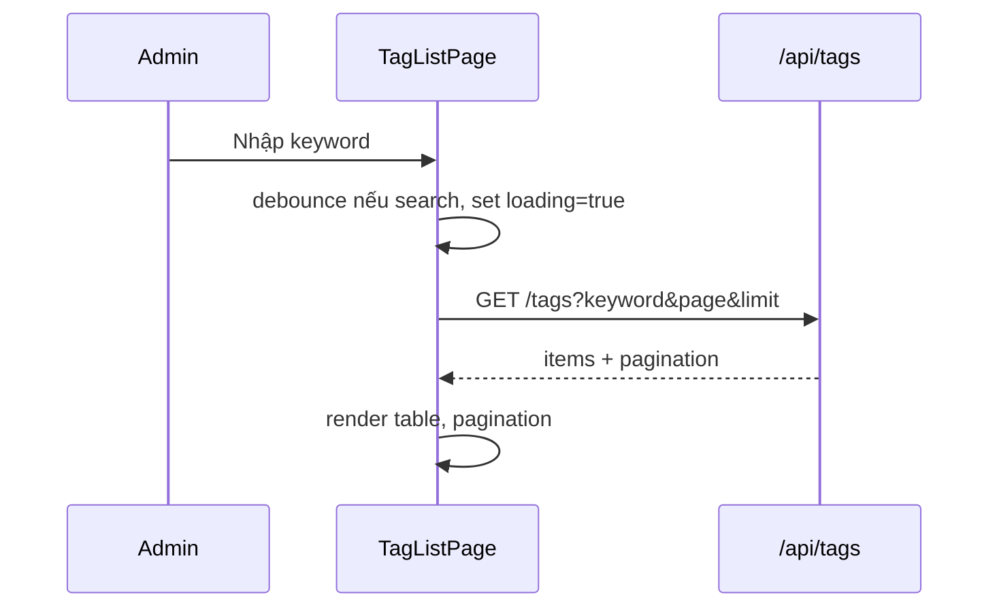
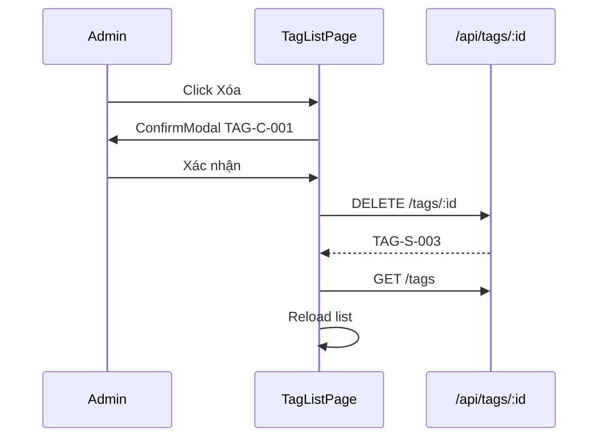

# [Design][SCREEN] ADMIN_TAG_LIST_QuanLyTags

## Change Log
| Ver | Ngày | Nội dung | Người tạo |
|-----|------|----------|----------|
| 1.0 | 2026-06-06 | Khởi tạo tài liệu thiết kế màn hình Quản lý Tags | GitHub Copilot |

## 1. Tổng quan
Trang quản lý Tags (thẻ phân loại) của bài viết. Chỉ Admin mới truy cập được. Cho phép xem danh sách có filter/sort/phân trang, thêm mới bằng modal, sửa bằng modal, và xóa bằng confirm modal.

## 2. Thông tin chung

| Thuộc tính | Giá trị |
|-----------|---------|
| Route | `/admin/tags` |
| Auth yêu cầu | Có (role: admin) |
| Redirect nếu chưa login | `/admin/login` |
| URL Params | Không có |

## 3. Navigation

### Vào từ đâu
| Nguồn | Điều kiện |
|-------|----------|
| Sidebar Admin | Click "Tags" |
| `ProtectedRoute` | Đã login với role `admin` |

### Đi đến đâu
| Hành động | Destination |
|----------|------------|
| Member truy cập | Redirect `/admin/dashboard` (403 guard) |
| Token hết hạn / Lỗi 401 | Redirect `/admin/login` |

## 4. Layout & Components

```jsx
<AdminLayout>
  <AdminPageLayout title="Quản Lý Tags">
    <HeaderActions />     {/* + Tạo mới */}
    <DataToolbar />       {/* Search input */}
    <DataTable />         {/* Cột chính: ID, Tên, Slug, Mô tả, Ngày tạo, Hành động */}
    <AddTagModal />       {/* Modal tạo mới */}
    <EditTagModal />      {/* Modal sửa */}
    <DeleteModal />       {/* Modal xác nhận xóa */}
  </AdminPageLayout>
</AdminLayout>
```

Components dùng lại: `AdminLayout`, `AdminPageLayout`, `DataToolbar`, `DataTable`, `ProtectedRoute` (role: admin), `ConfirmModal`, `ErrorBanner`, `LoadingSpinner`.

## 5. Ma trận trạng thái UI

| Trạng thái | Search/Filter | Nút `+ Tạo mới` | Nút Sửa | Nút Xóa | Pagination |
|------------|---------------|-----------------|---------|--------|------------|
| Init | Enable | Enable nút mở modal | Enable | Enable | Enable nếu `totalPages > 1` |
| Loading list | Disable | Disable | Disable | Disable | Disable |
| Submitting add/edit/delete | Disable | Disable | Disable | Disable | Disable |
| Empty | Enable | Enable | Ẩn | Ẩn | Ẩn |
| No permission | Ẩn | Ẩn | Ẩn | Ẩn | Ẩn |

## 6. Chi tiết UI từng section

### 6.1 TagToolbar
| UI Control | Loại | I/O | Ràng buộc | Giá trị khởi tạo | Nguồn dữ liệu | Event ID | JSON Field mapping | Ghi chú |
|------------|------|-----|-----------|------------------|---------------|----------|--------------------|---------|
| Tìm kiếm | Input text | Input | Max 100 ký tự | `''` | User input | E01 | `keyword` | Tìm theo `name`, `slug` |
| Nút Search | Button | Input | Disabled khi loading | N/A | N/A | E04 | N/A | Áp dụng keyword và page về 1 |
| Nút Reset | Button | Input | N/A | N/A | N/A | E05 | N/A | Clear keyword về mặc định rồi gọi lại API29 page 1 |
| Nút `+ Tạo mới` | Button | Input | Disabled khi loading/submitting | N/A | N/A | E06 | N/A | Mở AddTagModal |

### 6.2 AddTagModal / EditTagModal
| UI Control | Loại | I/O | Ràng buộc | Giá trị khởi tạo | Nguồn dữ liệu | Event ID | JSON Field mapping | Ghi chú |
|------------|------|-----|-----------|------------------|---------------|----------|--------------------|---------|
| Tên | Input text | Input | Bắt buộc, min 2 ký tự | `''` | User input | E06/E08 | `name` | |
| Slug | Input text | Input | Bắt buộc, a-z, 0-9, `-` | `''` | Auto `toSlug(name)` | E06/E08 | `slug` | Auto-generate từ Tên, cho phép sửa tay |
| Mô tả | Textarea | Input | Max 500 ký tự | `''` | User input | E06/E08 | `description` | |
| Nút Lưu | Button | Input | Disabled khi loading/form invalid | N/A | N/A | E06/E08 | N/A | Create/Update xong đóng modal, reload page hiện tại |
| Nút Hủy | Button | Input | Disabled khi submitting | N/A | N/A | E06/E08 | N/A | Đóng modal |

### 6.3 TagTable
| UI Control | Loại | I/O | Ràng buộc | Giá trị khởi tạo | Nguồn dữ liệu | Event ID | JSON Field mapping | Ghi chú |
|------------|------|-----|-----------|------------------|---------------|----------|--------------------|---------|
| ID (View) | Text | Output | N/A | N/A | API29 | N/A | `id` | |
| Tên (View) | Text | Output | N/A | N/A | API29 | N/A | `name` | |
| Slug (View) | Text | Output | N/A | N/A | API29 | N/A | `slug` | |
| Mô tả (View) | Text | Output | N/A | N/A | API29 | N/A | `description` | |
| Ngày tạo (View) | Text | Output | N/A | N/A | API29 | N/A | `created_at` | Format `DD/MM/YYYY` |
| Hành động: Sửa | Button | Input | Disabled khi busy | N/A | Row | E07 | Row object | Mở EditTagModal |
| Hành động: Xóa | Button | Input | Disabled khi busy | N/A | Row | E10 | `id` | Mở DeleteModal |

### 6.4 DeleteModal
- Text dùng `TAG-C-001`: "Bạn có chắc chắn muốn xóa tag này không? Hành động này không thể hoàn tác."
- Nút "Xóa" (`bg-red-500`) + Nút "Hủy"

## 7. API Calls

| # | Endpoint | Method | Khi nào gọi | Auth |
|---|---------|--------|------------|------|
| 1 | `/api/tags?keyword=&page=&limit=` | GET | On mount, đổi filter/page | Admin |
| 2 | `/api/tags` | POST | Submit AddTagModal | Admin |
| 3 | `/api/tags/:id` | PUT | Submit EditTagModal | Admin |
| 4 | `/api/tags/:id` | DELETE | Confirm xóa | Admin |

```js
// Load danh sách
const { data } = await api.get('/tags', { params: { keyword, page, limit } });
// data: { items: [{ id, name, slug, description, created_at, updated_at }], pagination: { page, limit, totalItems, totalPages } }

// Thêm mới
await api.post('/tags', { name, slug, description });

// Cập nhật
await api.put(`/tags/${id}`, { name, slug, description });

// Xóa
await api.delete(`/tags/${id}`);
```

> API29 Danh sách: [[Design][API] API29_Tags_DanhSach.md](../api/[Design][API]%20API29_Tags_DanhSach.md)
> API30 Tạo: [[Design][API] API30_Tags_Tao.md](../api/[Design][API]%20API30_Tags_Tao.md)
> API31 Cập nhật: [[Design][API] API31_Tags_CapNhat.md](../api/[Design][API]%20API31_Tags_CapNhat.md)
> API32 Xóa: [[Design][API] API32_Tags_Xoa.md](../api/[Design][API]%20API32_Tags_Xoa.md)

### Request Mapping
| Event ID | API | Query/Body mapping |
|----------|-----|--------------------|
| E01/E04/E09 | API29 | `keyword`, `page`, `limit` |
| E06 | API30 | `addForm` -> body |
| E08 | API31 | API31 | `editForm` -> body |
| E10 | API32 | `id` -> path param |

### Response Mapping
| API | UI State |
|-----|----------|
| API29 | `tags`, `pagination` |
| API30/API31/API32 | Toast success, reload list theo điều kiện search hiện tại |

## 8. State Management

```js
const [tags, setTags] = useState([]);
const [loading, setLoading] = useState(true);
const [keyword, setKeyword] = useState('');
const [searchDraft, setSearchDraft] = useState('');
const [pagination, setPagination] = useState({ page: 1, limit: 10, totalItems: 0, totalPages: 1 });
const [addModalOpen, setAddModalOpen] = useState(false);
const [editModalOpen, setEditModalOpen] = useState(false);
const [editForm, setEditForm] = useState({ id: null, name: '', slug: '', description: '' });
const [addForm, setAddForm] = useState({ name: '', slug: '', description: '' });
const [deleteModal, setDeleteModal] = useState({ open: false, id: null });
```

## 9. Xử lý lỗi & Edge Cases

| Tình huống | HTTP Status | Component hiển thị | Xử lý |
|-----------|-------------|--------------------|-------|
| Slug trùng | 409 | InlineError dưới field slug | Dùng `TAG-E-002` |
| Validate fail | 400/422 | InlineError/Toast | Dùng `TAG-E-001`, highlight field lỗi |
| API lỗi 403 | 403 | Toast + Redirect | Dùng `TAG-E-004`, redirect `/admin/dashboard` |
| Danh sách rỗng | 200 | EmptyState | Dùng `TAG-I-001` |
| Filter không có kết quả | 200 | EmptyState | Hiển thị "Không tìm thấy tag phù hợp" |

## 10. Responsive

| Breakpoint | Layout |
|-----------|--------|
| Mobile (< 768px) | Toolbar stack dọc, table ẩn cột Mô tả và Ngày tạo |
| Tablet (768–1024px) | Toolbar 2 hàng |
| Desktop (> 1024px) | Full layout với AdminLayout sidebar |

## 11. Events & Actions

| Event ID | Tên | Control | Trigger | API | Mô tả |
|----------|-----|---------|---------|-----|-------|
| E01 | Change search draft | Tìm kiếm | `onChange` | N/A | Chỉ cập nhật input, chưa gọi API |
| E04 | Search tag | Nút Search / Enter | `onClick` / `onKeyDown` | API29 | Áp dụng điều kiện, page về 1 |
| E05 | Reset filter | Nút Reset | `onClick` | API29 | Clear filter mặc định rồi search lại |
| E06 | Create tag | Modal Thêm | `onSubmit` | API30 | Tạo mới, đóng modal, reload page hiện tại |
| E07 | Start edit | Nút Sửa | `onClick` | N/A | Copy row vào editForm, mở EditTagModal |
| E08 | Save edit | Nút Lưu | `onClick` | API31 | Cập nhật, đóng modal, reload page hiện tại |
| E09 | Change page | Pagination | `onPageChange` | API29 | Load trang mới |
| E10 | Delete tag | Modal Xóa | `onConfirm` | API32 | Xóa tag, reload page hiện tại |





## 12. Message List

| MessageId | Loại | Nội dung | Component hiển thị | Điều kiện |
|-----------|------|----------|--------------------|-----------|
| TAG-E-001 | E | Dữ liệu tag không hợp lệ | InlineError / Toast | Validate fail |
| TAG-E-002 | E | Slug tag đã tồn tại | InlineError | API 409 |
| TAG-E-003 | E | Tag không tồn tại | Toast | API 404 |
| TAG-E-004 | E | Bạn không có quyền quản lý tag | Toast / Redirect | API 403 |
| TAG-S-001 | S | Tạo tag thành công | Toast | API30 success |
| TAG-S-002 | S | Cập nhật tag thành công | Toast | API31 success |
| TAG-S-003 | S | Xóa tag thành công | Toast | API32 success |
| TAG-C-001 | C | Bạn có chắc chắn muốn xóa tag này không? Hành động này không thể hoàn tác. | ConfirmModal | Click xóa |
| TAG-I-001 | I | Chưa có tag nào. Hãy thêm tag đầu tiên! | EmptyState | Danh sách rỗng |
