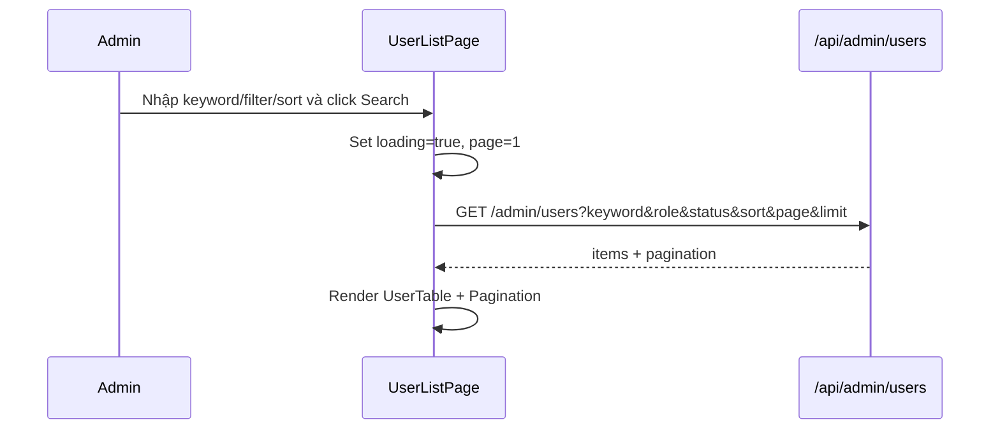
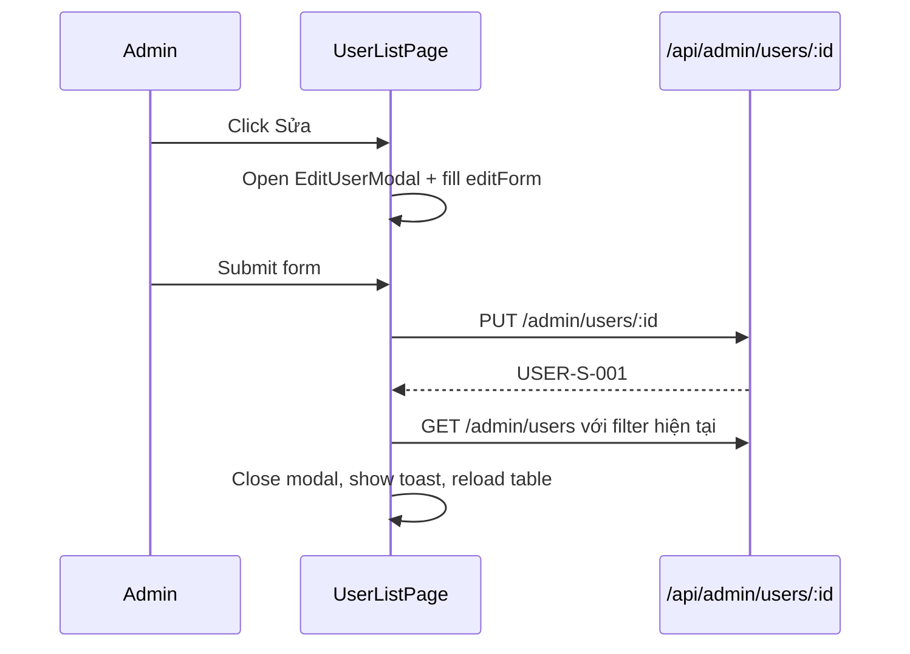
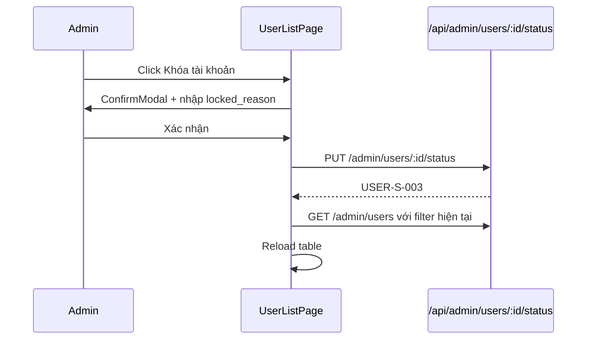

# [Design][SCREEN] ADMIN_USER_LIST_QuanLyNguoiDung

## Change Log
| Ver | Ngày | Nội dung | Người tạo |
|-----|------|----------|----------|
| 1.0 | 2026-06-03 | Tạo tài liệu ban đầu cho danh sách user và đổi role | GitHub Copilot |
| 2.0 | 2026-06-04 | Chuẩn hóa 12 sections; bổ sung search/filter/sort/pagination/export, profile fields, khóa/mở khóa và modal chỉnh sửa user | GitHub Copilot |

## 1. Tổng quan
Trang quản lý tài khoản người dùng. Chỉ Admin mới truy cập được. Màn hình cho phép xem danh sách user có search/filter/sort/pagination, export CSV theo điều kiện hiện tại, xem/chỉnh sửa thông tin profile mở rộng, đổi role và khóa/mở khóa tài khoản. Thiết kế này là target design cần đồng bộ thêm DB/API trước khi implement đầy đủ các field mới.

## 2. Thông tin chung

| Thuộc tính | Giá trị |
|-----------|---------|
| Route | `/admin/users` |
| Auth yêu cầu | Có (role: admin) |
| Redirect nếu chưa login | `/admin/login` |
| URL Params | Không có |

## 3. Navigation

### Vào từ đâu
| Nguồn | Điều kiện |
|-------|----------|
| Sidebar Admin | Click "Người Dùng" |
| Dashboard quick link | Admin click card quản lý người dùng |
| `ProtectedRoute` | Đã login với role `admin` |

### Đi đến đâu
| Hành động | Destination |
|----------|-------------|
| Member truy cập | Redirect `/admin/dashboard` qua route guard |
| Chưa login | Redirect `/admin/login` |
| Logout từ AdminLayout | `/admin/login` |

## 4. Layout & Components

```jsx
<AdminLayout>
  <PageHeader title="Quản Lý Người Dùng" />
  <UserToolbar />       {/* Search, role/status filter, sort, export CSV */}
  <UserTable>
    <UserRow />
    <RoleBadge />
    <StatusBadge />
  </UserTable>
  <Pagination />
  <UserDetailModal />
  <EditUserModal />
  <RoleConfirmModal />
  <LockConfirmModal />
</AdminLayout>
```

Components dùng lại: `AdminLayout`, `ProtectedRoute`, `Pagination`, `ConfirmModal`, `ErrorBanner`, `LoadingSpinner`.

## 5. Ma trận trạng thái UI

| Trạng thái | Search/Filter | Export CSV | Xem chi tiết | Sửa profile | Đổi role | Khóa/Mở khóa | Pagination |
|------------|---------------|------------|--------------|-------------|----------|--------------|------------|
| Init | Enable | Enable | Enable | Enable | Enable nếu không phải chính mình | Enable nếu không phải chính mình | Enable nếu `totalPages > 1` |
| Loading list | Disable | Disable | Disable | Disable | Disable | Disable | Disable |
| Submitting edit/role/lock | Disable | Disable | Disable | Disable | Disable | Disable | Disable |
| Empty | Enable | Disable | Ẩn | Ẩn | Ẩn | Ẩn | Ẩn |
| No permission | Ẩn | Ẩn | Ẩn | Ẩn | Ẩn | Ẩn | Ẩn |

## 6. Chi tiết UI từng section

### 6.1 UserToolbar
| UI Control | Loại | I/O | Ràng buộc | Giá trị khởi tạo | Nguồn dữ liệu | Event ID | JSON Field mapping | Ghi chú |
|------------|------|-----|-----------|------------------|---------------|----------|--------------------|---------|
| Tìm kiếm | Input text | Input | Max 100 ký tự | `''` | User input | E01 | `keyword` | Tìm theo `name`, `email`, `phone` |
| Role | Select | Input | `all`, `admin`, `member` | `all` | Static options | E02 | `role` | Lọc role |
| Trạng thái | Select | Input | `all`, `active`, `locked` | `all` | Static options | E03 | `status` | Lọc tài khoản hoạt động/bị khóa |
| Sắp xếp | Select | Input | `created_at_desc`, `name_asc`, `post_count_desc`, `last_login_desc` | `created_at_desc` | Static options | E04 | `sort` | Sort server-side |
| Nút Search | Button | Input | Disabled khi loading | N/A | N/A | E05 | N/A | Áp dụng điều kiện, page về 1 |
| Nút Reset | Button | Input | Disabled khi loading | N/A | N/A | E06 | N/A | Clear keyword/filter/sort rồi search lại |
| Nút Export CSV | Button | Input | Disabled khi loading/submitting/empty | N/A | N/A | E14 | Query hiện tại | Export danh sách user theo điều kiện hiện tại, tải tuần tự từng page `limit=100` |

### 6.2 UserTable
| UI Control | Loại | I/O | Ràng buộc | Giá trị khởi tạo | Nguồn dữ liệu | Event ID | JSON Field mapping | Ghi chú |
|------------|------|-----|-----------|------------------|---------------|----------|--------------------|---------|
| Avatar | Image/Text | Output | URL hợp lệ hoặc fallback chữ cái đầu | Row value | API19 | N/A | `avatar_url`, `name` | Fallback màu theo `id` |
| Tên | Text | Output | N/A | N/A | API19 | N/A | `name` | Hiển thị kèm bio ngắn nếu có |
| Email | Text | Output | N/A | N/A | API19 | N/A | `email` | Email đăng nhập |
| Số điện thoại | Text | Output | N/A | N/A | API19 | N/A | `phone` | Hiển thị `—` nếu null |
| Địa chỉ | Text | Output | N/A | N/A | API19 | N/A | `address` | Có thể truncate |
| Role | Badge/Button | Input/Output | `admin`, `member` | Row value | API19/User input | E09/E10 | `role` | E09 mở modal, E10 confirm đổi role; không cho đổi role chính mình |
| Trạng thái | Badge/Button | Input/Output | `active`, `locked` | Row value | API19/User input | E11/E12 | `status` | E11 mở modal, E12 confirm khóa/mở khóa; không cho khóa chính mình |
| Bài viết | Text | Output | N/A | N/A | API19 | N/A | `postCount`, `publishedPostCount`, `draftPostCount` | Hiển thị `total / published / draft` |
| Lần đăng nhập | Text | Output | Format `DD/MM/YYYY HH:mm` | N/A | API19 | N/A | `last_login_at` | `—` nếu chưa login |
| Ngày tham gia | Text | Output | Format `DD/MM/YYYY` | N/A | API19 | N/A | `created_at` | |
| Ngày cập nhật | Text | Output | Format `DD/MM/YYYY` | N/A | API19 | N/A | `updated_at` | |
| Hành động | Button group | Input | Disabled khi busy | N/A | User input | E07/E08/E09/E11 | N/A | Xem, Sửa, Đổi role, Khóa/Mở khóa |

### 6.3 UserDetailModal
| UI Control | Loại | I/O | Ràng buộc | Giá trị khởi tạo | Nguồn dữ liệu | Event ID | JSON Field mapping | Ghi chú |
|------------|------|-----|-----------|------------------|---------------|----------|--------------------|---------|
| Avatar lớn | Image/Text | Output | N/A | Row value | Selected user | N/A | `avatar_url`, `name` | |
| Thông tin cá nhân | Text group | Output | N/A | Row value | Selected user | N/A | `name`, `email`, `phone`, `address`, `birthdate`, `gender`, `bio` | |
| Thông tin tài khoản | Text group | Output | N/A | Row value | Selected user | N/A | `role`, `status`, `locked_reason`, `last_login_at`, `created_at`, `updated_at` | |
| Thống kê bài viết | Text group | Output | N/A | Row value | Selected user | N/A | `postCount`, `publishedPostCount`, `draftPostCount` | |

### 6.4 EditUserModal
| UI Control | Loại | I/O | Ràng buộc | Giá trị khởi tạo | Nguồn dữ liệu | Event ID | JSON Field mapping | Ghi chú |
|------------|------|-----|-----------|------------------|---------------|----------|--------------------|---------|
| Họ tên | Input text | Input | Bắt buộc, min 2, max 100 | Row value | User input | E08 | `name` | |
| Số điện thoại | Input text | Input | Max 20, format phone Việt Nam | Row value | User input | E08 | `phone` | Optional |
| Địa chỉ | Textarea | Input | Max 255 | Row value | User input | E08 | `address` | Optional |
| Avatar URL | Input text | Input | Max 255 | Row value | User input | E08 | `avatar_url` | Optional |
| Giới thiệu | Textarea | Input | Max 500 | Row value | User input | E08 | `bio` | Optional |
| Ngày sinh | Input date | Input | Không lớn hơn hôm nay | Row value | User input | E08 | `birthdate` | Optional |
| Giới tính | Select | Input | `male`, `female`, `other`, `unknown` | Row value hoặc `unknown` | Static options | E08 | `gender` | Optional |
| Nút Lưu | Button | Input | Disabled khi form invalid/submitting | N/A | User input | E08 | N/A | Lưu xong reload page hiện tại |
| Nút Hủy | Button | Input | Disabled khi submitting | N/A | User input | E08 | N/A | Đóng modal |

### 6.5 RoleConfirmModal
- Text dùng `USER-C-001`: "Đổi role của người dùng này? Quyền truy cập của họ sẽ thay đổi ở lần xác thực tiếp theo."
- Nút "Xác nhận" + Nút "Hủy".
- Không hiển thị hoặc disabled nếu user là chính mình.

### 6.6 LockConfirmModal
- Khi `active` -> `locked`: yêu cầu nhập `locked_reason`.
- Khi `locked` -> `active`: confirm mở khóa.
- Text dùng `USER-C-002`: "Khóa tài khoản này? Người dùng sẽ không thể đăng nhập cho đến khi được mở khóa."
- Text dùng `USER-C-003`: "Mở khóa tài khoản này? Người dùng có thể đăng nhập lại."

## 7. API Calls

| # | Endpoint | Method | Khi nào gọi | Auth |
|---|----------|--------|-------------|------|
| 1 | `/api/admin/users?keyword=&role=&status=&sort=&page=&limit=` | GET | On mount, search/filter/sort/page | Admin |
| 2 | `/api/admin/users/:id` | GET | Click xem chi tiết nếu table chưa đủ field | Admin |
| 3 | `/api/admin/users/:id` | PUT | Submit EditUserModal | Admin |
| 4 | `/api/admin/users/:id/role` | PUT | Confirm đổi role | Admin |
| 5 | `/api/admin/users/:id/status` | PUT | Confirm khóa/mở khóa | Admin |
| 6 | `/api/admin/users?keyword=&role=&status=&sort=&page=n&limit=100` | GET | Export CSV theo điều kiện hiện tại, tải tuần tự từ page 1 đến `pagination.totalPages` | Admin |

```js
const { data } = await api.get('/admin/users', { params: { keyword, role, status, sort, page, limit } });
// Target data: { items: [{ id, name, email, phone, address, avatar_url, role, status, bio, birthdate, gender, locked_reason, last_login_at, created_at, updated_at, postCount, publishedPostCount, draftPostCount }], pagination }

await api.put(`/admin/users/${id}`, { name, phone, address, avatar_url, bio, birthdate, gender });
await api.put(`/admin/users/${id}/role`, { role: newRole });
await api.put(`/admin/users/${id}/status`, { status: nextStatus, locked_reason });
```

> API19 Danh sách: [[Design][API] API19_AdminUsers_DanhSach.md](../api/[Design][API]%20API19_AdminUsers_DanhSach.md) — contract chuẩn trả `{ items, pagination }` và đủ field row cho table/detail/export.
> API20 Đổi Role: [[Design][API] API20_AdminUsers_DoiRole.md](../api/[Design][API]%20API20_AdminUsers_DoiRole.md) — hiện tại chỉ đổi role.
> API bổ sung cần tạo: `API23_AdminUsers_ChiTiet`, `API24_AdminUsers_CapNhat`, `API25_AdminUsers_DoiStatus`.

### Request Mapping
| Event ID | API | Query/Body mapping |
|----------|-----|--------------------|
| E05/E06/E13 | API19 | `keyword`, `role`, `status`, `sort`, `page`, `limit` |
| E07 | API23 hoặc selected row | `id` path param |
| E08 | API24 | `editForm` -> body |
| E10 | API20 | `{ role: newRole }` |
| E12 | API25 | `{ status: nextStatus, locked_reason }` |
| E14 | API19 | Query hiện tại, tải tuần tự `limit=100` |

### Response Mapping
| API | UI State |
|-----|----------|
| API19 | `users`, `pagination` |
| API23 | `detailModal.user` |
| API24 | Toast success, đóng modal, reload page hiện tại theo điều kiện search/filter/sort |
| API20 | Toast success, đóng modal, reload page hiện tại |
| API25 | Toast success, đóng modal, reload page hiện tại |

## 8. State Management

```js
const [users, setUsers] = useState([]);
const [loading, setLoading] = useState(true);
const [error, setError] = useState('');
const [success, setSuccess] = useState('');
const [keyword, setKeyword] = useState('');
const [searchDraft, setSearchDraft] = useState('');
const [roleFilter, setRoleFilter] = useState('all');
const [statusFilter, setStatusFilter] = useState('all');
const [sort, setSort] = useState('created_at_desc');
const [pagination, setPagination] = useState({ page: 1, limit: 5, totalItems: 0, totalPages: 1 });
const [detailModal, setDetailModal] = useState({ open: false, user: null });
const [editModal, setEditModal] = useState({ open: false, userId: null });
const [editForm, setEditForm] = useState({ name: '', phone: '', address: '', avatar_url: '', bio: '', birthdate: '', gender: 'unknown' });
const [roleModal, setRoleModal] = useState({ open: false, userId: null, userName: '', newRole: '' });
const [lockModal, setLockModal] = useState({ open: false, userId: null, userName: '', nextStatus: '', locked_reason: '' });
const { user: currentUser } = useAuth();
```

## 9. Xử lý lỗi & Edge Cases

| Tình huống | HTTP Status | Component hiển thị | Xử lý |
|-----------|-------------|--------------------|-------|
| User không phải admin | 403 | Toast + redirect | Dùng `USER-E-004`, redirect `/admin/dashboard` |
| Không tìm thấy user | 404 | Toast | Dùng `USER-E-003`, reload list |
| Validate profile fail | 400/422 | InlineError trong modal | Dùng `USER-E-001`, highlight field lỗi |
| Đổi role của chính mình | 400 | Button disabled + tooltip | Dùng `USER-E-005` nếu API vẫn trả lỗi |
| Khóa tài khoản chính mình | 400 | Button disabled + tooltip | Dùng `USER-E-006` nếu API vẫn trả lỗi |
| Khóa tài khoản thiếu lý do | 422 | InlineError | Require `locked_reason` khi nextStatus=`locked` |
| Danh sách rỗng | 200 | EmptyState | Dùng `USER-I-001` |
| Filter không có kết quả | 200 | EmptyState | Dùng `USER-I-002` |
| API/network error | 500/N/A | ErrorBanner | Dùng `COMMON-E-001` fallback |
| User bị khóa đang đăng nhập | 401/403 ở lần xác thực sau | Interceptor/AuthContext | Logout hoặc redirect login tùy BE contract |

## 10. Responsive

| Breakpoint | Layout |
|-----------|--------|
| Mobile (< 768px) | Toolbar stack dọc, bảng scroll ngang, ưu tiên hiển thị Avatar/Tên/Email/Role/Status; các field address/bio ẩn khỏi table và xem trong detail modal |
| Tablet (768–1024px) | Toolbar 2 hàng, bảng hiển thị thêm phone, post stats, last login |
| Desktop (> 1024px) | Full layout với AdminLayout sidebar, đầy đủ cột và actions |

## 11. Events & Actions

| Event ID | Tên | Control | Trigger | API | Mô tả |
|----------|-----|---------|---------|-----|-------|
| E01 | Change search draft | Tìm kiếm | `onChange` | N/A | Chỉ cập nhật input, chưa gọi API |
| E02 | Change role filter | Role filter | `onChange` | N/A | Cập nhật filter role |
| E03 | Change status filter | Status filter | `onChange` | N/A | Cập nhật filter status |
| E04 | Change sort | Sort select | `onChange` | N/A | Cập nhật sort |
| E05 | Search users | Nút Search / Enter | `onClick` / `onKeyDown` | API19 | Áp dụng điều kiện, page về 1 |
| E06 | Reset filters | Nút Reset | `onClick` | API19 | Clear filter rồi search lại |
| E07 | Open detail | Nút Xem | `onClick` | API23/N/A | Mở modal chi tiết user |
| E08 | Save profile | EditUserModal | `onSubmit` | API24 | Lưu profile mở rộng, reload list |
| E09 | Open role modal | Role badge | `onClick` | N/A | Chọn role mới và mở confirm |
| E10 | Confirm role | RoleConfirmModal | `onConfirm` | API20 | Cập nhật role |
| E11 | Open lock modal | Status badge/action | `onClick` | N/A | Mở confirm khóa/mở khóa |
| E12 | Confirm lock | LockConfirmModal | `onConfirm` | API25 | Cập nhật status và locked_reason |
| E13 | Change page | Pagination | `onPageChange` | API19 | Load page mới |
| E14 | Export CSV | Nút Export CSV | `onClick` | API19 | Export CSV theo điều kiện hiện tại |







## 12. Message List

## 12. Message List

- Toolbar phải có `+ Tạo mới`, Search, Reset, Export CSV.
- Table action chuẩn: `Xem`, `Sửa`, `Xóa`, cộng action đặc thù `Đổi role`, `Khóa/Mở khóa`.
- Tạo user dùng `POST /api/admin/users` (API26).
- Xóa user dùng `DELETE /api/admin/users/:id` (API27), xóa mềm và không cho tự xóa chính mình.
- Layout/action phải đồng bộ với màn `ADMIN_CATEGORY_LIST_QuanLyDanhMuc`.


| MessageId | Loại | Nội dung | Component hiển thị | Điều kiện |
|-----------|------|----------|--------------------|-----------|
| USER-E-001 | E | Dữ liệu người dùng không hợp lệ | InlineError / Toast | Validate fail |
| USER-E-002 | E | Email người dùng đã tồn tại | InlineError | Email trùng nếu API cho sửa email sau này |
| USER-E-003 | E | Người dùng không tồn tại | Toast | API 404 |
| USER-E-004 | E | Bạn không có quyền quản lý người dùng | Toast / Redirect | API 403 |
| USER-E-005 | E | Không thể đổi role của chính mình | Tooltip / Toast | Self role change |
| USER-E-006 | E | Không thể khóa tài khoản của chính mình | Tooltip / Toast | Self lock |
| USER-S-001 | S | Cập nhật người dùng thành công | Toast | API24 success |
| USER-S-002 | S | Cập nhật role thành công | Toast | API20 success |
| USER-S-003 | S | Cập nhật trạng thái tài khoản thành công | Toast | API25 success |
| USER-C-001 | C | Đổi role của người dùng này? Quyền truy cập của họ sẽ thay đổi ở lần xác thực tiếp theo. | ConfirmModal | Click đổi role |
| USER-C-002 | C | Khóa tài khoản này? Người dùng sẽ không thể đăng nhập cho đến khi được mở khóa. | ConfirmModal | Click khóa |
| USER-C-003 | C | Mở khóa tài khoản này? Người dùng có thể đăng nhập lại. | ConfirmModal | Click mở khóa |
| USER-I-001 | I | Chưa có người dùng nào. | EmptyState | Danh sách rỗng |
| USER-I-002 | I | Không tìm thấy người dùng phù hợp | EmptyState | Filter/search không có kết quả |

## Implementation Notes
- Hiện code/API đang chỉ hỗ trợ danh sách user cơ bản và đổi role. Các field `phone`, `address`, `avatar_url`, `status`, `last_login_at`, `updated_at`, `publishedPostCount`, `draftPostCount`, `bio`, `birthdate`, `gender`, `locked_reason` cần được bổ sung ở DB/API trước khi implement đầy đủ UI.
- API contract trong tài liệu dùng `PUT` cho API20/API24/API25. Nếu code hiện tại ở BE/FE còn dùng `PATCH /api/admin/users/:id/role`, đó là việc cần correct trong phase implement/correct để đổi về `PUT`, không xem là mismatch của tài liệu thiết kế.
- API23 là optional fresh-detail fetch khi cần reload dữ liệu mới nhất trước khi mở detail modal. Với luồng thông thường, API19 đã trả đủ full row fields (`id`, `name`, `email`, `phone`, `address`, `avatar_url`, `role`, `status`, `bio`, `birthdate`, `gender`, `locked_reason`, `last_login_at`, `created_at`, `updated_at`, `postCount`, `publishedPostCount`, `draftPostCount`) nên FE có thể mở detail từ selected row mà không gọi API23.
