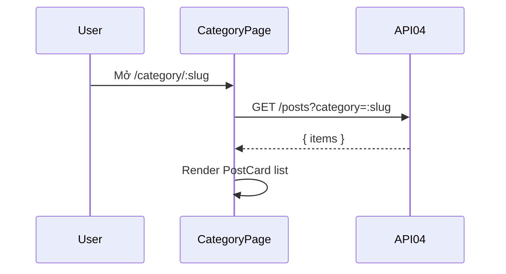

# [Design][SCREEN] CATEGORY_DanhMuc

## Change Log
| Ver | Ngày | Nội dung | Người tạo |
|---|---|---|---|
| 1.1 | 2026-06-05 | Chuẩn hóa 12 sections, đồng bộ `CategoryPage.jsx` và API04 | docs-agent |

## 1. Tổng quan
Trang public hiển thị danh sách bài viết theo `category` slug bằng API04. Code hiện tại là danh sách đơn giản, chưa gọi API15 để lấy header danh mục.

## 2. Thông tin chung
| Thuộc tính | Giá trị |
|---|---|
| Route | `/category/:slug` |
| Auth yêu cầu | Không |
| Redirect nếu chưa login | Không |
| URL Params | `slug` |

## 3. Navigation
| Vào từ đâu | Điều kiện |
|---|---|
| Link category / nhập URL | Public |

| Đi đến đâu | Destination |
|---|---|
| Click PostCard | `/post/:slug` |

## 4. Layout & Components
```jsx
<Navbar />
<main className="grid">
  <PostCard />
</main>
<Footer />
```
Components dùng lại: `Navbar`, `Footer`, `PostCard`.

## 5. Ma trận trạng thái UI
| Trạng thái | PostGrid |
|---|---|
| Init/Loading | Có thể trống |
| Loaded có data | Hiển thị PostCard |
| Empty | Không có card |
| Error | Code hiện chưa xử lý riêng |

## 6. Chi tiết UI từng section
| Control | Loại | I/O | Ràng buộc | Giá trị khởi tạo | Nguồn dữ liệu | Event ID | JSON Field | Ghi chú |
|---|---|---|---|---|---|---|---|---|
| Route slug | Param | Input | string | URL | React Router | E01 | `category` query | Dùng lọc API04 |
| PostCard grid | List | Output | N/A | `[]` | API04 | E01 | `items[]` | Render trực tiếp |

## 7. API Calls
| Event ID | API | Endpoint | Khi gọi | Link |
|---|---|---|---|---|
| E01 | API04 | `GET /api/posts?category=:slug` | On mount hoặc slug đổi | [[Design][API] API04_Posts_DanhSach.md](../api/[Design][API]%20API04_Posts_DanhSach.md) |

### Request Mapping
| Event ID | Query |
|---|---|
| E01 | `category = slug` |

### Response Mapping
| API Field | UI State |
|---|---|
| `items` | `items` |

## 8. State Management
```js
const { slug } = useParams();
const [items, setItems] = useState([]);
```

## 9. Xử lý lỗi & Edge Cases
| Tình huống | HTTP Status | Component | Xử lý |
|---|---|---|---|
| Không có bài | 200 | Empty grid | Code hiện chưa có EmptyState riêng |
| API lỗi | 500/N/A | Console/browser error | Code hiện chưa catch |
| Slug đổi | N/A | Page | `useEffect` gọi lại API04 |

## 10. Responsive
| Breakpoint | Layout |
|---|---|
| Mobile | Grid 1 cột theo CSS hiện tại `p-4 grid gap-3` |
| Desktop | Grid đơn giản, chưa cấu hình cột riêng trong code |

## 11. Events & Actions
| Event ID | Tên | Control | Trigger | API | Mô tả |
|---|---|---|---|---|---|
| E01 | Load category posts | Page | Mount/slug change | API04 | Load bài theo category slug |
| E02 | Open detail | PostCard | Click | N/A | Điều hướng `/post/:slug` |



## 12. Message List
| MessageId | Loại | Nội dung | Component hiển thị | Điều kiện |
|---|---|---|---|---|
| POST-I-001 | I | Chưa có bài viết nào. | EmptyState target | Không có bài trong danh mục |
| POST-E-005 | E | Không thể tải bài viết. Vui lòng thử lại. | ErrorBanner target | API lỗi |
