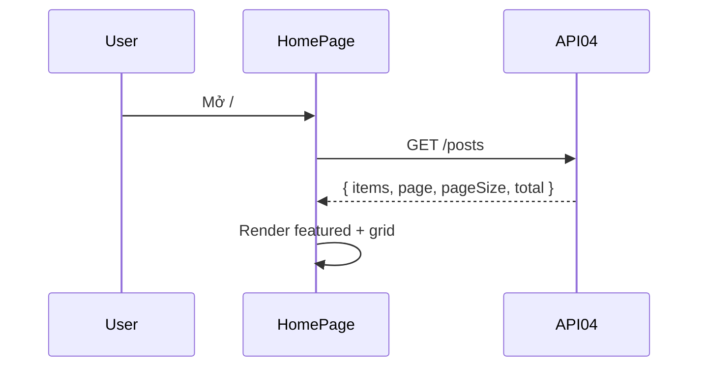

# [Design][SCREEN] HOME_TrangChu

## Change Log
| Ver | Ngày | Nội dung | Người tạo |
|---|---|---|---|
| 1.1 | 2026-06-05 | Chuẩn hóa 12 sections, đồng bộ `HomePage.jsx` và API04 | docs-agent |
| 1.2 | 2026-06-06 | Nâng cấp UI/UX chuẩn báo chí: Hero Grid, Layout 2 cột, Sidebar Widgets | AI |

## 1. Tổng quan
Trang chủ public hiển thị danh sách các bài viết mới nhất. Giao diện được thiết kế theo chuẩn các trang tin tức/blog du lịch chuyên nghiệp (như blogdulich.net, gody.vn) với Hero Grid (1 bài lớn, 2 bài nhỏ) và bố cục 2 cột (Nội dung chính + Sidebar).

## 2. Thông tin chung
| Thuộc tính | Giá trị |
|---|---|
| Route | `/` |
| Auth yêu cầu | Không |
| Redirect nếu chưa login | Không |
| URL Params | Không có |

## 3. Navigation
| Vào từ đâu | Điều kiện |
|---|---|
| Navbar / nhập URL | Public |

| Đi đến đâu | Destination |
|---|---|
| Click Đọc bài viết / PostCard | `/post/:slug` |
| Click Xem tất cả | `/category/all` |

## 4. Layout & Components
```jsx
<Navbar />
<main className="bg-gray-50 min-h-screen pb-16">
  {/* Hero Section - Magazine Style Grid */}
  <section className="bg-white pt-8 pb-12 border-b border-gray-200">
    <div className="max-w-7xl mx-auto">
      <HeroGrid featuredPosts={items.slice(0, 3)} />
    </div>
  </section>

  {/* Main Content Area (2 Columns) */}
  <section className="max-w-7xl mx-auto mt-12 flex flex-col lg:flex-row gap-12">
    {/* Left Column: Latest Posts */}
    <div className="lg:w-2/3">
      <SectionHeader title="Bài viết mới nhất" />
      <div className="grid gap-8 sm:grid-cols-2">
        <PostCard />
      </div>
      <LoadMoreButton />
    </div>

    {/* Right Column: Sidebar */}
    <aside className="lg:w-1/3 sticky top-8">
      <NewsletterWidget />
      <CategoriesWidget />
      <PopularPostsWidget />
    </aside>
  </section>
</main>
<Footer />
```
Components dùng lại: `Navbar`, `Footer`, `PostCard`.

## 5. Ma trận trạng thái UI
| Trạng thái | Hero Grid | Latest Posts (Left) | Sidebar (Right) | Error Banner |
|---|---|---|---|---|
| Init/Loading | Skeleton Grid | Ẩn | Ẩn | Ẩn |
| Loaded có data | Hiển thị (Top 3) | Hiển thị (Các bài còn lại) | Hiển thị | Ẩn |
| Empty | Ẩn | EmptyState | Ẩn | Ẩn |
| Error | Ẩn | Ẩn | Ẩn | Hiển thị |

## 6. Chi tiết UI từng section
| Control | Loại | I/O | Ràng buộc | Giá trị khởi tạo | Nguồn dữ liệu | Event ID | JSON Field | Ghi chú |
|---|---|---|---|---|---|---|---|---|
| Hero CTA Xem bài mới | Link | Input | N/A | `#latest-posts` | Static | E01 | N/A | Scroll nội trang |
| Featured image | Image | Output | Fallback URL | N/A | API04 | N/A | `thumbnail_url` | Item đầu tiên |
| Featured title | Text | Output | N/A | N/A | API04 | N/A | `title` | Link `/post/:slug` |
| PostCard grid | List | Output | N/A | `[]` | API04 | E02 | `items[]` | Dùng `PostCard` |
| PostCard tags | List | Output | N/A | `[]` | API04 | N/A | `items[].tags` | Hiển thị tags trên card (nếu có) |
| Error banner | Text | Output | N/A | `''` | API error | N/A | N/A | Text hiện tại trong code |

## 7. API Calls
| Event ID | API | Endpoint | Khi gọi | Link |
|---|---|---|---|---|
| E02 | API04 | `GET /api/posts` | On mount | [[Design][API] API04_Posts_DanhSach.md](../api/[Design][API]%20API04_Posts_DanhSach.md) |

### Request Mapping
| Event ID | Query |
|---|---|
| E02 | Không truyền query |

### Response Mapping
| API Field | UI State |
|---|---|
| `items` hoặc fallback `posts` | `items` |
| `items[0]` | `featured` |
| `items.slice(1)` | `latest` |

## 8. State Management
```js
const [items, setItems] = useState([]);
const [loading, setLoading] = useState(true);
const [error, setError] = useState('');
```

## 9. Xử lý lỗi & Edge Cases
| Tình huống | HTTP Status | Component | Xử lý |
|---|---|---|---|
| API lỗi | 500/N/A | ErrorBanner | Hiển thị `POST-E-005` |
| Không có bài | 200 | EmptyState | Hiển thị `POST-I-001` |
| Không có thumbnail | 200 | Image | Dùng fallback Unsplash |

## 10. Responsive
| Breakpoint | Layout |
|---|---|
| Mobile | Hero stack, grid 1 cột |
| Tablet | Grid 2 cột |
| Desktop | Hero 2 cột, grid 3 cột |

## 11. Events & Actions
| Event ID | Tên | Control | Trigger | API | Mô tả |
|---|---|---|---|---|---|
| E01 | Scroll latest | CTA | Click | N/A | Điều hướng anchor |
| E02 | Load posts | Page | Mount | API04 | Load danh sách bài public |
| E03 | Open detail | PostCard | Click | N/A | Điều hướng `/post/:slug` |



## 12. Message List
| MessageId | Loại | Nội dung | Component hiển thị | Điều kiện |
|---|---|---|---|---|
| POST-E-005 | E | Không thể tải bài viết. Vui lòng thử lại. | ErrorBanner | API04 lỗi |
| POST-I-001 | I | Chưa có bài viết nào. | EmptyState | API04 trả rỗng |
