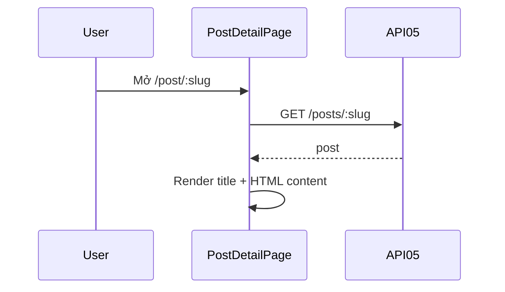

# [Design][SCREEN] POST_DETAIL_ChiTietBai

## Change Log
| Ver | Ngày | Nội dung | Người tạo |
|---|---|---|---|
| 1.1 | 2026-06-05 | Chuẩn hóa 12 sections, đồng bộ `PostDetailPage.jsx` và API05 | docs-agent |
| 1.2 | 2026-06-06 | Cập nhật UI/UX: Thêm Hero section, Meta info, Skeleton loading, Typography | AI |
| 1.3 | 2026-06-06 | Nâng cấp UI/UX chuẩn báo chí: Hero Banner full-width, Layout 2 cột (Content + Sidebar) | AI |

## 1. Tổng quan
Trang public hiển thị chi tiết một bài viết theo slug. Giao diện được thiết kế theo chuẩn các trang tin tức/blog du lịch chuyên nghiệp (như blogdulich.net, gody.vn) với Hero Banner tràn viền và bố cục 2 cột (Nội dung chính + Sidebar).

## 2. Thông tin chung
| Thuộc tính | Giá trị |
|---|---|
| Route | `/post/:slug` |
| Auth yêu cầu | Không |
| Redirect nếu chưa login | Không |
| URL Params | `slug` |

## 3. Navigation
| Vào từ đâu | Điều kiện |
|---|---|
| `PostCard`, featured post, nhập URL | Public |

| Đi đến đâu | Destination |
|---|---|
| Click Category Badge | `/category/:category_slug` |
| Click Breadcrumb "Trang chủ" | `/` |

## 4. Layout & Components
```jsx
<Navbar />
<main className="bg-white min-h-screen pb-16">
  {/* Hero Banner (Full width) */}
  <div className="relative w-full h-[550px] bg-gray-900">
    
    <div className="absolute bottom-0">
      <Badge>{post.category_name}</Badge>
      <h1>{post.title}</h1>
      <AuthorInfo />
    </div>
  </div>

  {/* Main Content Area (2 Columns) */}
  <div className="max-w-7xl mx-auto flex flex-col lg:flex-row gap-12 mt-10">
    {/* Left Column: Article */}
    <article className="lg:w-2/3">
      <Breadcrumbs />
      <SocialShare />
      <div className="prose prose-lg" dangerouslySetInnerHTML={{ __html: post.content }} />
      <Tags />
    </article>

    {/* Right Column: Sidebar */}
    <aside className="lg:w-1/3 sticky top-8">
      <AuthorWidget />
      <PopularPostsWidget />
    </aside>
  </div>
</main>
<Footer />
```
Components dùng lại: `Navbar`, `Footer`.
Components mới/cần tạo: `SkeletonPostDetail`, `ErrorState`.

## 5. Ma trận trạng thái UI
| Trạng thái | Hero Banner | Content (Left) | Sidebar (Right) | Loading Skeleton | Error Message |
|---|---|---|---|---|---|
| Init/Loading | Ẩn | Ẩn | Ẩn | Hiển thị (2 cột) | Ẩn |
| Loaded | Hiển thị | Hiển thị HTML | Hiển thị | Ẩn | Ẩn |
| Error/404 | Ẩn | Ẩn | Ẩn | Ẩn | Hiển thị (Post not found) |

## 6. Chi tiết UI từng section
| Control | Loại | I/O | Ràng buộc | Giá trị khởi tạo | Nguồn dữ liệu | Event ID | JSON Field | Ghi chú |
|---|---|---|---|---|---|---|---|---|
| Route slug | Param | Input | string | URL | React Router | E01 | `slug` | Path API05 |
| Breadcrumb | Link | Output | N/A | N/A | API05 | N/A | `category_name`, `title` | Điều hướng về Home/Category |
| Category Badge | Link | Output | N/A | N/A | API05 | N/A | `category_name` | Link tới `/category/:slug` |
| Date | Text | Output | Format DD/MM/YYYY | N/A | API05 | N/A | `created_at` | |
| Title | Text | Output | N/A | N/A | API05 | N/A | `title` | h1, text-4xl, bold |
| Author | Text | Output | N/A | N/A | API05 | N/A | `author_name` | Kèm avatar placeholder |
| Thumbnail | Image | Output | N/A | N/A | API05 | N/A | `thumbnail_url` | object-cover, h-[400px] |
| Content | HTML | Output | HTML string | `''` | API05 | N/A | `content` | Render bằng `dangerouslySetInnerHTML` trong class `prose` |
| Tags | List | Output | N/A | `[]` | API05 | N/A | `tags` | Hiển thị danh sách tags ở cuối bài |

## 7. API Calls
| Event ID | API | Endpoint | Khi gọi | Link |
|---|---|---|---|---|
| E01 | API05 | `GET /api/posts/:slug` | On mount hoặc slug đổi | [[Design][API] API05_Posts_ChiTiet.md](../api/[Design][API]%20API05_Posts_ChiTiet.md) |

### Request Mapping
| Event ID | Path |
|---|---|
| E01 | `slug = useParams().slug` |

### Response Mapping
| API Field | UI State |
|---|---|
| response object | `post` |
| `title` | h1 |
| `content` | HTML content |

## 8. State Management
```js
const { slug } = useParams();
const [post, setPost] = useState(null);
```

## 9. Xử lý lỗi & Edge Cases
| Tình huống | HTTP Status | Component | Xử lý |
|---|---|---|---|
| Đang tải | N/A | Skeleton | Hiển thị `SkeletonPostDetail` (khung xám nhấp nháy cho title, image, content) |
| Không có content | 200 | Content | Render chuỗi rỗng hoặc thông báo "Nội dung đang cập nhật" |
| API 404/lỗi | 404/500 | ErrorState | Hiển thị UI 404 đẹp mắt với nút "Quay lại trang chủ" |

## 10. Responsive
| Breakpoint | Layout |
|---|---|
| Mobile (< 768px) | Padding `p-4`, Thumbnail height `h-[250px]`, Title `text-2xl`, Content `prose-base` |
| Tablet (768px - 1024px) | Padding `p-6`, Thumbnail height `h-[300px]`, Title `text-3xl` |
| Desktop (> 1024px) | Container `max-w-4xl` căn giữa, Thumbnail height `h-[400px]`, Title `text-4xl`, Content `prose-lg` |

## 11. Events & Actions
| Event ID | Tên | Control | Trigger | API | Mô tả |
|---|---|---|---|---|---|
| E01 | Load detail | Page | Mount/slug change | API05 | Load chi tiết bài |



## 12. Message List
| MessageId | Loại | Nội dung | Component hiển thị | Điều kiện |
|---|---|---|---|---|
| POST-E-003 | E | Post not found | Error target | API05 404 |
| POST-E-005 | E | Không thể tải bài viết. Vui lòng thử lại. | Error target | API lỗi |
