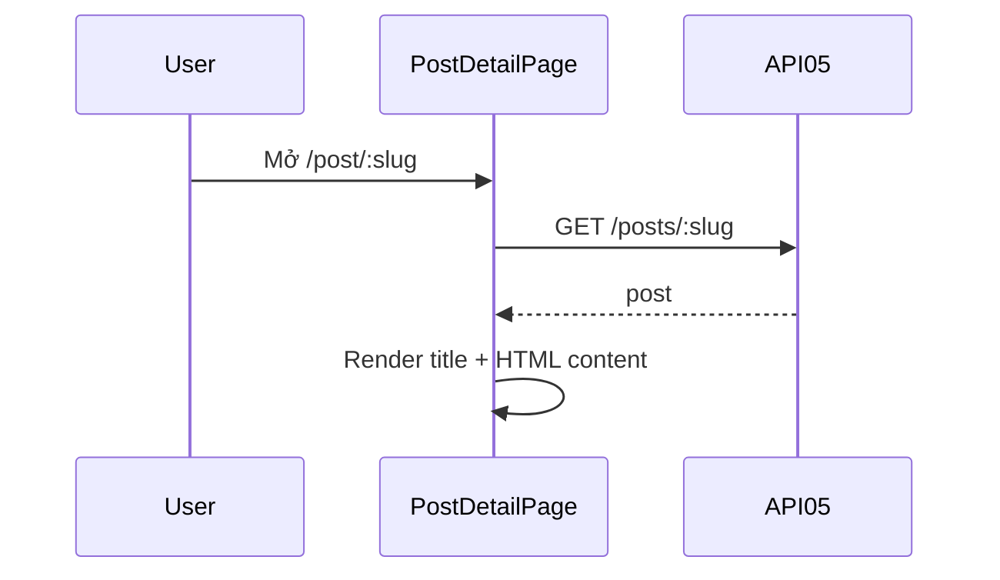

# [Design][SCREEN] POST_DETAIL_ChiTietBai

## Change Log
| Ver | Ngày | Nội dung | Người tạo |
|---|---|---|---|
| 1.1 | 2026-06-05 | Chuẩn hóa 12 sections, đồng bộ `PostDetailPage.jsx` và API05 | docs-agent |

## 1. Tổng quan
Trang public hiển thị tiêu đề và nội dung HTML của một bài viết theo slug.

## 2. Thông tin chung
| Thuộc tính | Giá trị |
|---|---|
| Route | `/post/:slug` |
| Auth yêu cầu | Không |
| Redirect nếu chưa login | Không |
| URL Params | `slug` |

## 3. Navigation
| Vào từ đâu | Điều kiện |
|---|---|
| `PostCard`, featured post, nhập URL | Public |

| Đi đến đâu | Destination |
|---|---|
| Không có action nội bộ trong code hiện tại | N/A |

## 4. Layout & Components
```jsx
<Navbar />
<main>
  <h1>{post.title}</h1>
  <div dangerouslySetInnerHTML={{ __html: post.content }} />
</main>
<Footer />
```
Components dùng lại: `Navbar`, `Footer`.

## 5. Ma trận trạng thái UI
| Trạng thái | Title | Content | Loading |
|---|---|---|---|
| Init/Loading | Ẩn | Ẩn | `Loading...` |
| Loaded | Hiển thị | Hiển thị HTML | Ẩn |
| Error/404 | Code hiện chưa catch riêng | Code hiện chưa catch riêng | Có thể giữ loading nếu request fail |

## 6. Chi tiết UI từng section
| Control | Loại | I/O | Ràng buộc | Giá trị khởi tạo | Nguồn dữ liệu | Event ID | JSON Field | Ghi chú |
|---|---|---|---|---|---|---|---|---|
| Route slug | Param | Input | string | URL | React Router | E01 | `slug` | Path API05 |
| Title | Text | Output | N/A | N/A | API05 | N/A | `title` | h1 |
| Content | HTML | Output | HTML string | `''` | API05 | N/A | `content` | Render bằng `dangerouslySetInnerHTML` |

## 7. API Calls
| Event ID | API | Endpoint | Khi gọi | Link |
|---|---|---|---|---|
| E01 | API05 | `GET /api/posts/:slug` | On mount hoặc slug đổi | [[Design][API] API05_Posts_ChiTiet.md](../api/[Design][API]%20API05_Posts_ChiTiet.md) |

### Request Mapping
| Event ID | Path |
|---|---|
| E01 | `slug = useParams().slug` |

### Response Mapping
| API Field | UI State |
|---|---|
| response object | `post` |
| `title` | h1 |
| `content` | HTML content |

## 8. State Management
```js
const { slug } = useParams();
const [post, setPost] = useState(null);
```

## 9. Xử lý lỗi & Edge Cases
| Tình huống | HTTP Status | Component | Xử lý |
|---|---|---|---|
| Đang tải | N/A | Text | Hiển thị `Loading...` |
| Không có content | 200 | Content | Render chuỗi rỗng |
| API 404/lỗi | 404/500 | Chưa xử lý riêng | Target message `POST-E-003` hoặc `POST-E-005` |

## 10. Responsive
| Breakpoint | Layout |
|---|---|
| Mobile | Padding `p-4`, content stack |
| Desktop | Padding `p-4`, content full width hiện tại |

## 11. Events & Actions
| Event ID | Tên | Control | Trigger | API | Mô tả |
|---|---|---|---|---|---|
| E01 | Load detail | Page | Mount/slug change | API05 | Load chi tiết bài |



## 12. Message List
| MessageId | Loại | Nội dung | Component hiển thị | Điều kiện |
|---|---|---|---|---|
| POST-E-003 | E | Post not found | Error target | API05 404 |
| POST-E-005 | E | Không thể tải bài viết. Vui lòng thử lại. | Error target | API lỗi |
