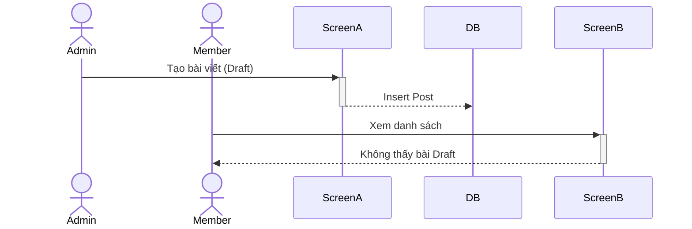

# ITb: Kiểm thử Luồng [Tên luồng nghiệp vụ]

## 1. Mục đích (Overview)
[Mô tả ngắn gọn mục đích của kịch bản này. Ví dụ: Kiểm tra luồng xuất bản bài viết từ lúc Admin tạo nháp, duyệt bài, cho đến khi User bình thường nhìn thấy trên trang chủ.]

## 2. Sơ đồ Luồng (Workflow Flowchart)
*Sơ đồ Mermaid mô tả trực quan các bước đi qua các màn hình/role.*


## 3. Dữ liệu Test (Test Data)

### 3.1. Dữ liệu nền (Setup Data - DB State)
*Dữ liệu bắt buộc phải được insert vào DB trước khi chạy test suite này.*
```sql
-- Xóa data cũ để clean state
DELETE FROM [table_name] WHERE [condition];

-- Tạo dữ liệu mẫu (Users, Categories...)
INSERT INTO [table_name] (col1, col2) VALUES 
(val1, val2);
```

### 3.2. Ma trận Kiểm tra Dữ liệu (DB Confirmation Matrix)
*Bảng mapping để verify dữ liệu chảy qua các màn hình được lưu đúng vào DB.*

| TC ID | Step | Table | Column | Expected Value | Nguồn giá trị (Source) | SQL Verify |
|---|---|---|---|---|---|---|
| `[TC_ID]` | [Step No] | `[table]` | `[column]` | `[value]` | [Input/Hardcode/Default] | `SELECT ...` |

---

## 4. ITb Checklist (Danh sách Test Case)
*Tóm tắt danh sách các Test Case sẽ thực hiện, phân loại theo 9 Pattern Taxonomy.*

| TC ID | Pattern | Title | Priority |
|---|---|---|---|
| `[TC_ID]` | `[HP/ALT/ISO...]` | [Tiêu đề TC] | [High/Medium] |

---

## 5. Kịch bản Kiểm thử Chi tiết (TC Detail)

*Kịch bản này mô phỏng một luồng thao tác liên tục đi qua >= 2 nodes. Step và Expected Result phải đánh số 1-1.*

### [TC_ID]: [Tiêu đề TC]
- **Pattern:** `[HP/ALT/CONC...]`
- **Pre-conditions:** [Điều kiện tiền quyết cụ thể cho TC này]

| Bước (Step) | Actor | Node (Screen/API) | Hành động (Procedure) | Kết quả mong đợi (Expected Result) |
|---|---|---|---|---|
| 1 | `[Role]` | `[Screen]` | 1. [Mô tả hành động 1] | 1. **[UI]** [Kết quả UI 1]<br>**[DB]** [Kết quả DB 1] |
| 2 | `[Role]` | `[Screen]` | 2. [Mô tả hành động 2] | 2. **[API]** [Kết quả API 2] |
