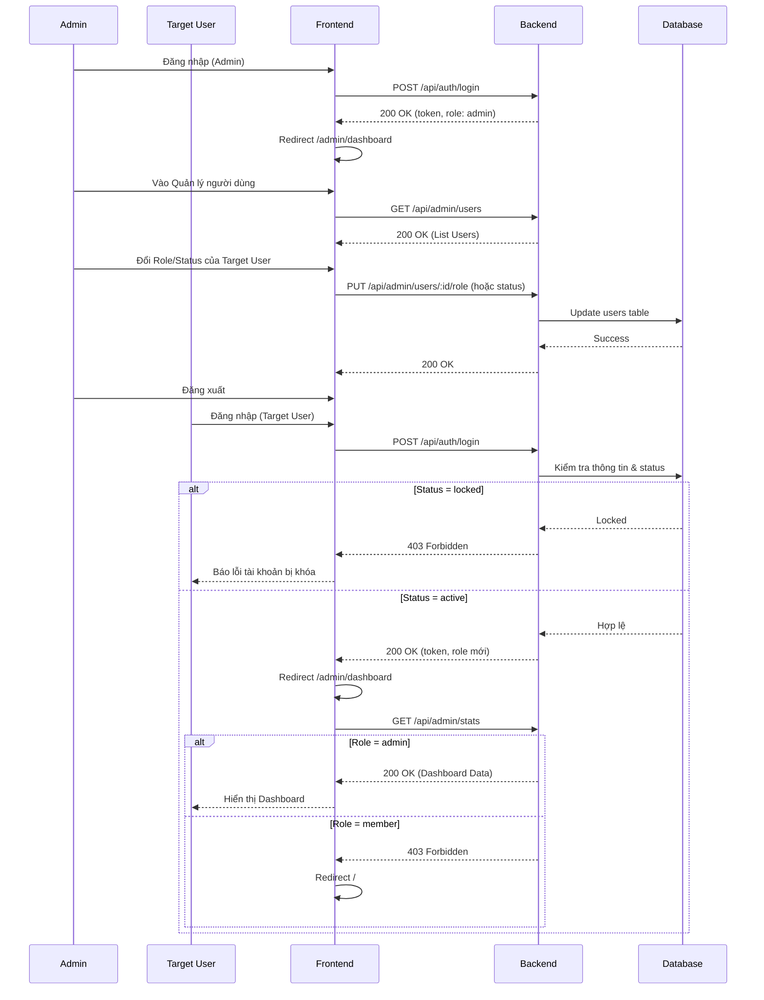

# ITb: Kiểm thử Luồng Admin quản lý user và user đăng nhập

## 1. Mục đích (Overview)
Kiểm tra luồng nghiệp vụ xuyên suốt: Admin đăng nhập, truy cập trang Quản lý người dùng để thay đổi quyền (role) hoặc trạng thái (status) của một người dùng khác (Target User). Sau đó, Target User sử dụng tài khoản vừa được cập nhật để đăng nhập và hệ thống phải phản hồi đúng theo quyền/trạng thái mới (cho phép vào Dashboard, chặn truy cập, hoặc báo lỗi tài khoản bị khóa).

## 2. Sơ đồ Luồng (Workflow Flowchart)


## 3. Dữ liệu Test (Test Data)

### 3.1. Dữ liệu nền (Setup Data - DB State)
*Dữ liệu bắt buộc phải được insert vào DB trước khi chạy test suite này.*
```sql
-- Xóa data test cũ nếu có
DELETE FROM users WHERE email IN ('test_admin_itb@hoianblog.vn', 'test_target_itb@hoianblog.vn');

-- Tạo Admin User (id: 9901)
INSERT INTO users (id, email, password_hash, name, role, status, created_at, updated_at) 
VALUES (9901, 'test_admin_itb@hoianblog.vn', '$2b$10$9br.361KuQ9FFBIXQzBS5eIuFSOjliX0JDwvXR838SbEURkkKmyCK', 'ITb Admin', 'admin', 'active', NOW(), NOW());

-- Tạo Target User (id: 9902) ban đầu là member
INSERT INTO users (id, email, password_hash, name, role, status, created_at, updated_at) 
VALUES (9902, 'test_target_itb@hoianblog.vn', '$2b$10$9br.361KuQ9FFBIXQzBS5eIuFSOjliX0JDwvXR838SbEURkkKmyCK', 'ITb Target', 'member', 'active', NOW(), NOW());
```
*(Lưu ý: `password_hash` trên tương ứng với mật khẩu `password123`)*

### 3.2. Ma trận Kiểm tra Dữ liệu (DB Confirmation Matrix)

| TC ID | Step | Table | Column | Expected Value | Nguồn giá trị (Source) | SQL Verify |
|---|---|---|---|---|---|---|
| `TC_ITB_01` | 4 | `users` | `role` | `'admin'` | Input từ Admin | `SELECT role FROM users WHERE id = 9902;` |
| `TC_ITB_02` | 4 | `users` | `status` | `'locked'` | Input từ Admin | `SELECT status FROM users WHERE id = 9902;` |
| `TC_ITB_03` | 4 | `users` | `role` | `'member'` | Input từ Admin | `SELECT role FROM users WHERE id = 9902;` |

---

## 4. ITb Checklist (Danh sách Test Case)

| TC ID | Pattern | Title | Priority |
|---|---|---|---|
| `TC_ITB_01` | `HP` | Admin cấp quyền Admin cho Member, Member đăng nhập và xem được Dashboard | High |
| `TC_ITB_02` | `ALT` | Admin khóa tài khoản Member, Member đăng nhập bị chặn | High |
| `TC_ITB_03` | `ALT` | Admin hạ quyền Admin xuống Member, Member đăng nhập không vào được Dashboard | Medium |
| `TC_ITB_04` | `STATE-VIO` | Admin cố gắng tự đổi role của chính mình (Bị chặn) | Medium |

---

## 5. Kịch bản Kiểm thử Chi tiết (TC Detail)

### TC_ITB_01: Admin cấp quyền Admin cho Member, Member đăng nhập và xem được Dashboard
- **Pattern:** `HP` (Happy Path)
- **Pre-conditions:** Chạy script Setup Data (Admin 9901, Target 9902 role `member`).

| Bước (Step) | Actor | Node (Screen/API) | Hành động (Procedure) | Kết quả mong đợi (Expected Result) |
|---|---|---|---|---|
| 1 | `Admin` | `ADMIN_LOGIN` | 1. Nhập email `test_admin_itb@hoianblog.vn`, pass `password123` và click Đăng nhập. | 1. **[API]** `POST /api/auth/login` trả 200 OK.<br>**[UI]** Redirect sang `/admin/dashboard`. |
| 2 | `Admin` | `ADMIN_USER_LIST` | 2. Điều hướng sang Quản lý người dùng. | 2. **[API]** `GET /api/admin/users` trả 200 OK.<br>**[UI]** Hiển thị danh sách user, có user `test_target_itb@hoianblog.vn`. |
| 3 | `Admin` | `ADMIN_USER_LIST` | 3. Tìm user `test_target_itb@hoianblog.vn`, chọn đổi Role thành `Admin` và xác nhận. | 3. **[API]** `PUT /api/admin/users/9902/role` trả 200 OK.<br>**[DB]** `role` của user 9902 thành `admin`.<br>**[UI]** Toast báo thành công. |
| 4 | `Admin` | `Navbar` | 4. Click Đăng xuất. | 4. **[UI]** Xóa token, redirect về `/admin/login`. |
| 5 | `Target` | `ADMIN_LOGIN` | 5. Nhập email `test_target_itb@hoianblog.vn`, pass `password123` và click Đăng nhập. | 5. **[API]** `POST /api/auth/login` trả 200 OK (role: admin).<br>**[UI]** Redirect sang `/admin/dashboard`. |
| 6 | `Target` | `ADMIN_DASHBOARD` | 6. Xem trang Dashboard. | 6. **[API]** `GET /api/admin/stats` trả 200 OK.<br>**[UI]** Hiển thị số liệu thống kê thành công. |

### TC_ITB_02: Admin khóa tài khoản Member, Member đăng nhập bị chặn
- **Pattern:** `ALT` (Alternative Branch)
- **Pre-conditions:** Chạy script Setup Data (Admin 9901, Target 9902 status `active`).

| Bước (Step) | Actor | Node (Screen/API) | Hành động (Procedure) | Kết quả mong đợi (Expected Result) |
|---|---|---|---|---|
| 1 | `Admin` | `ADMIN_LOGIN` | 1. Đăng nhập bằng tài khoản Admin. | 1. **[UI]** Redirect sang `/admin/dashboard`. |
| 2 | `Admin` | `ADMIN_USER_LIST` | 2. Vào Quản lý người dùng, tìm user `test_target_itb@hoianblog.vn`. | 2. **[UI]** Hiển thị danh sách user. |
| 3 | `Admin` | `ADMIN_USER_LIST` | 3. Click "Khóa tài khoản", nhập lý do "Vi phạm nội quy" và xác nhận. | 3. **[API]** `PUT /api/admin/users/9902/status` trả 200 OK.<br>**[DB]** `status` thành `locked`. |
| 4 | `Admin` | `Navbar` | 4. Đăng xuất. | 4. **[UI]** Redirect về `/admin/login`. |
| 5 | `Target` | `ADMIN_LOGIN` | 5. Nhập email `test_target_itb@hoianblog.vn`, pass `password123` và click Đăng nhập. | 5. **[API]** `POST /api/auth/login` trả 403 Forbidden (hoặc 401).<br>**[UI]** Hiển thị lỗi "Tài khoản đã bị khóa". Không redirect. |

### TC_ITB_03: Admin hạ quyền Admin xuống Member, Member đăng nhập không vào được Dashboard
- **Pattern:** `ALT` (Alternative Branch)
- **Pre-conditions:** Chạy script Setup Data. Update thủ công Target 9902 thành role `admin` trước khi test.

| Bước (Step) | Actor | Node (Screen/API) | Hành động (Procedure) | Kết quả mong đợi (Expected Result) |
|---|---|---|---|---|
| 1 | `Admin` | `ADMIN_LOGIN` | 1. Đăng nhập bằng tài khoản Admin. | 1. **[UI]** Redirect sang `/admin/dashboard`. |
| 2 | `Admin` | `ADMIN_USER_LIST` | 2. Vào Quản lý người dùng, tìm user `test_target_itb@hoianblog.vn` (đang là Admin). | 2. **[UI]** Hiển thị danh sách user. |
| 3 | `Admin` | `ADMIN_USER_LIST` | 3. Chọn đổi Role thành `Member` và xác nhận. | 3. **[API]** `PUT /api/admin/users/9902/role` trả 200 OK.<br>**[DB]** `role` thành `member`. |
| 4 | `Admin` | `Navbar` | 4. Đăng xuất. | 4. **[UI]** Redirect về `/admin/login`. |
| 5 | `Target` | `ADMIN_LOGIN` | 5. Nhập email `test_target_itb@hoianblog.vn`, pass `password123` và click Đăng nhập. | 5. **[API]** `POST /api/auth/login` trả 200 OK (role: member).<br>**[UI]** Redirect sang `/admin/dashboard`. |
| 6 | `Target` | `ADMIN_DASHBOARD` | 6. Truy cập `/admin/dashboard`. | 6. **[API]** `GET /api/admin/stats` trả 403 Forbidden.<br>**[UI]** Route Guard chặn lại và redirect về trang chủ `/`. |

### TC_ITB_04: Admin cố gắng tự đổi role của chính mình (Bị chặn)
- **Pattern:** `STATE-VIO` (State Transition Violation)
- **Pre-conditions:** Chạy script Setup Data (Admin 9901).

| Bước (Step) | Actor | Node (Screen/API) | Hành động (Procedure) | Kết quả mong đợi (Expected Result) |
|---|---|---|---|---|
| 1 | `Admin` | `ADMIN_LOGIN` | 1. Đăng nhập bằng tài khoản Admin `test_admin_itb@hoianblog.vn`. | 1. **[UI]** Redirect sang `/admin/dashboard`. |
| 2 | `Admin` | `ADMIN_USER_LIST` | 2. Vào Quản lý người dùng, tìm chính user `test_admin_itb@hoianblog.vn`. | 2. **[UI]** Hiển thị danh sách user. |
| 3 | `Admin` | `ADMIN_USER_LIST` | 3. Chọn đổi Role thành `Member` và xác nhận. | 3. **[API]** `PUT /api/admin/users/9901/role` trả 400 Bad Request.<br>**[DB]** `role` vẫn giữ nguyên là `admin`.<br>**[UI]** Hiển thị lỗi `USER-E-005` (Không thể đổi role của chính mình). |
