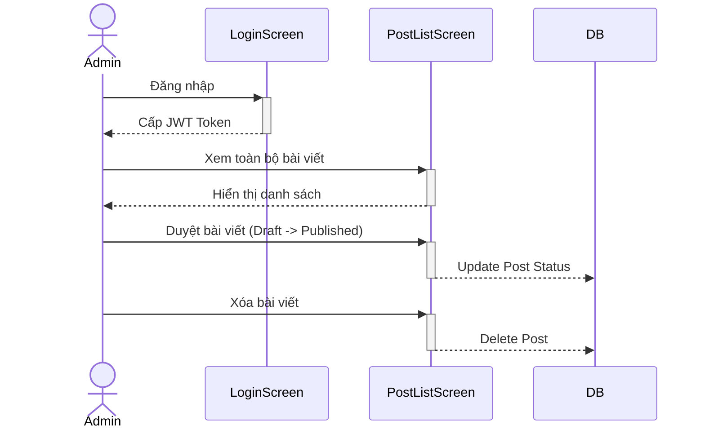

# ITb: Kiểm thử Luồng Admin Quản lý Bài viết

## 1. Mục đích (Overview)
Kiểm tra luồng nghiệp vụ của Admin: Đăng nhập, xem toàn bộ danh sách bài viết trên hệ thống, duyệt bài viết (đổi status từ draft sang published) và xóa bài viết vi phạm.

## 2. Sơ đồ Luồng (Workflow Flowchart)


## 3. Dữ liệu Test (Test Data)

### 3.1. Dữ liệu nền (Setup Data - DB State)
```sql
DELETE FROM posts WHERE slug IN ('bai-viet-can-duyet', 'bai-viet-vi-pham');
DELETE FROM users WHERE email IN ('admin_itb_posts@hoianblog.vn', 'member_itb_posts@hoianblog.vn');
DELETE FROM categories WHERE slug = 'danh-muc-admin-itb';

INSERT INTO users (id, name, email, password_hash, role, status) VALUES 
(401, 'Admin Posts', 'admin_itb_posts@hoianblog.vn', '$2b$10$X7/1.2.3.4.5.6.7.8.9.0.1.2.3.4.5.6.7.8.9.0.1.2.3.4.5.6', 'admin', 'active'),
(402, 'Member Posts', 'member_itb_posts@hoianblog.vn', '$2b$10$X7/1.2.3.4.5.6.7.8.9.0.1.2.3.4.5.6.7.8.9.0.1.2.3.4.5.6', 'member', 'active');

INSERT INTO categories (id, name, slug) VALUES (401, 'Danh mục Admin ITb', 'danh-muc-admin-itb');

INSERT INTO posts (id, title, slug, content, excerpt, category_id, author_id, status) VALUES 
(401, 'Bài viết cần duyệt', 'bai-viet-can-duyet', 'Content', 'Excerpt', 401, 402, 'draft'),
(402, 'Bài viết vi phạm', 'bai-viet-vi-pham', 'Content', 'Excerpt', 401, 402, 'published');
```

### 3.2. Ma trận Kiểm tra Dữ liệu (DB Confirmation Matrix)

| TC ID | Step | Table | Column | Expected Value | Nguồn giá trị (Source) | SQL Verify |
|---|---|---|---|---|---|---|
| `TC_ITB_ADM_01` | 3 | `posts` | `status` | `published` | Action | `SELECT status FROM posts WHERE id = 401` |
| `TC_ITB_ADM_01` | 4 | `posts` | `id` | `NULL` | Action | `SELECT * FROM posts WHERE id = 402` |

---

## 4. ITb Checklist (Danh sách Test Case)

| TC ID | Pattern | Title | Priority |
|---|---|---|---|
| `TC_ITB_ADM_01` | `HP` | Admin duyệt bài viết và xóa bài viết vi phạm | High |

---

## 5. Kịch bản Kiểm thử Chi tiết (TC Detail)

### TC_ITB_ADM_01: Admin duyệt bài viết và xóa bài viết vi phạm
- **Pattern:** `HP` (Happy Path)
- **Pre-conditions:** Database đã được setup theo mục 3.1.

| Bước (Step) | Actor | Node (Screen/API) | Hành động (Procedure) | Kết quả mong đợi (Expected Result) |
|---|---|---|---|---|
| 1 | `Admin` | `ADMIN_LOGIN` | 1. Đăng nhập với `admin_itb_posts@hoianblog.vn` / `password123` | 1. **[UI]** Chuyển hướng sang `/admin/dashboard` |
| 2 | `Admin` | `ADMIN_POST_LIST` | 1. Truy cập `/admin/posts` | 2. **[UI]** Hiển thị danh sách toàn bộ bài viết, bao gồm bài ID 401 và 402 |
| 3 | `Admin` | `ADMIN_POST_LIST` | 1. Tìm bài viết "Bài viết cần duyệt" (ID 401)<br>2. Click Đổi trạng thái thành Published | 3. **[UI]** Thông báo thành công, trạng thái trên lưới đổi thành Published<br>**[DB]** `status` của ID 401 thành `published` |
| 4 | `Admin` | `ADMIN_POST_LIST` | 1. Tìm bài viết "Bài viết vi phạm" (ID 402)<br>2. Click Xóa và xác nhận | 4. **[UI]** Thông báo thành công, bài viết biến mất khỏi list<br>**[DB]** Record ID 402 bị xóa khỏi `posts` |
