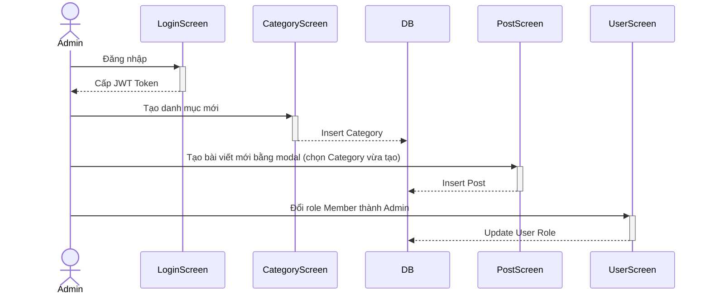

# ITb: Kiểm thử Luồng Admin Quản lý Hệ thống

## 1. Mục đích (Overview)
Kiểm tra luồng nghiệp vụ tổng hợp của Admin: Đăng nhập vào hệ thống, tạo một danh mục mới, tạo một bài viết thuộc danh mục vừa tạo, và cuối cùng là quản lý người dùng (đổi role của một user khác). Đảm bảo dữ liệu xuyên suốt giữa các màn hình và API hoạt động chính xác.

## 2. Sơ đồ Luồng (Workflow Flowchart)


## 3. Dữ liệu Test (Test Data)

> **Lưu ý:** Test Data được lấy trực tiếp từ DB thật qua MCP (không dùng data giả hardcode). Các câu lệnh SQL dưới đây mang tính chất tham khảo cấu trúc.

### 3.1. Dữ liệu nền (Setup Data - DB State)
```sql
-- Xóa data cũ để clean state
DELETE FROM posts WHERE slug = 'bai-viet-itb';
DELETE FROM categories WHERE slug = 'danh-muc-itb';
DELETE FROM users WHERE email IN ('admin_itb@hoianblog.vn', 'member_itb@hoianblog.vn');

-- Tạo Users
INSERT INTO users (id, name, email, password_hash, role, status) VALUES 
(201, 'Admin ITb', 'admin_itb@hoianblog.vn', '$2b$10$X7/1.2.3.4.5.6.7.8.9.0.1.2.3.4.5.6.7.8.9.0.1.2.3.4.5.6', 'admin', 'active'),
(202, 'Member ITb', 'member_itb@hoianblog.vn', '$2b$10$X7/1.2.3.4.5.6.7.8.9.0.1.2.3.4.5.6.7.8.9.0.1.2.3.4.5.6', 'member', 'active');
```

### 3.2. Ma trận Kiểm tra Dữ liệu (DB Confirmation Matrix)

| TC ID | Step | Table | Column | Expected Value | Nguồn giá trị (Source) | SQL Verify |
|---|---|---|---|---|---|---|
| `TC_ITB_01` | 2 | `categories` | `slug` | `danh-muc-itb` | Input | `SELECT * FROM categories WHERE slug = 'danh-muc-itb'` |
| `TC_ITB_01` | 3 | `posts` | `slug` | `bai-viet-itb` | Input | `SELECT * FROM posts WHERE slug = 'bai-viet-itb'` |
| `TC_ITB_01` | 4 | `users` | `role` | `admin` | Input | `SELECT role FROM users WHERE id = 202` |

---

## 4. ITb Checklist (Danh sách Test Case)

| TC ID | Pattern | Title | Priority |
|---|---|---|---|
| `TC_ITB_01` | `HP` | Luồng Admin đăng nhập, tạo danh mục, tạo bài viết và đổi role user | High |

---

## 5. Kịch bản Kiểm thử Chi tiết (TC Detail)

> **Lưu ý:** Quá trình test phải sử dụng Condition-Based Waiting (chờ element, chờ API response), tuyệt đối không dùng hard sleep (`waitForTimeout`).

### TC_ITB_01: Luồng Admin đăng nhập, tạo danh mục, tạo bài viết và đổi role user
- **Pattern:** `HP` (Happy Path)
- **Pre-conditions:** Database đã được setup theo mục 3.1. User chưa đăng nhập.

| Bước (Step) | Actor | Node (Screen/API) | Hành động (Procedure) | Kết quả mong đợi (Expected Result) |
|---|---|---|---|---|
| 1 | `Admin` | `ADMIN_LOGIN` | 1. Truy cập `/admin/login`<br>2. Nhập email `admin_itb@hoianblog.vn` và pass `password123`<br>3. Click Đăng Nhập | 1. **[UI]** Chuyển hướng sang `/admin/dashboard`<br>2. **[API]** Trả về token hợp lệ |
| 2 | `Admin` | `ADMIN_CATEGORY_LIST` | 1. Truy cập `/admin/categories`<br>2. Click Tạo mới<br>3. Nhập Tên: "Danh mục ITb", Slug: "danh-muc-itb"<br>4. Lưu | 1. **[UI]** Hiển thị thông báo thành công, danh mục xuất hiện trong list<br>2. **[DB]** Có record trong bảng `categories` với slug `danh-muc-itb` |
| 3 | `Admin` | `ADMIN_POST_LIST` | 1. Truy cập `/admin/posts`<br>2. Click `+ Tạo mới` để mở modal tạo bài<br>3. Nhập Tiêu đề: "Bài viết ITb", Slug: "bai-viet-itb"<br>4. Chọn danh mục "Danh mục ITb"<br>5. Nhập nội dung và Lưu | 1. **[UI]** Hiển thị thông báo thành công, đóng modal và reload list bài viết<br>2. **[DB]** Có record trong bảng `posts` với slug `bai-viet-itb` và `category_id` tương ứng |
| 4 | `Admin` | `ADMIN_USER_LIST` | 1. Truy cập `/admin/users`<br>2. Tìm user "Member ITb"<br>3. Click Đổi Role thành "Admin" | 1. **[UI]** Hiển thị thông báo thành công, role trên lưới đổi thành Admin<br>2. **[DB]** Bảng `users` ID 202 có `role` = 'admin' |
