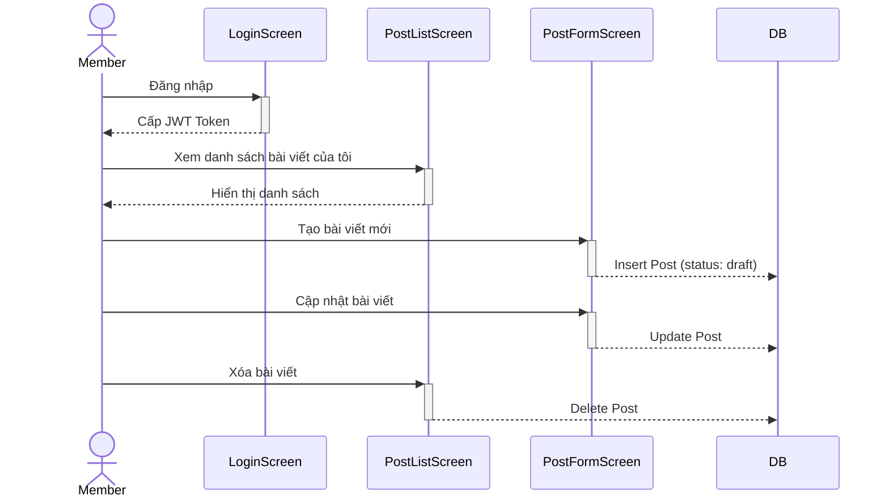

# ITb: Kiểm thử Luồng Member Quản lý Bài viết

## 1. Mục đích (Overview)
Kiểm tra luồng nghiệp vụ của Member: Đăng nhập, xem danh sách bài viết của mình, tạo bài viết mới (mặc định là draft), cập nhật bài viết và xóa bài viết. Đảm bảo Member chỉ có thể thao tác trên bài viết của chính mình.

## 2. Sơ đồ Luồng (Workflow Flowchart)


## 3. Dữ liệu Test (Test Data)

> **Lưu ý:** Test Data được lấy trực tiếp từ DB thật qua MCP (không dùng data giả hardcode). Các câu lệnh SQL dưới đây mang tính chất tham khảo cấu trúc.

### 3.1. Dữ liệu nền (Setup Data - DB State)
```sql
DELETE FROM posts WHERE slug IN ('bai-viet-member-itb', 'bai-viet-nguoi-khac');
DELETE FROM users WHERE email IN ('member_itb_1@hoianblog.vn', 'member_itb_2@hoianblog.vn');
DELETE FROM categories WHERE slug = 'danh-muc-member-itb';

INSERT INTO users (id, name, email, password_hash, role, status) VALUES 
(301, 'Member 1', 'member_itb_1@hoianblog.vn', '$2b$10$X7/1.2.3.4.5.6.7.8.9.0.1.2.3.4.5.6.7.8.9.0.1.2.3.4.5.6', 'member', 'active'),
(302, 'Member 2', 'member_itb_2@hoianblog.vn', '$2b$10$X7/1.2.3.4.5.6.7.8.9.0.1.2.3.4.5.6.7.8.9.0.1.2.3.4.5.6', 'member', 'active');

INSERT INTO categories (id, name, slug) VALUES (301, 'Danh mục Member ITb', 'danh-muc-member-itb');

INSERT INTO posts (id, title, slug, content, excerpt, category_id, author_id, status) VALUES 
(301, 'Bài viết người khác', 'bai-viet-nguoi-khac', 'Content', 'Excerpt', 301, 302, 'draft');
```

### 3.2. Ma trận Kiểm tra Dữ liệu (DB Confirmation Matrix)

| TC ID | Step | Table | Column | Expected Value | Nguồn giá trị (Source) | SQL Verify |
|---|---|---|---|---|---|---|
| `TC_ITB_MEM_01` | 3 | `posts` | `slug` | `bai-viet-member-itb` | Input | `SELECT * FROM posts WHERE slug = 'bai-viet-member-itb'` |
| `TC_ITB_MEM_01` | 4 | `posts` | `title` | `Bài viết Member ITb Updated` | Input | `SELECT title FROM posts WHERE slug = 'bai-viet-member-itb'` |
| `TC_ITB_MEM_01` | 5 | `posts` | `id` | `NULL` | Action | `SELECT * FROM posts WHERE slug = 'bai-viet-member-itb'` |

---

## 4. ITb Checklist (Danh sách Test Case)

| TC ID | Pattern | Title | Priority |
|---|---|---|---|
| `TC_ITB_MEM_01` | `HP` | Member tạo, sửa, xóa bài viết của chính mình | High |
| `TC_ITB_MEM_02` | `ISO` | Member không thể sửa/xóa bài viết của người khác | High |

---

## 5. Kịch bản Kiểm thử Chi tiết (TC Detail)

> **Lưu ý:** Quá trình test phải sử dụng Condition-Based Waiting (chờ element, chờ API response), tuyệt đối không dùng hard sleep (`waitForTimeout`).

### TC_ITB_MEM_01: Member tạo, sửa, xóa bài viết của chính mình
- **Pattern:** `HP` (Happy Path)
- **Pre-conditions:** Database đã được setup theo mục 3.1.

| Bước (Step) | Actor | Node (Screen/API) | Hành động (Procedure) | Kết quả mong đợi (Expected Result) |
|---|---|---|---|---|
| 1 | `Member` | `ADMIN_LOGIN` | 1. Đăng nhập với `member_itb_1@hoianblog.vn` / `password123` | 1. **[UI]** Chuyển hướng sang `/admin/dashboard` |
| 2 | `Member` | `ADMIN_POST_LIST` | 1. Truy cập `/admin/posts` | 2. **[UI]** Hiển thị danh sách bài viết trống (chưa có bài nào) |
| 3 | `Member` | `ADMIN_POST_FORM` | 1. Click Tạo bài viết<br>2. Nhập Tiêu đề: "Bài viết Member ITb", Slug: "bai-viet-member-itb"<br>3. Chọn danh mục "Danh mục Member ITb"<br>4. Lưu | 3. **[UI]** Thông báo thành công<br>**[DB]** Có record trong `posts` với `author_id` = 301, `status` = 'draft' |
| 4 | `Member` | `ADMIN_POST_FORM` | 1. Click Sửa bài viết vừa tạo<br>2. Đổi Tiêu đề thành "Bài viết Member ITb Updated"<br>3. Lưu | 4. **[UI]** Thông báo thành công<br>**[DB]** `title` được cập nhật |
| 5 | `Member` | `ADMIN_POST_LIST` | 1. Click Xóa bài viết vừa tạo<br>2. Xác nhận | 5. **[UI]** Thông báo thành công, bài viết biến mất khỏi list<br>**[DB]** Record bị xóa khỏi `posts` |

### TC_ITB_MEM_02: Member không thể sửa/xóa bài viết của người khác
- **Pattern:** `ISO` (Isolation)
- **Pre-conditions:** Database đã được setup theo mục 3.1. Có bài viết ID 301 của Member 2.

| Bước (Step) | Actor | Node (Screen/API) | Hành động (Procedure) | Kết quả mong đợi (Expected Result) |
|---|---|---|---|---|
| 1 | `Member` | `ADMIN_LOGIN` | 1. Đăng nhập với `member_itb_1@hoianblog.vn` / `password123` | 1. **[UI]** Chuyển hướng sang `/admin/dashboard` |
| 2 | `Member` | `API` | 1. Gọi trực tiếp API PUT `/api/posts/301` | 2. **[API]** Trả về 403 Forbidden hoặc 404 Not Found |
| 3 | `Member` | `API` | 1. Gọi trực tiếp API DELETE `/api/posts/301` | 3. **[API]** Trả về 403 Forbidden hoặc 404 Not Found |
