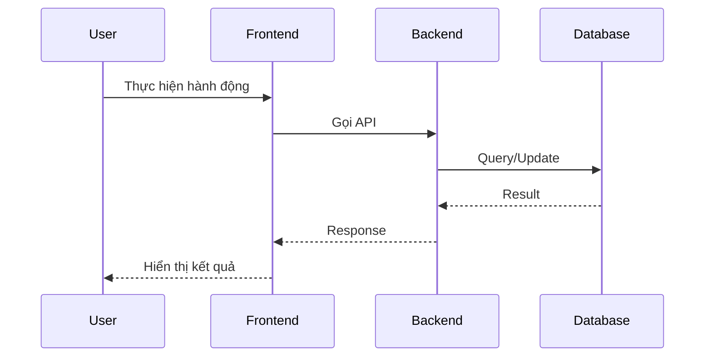

# [Design][WORKFLOW] WF{ID}_{TênLuồng}

## Change Log
| Ver | Ngày | Nội dung | Người tạo |
|---|---|---|---|
| 1.0 | YYYY-MM-DD | Tạo tài liệu ban đầu | docs-agent |

## 1. Tổng quan
Mô tả ngắn gọn mục đích của luồng nghiệp vụ này. Luồng này giải quyết bài toán gì, mang lại giá trị gì cho người dùng.

## 2. Actors (Vai trò tham gia)
| Actor | Mô tả | Role tương ứng trong hệ thống |
|---|---|---|
| Actor 1 | ... | ... |
| Actor 2 | ... | ... |

## 3. Pre-conditions & Post-conditions
- **Pre-conditions (Điều kiện tiên quyết)**: Trạng thái hệ thống, dữ liệu, hoặc quyền hạn bắt buộc phải có trước khi bắt đầu luồng.
- **Post-conditions (Điều kiện hậu quyết)**: Trạng thái hệ thống, dữ liệu thay đổi sau khi luồng kết thúc thành công.

## 4. Sơ đồ luồng (Mermaid)
Sử dụng `sequenceDiagram` hoặc `stateDiagram` để mô tả trực quan các bước tương tác giữa Actor và Hệ thống (FE/BE).

## 5. Main Flow (Luồng chính - Happy Path)
Mô tả chi tiết từng bước khi mọi thứ diễn ra suôn sẻ.

| Step | Actor | Action (Hành động) | System Response (Phản hồi hệ thống) | API / Screen Ref |
|---|---|---|---|---|
| 1 | ... | ... | ... | ... |
| 2 | ... | ... | ... | ... |

## 6. Alternative Flows (Luồng rẽ nhánh)
Các nhánh đi khác với luồng chính nhưng vẫn hợp lệ về mặt nghiệp vụ.

- **ALT1: [Tên nhánh]**
  - Tại bước X của Main Flow, nếu [điều kiện] xảy ra.
  - Hệ thống thực hiện: ...
  - Luồng quay lại bước Y của Main Flow hoặc kết thúc.

## 7. Exception Flows (Luồng ngoại lệ/Lỗi)
Các trường hợp lỗi nghiệp vụ hoặc lỗi hệ thống khiến luồng bị gián đoạn.

- **EX1: [Tên lỗi]**
  - Tại bước X của Main Flow, nếu [điều kiện lỗi] xảy ra.
  - Hệ thống hiển thị thông báo lỗi: `[Message ID]`
  - Luồng kết thúc hoặc yêu cầu thử lại.
