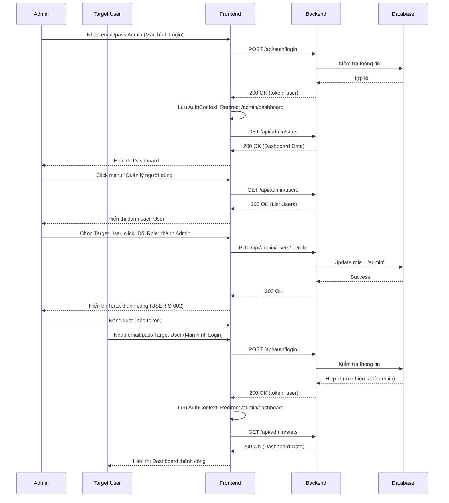

# [Design][WORKFLOW] WF01_AdminQuanLyUserVaDangNhap

## Change Log
| Ver | Ngày | Nội dung | Người tạo |
|---|---|---|---|
| 1.0 | 2026-06-05 | Tạo tài liệu luồng Admin quản lý user và user đăng nhập | docs-agent |

## 1. Tổng quan
Luồng nghiệp vụ mô tả quá trình một Admin đăng nhập vào hệ thống, truy cập Dashboard, điều hướng sang trang Quản lý người dùng để cấp quyền (đổi role) cho một người dùng khác (Target User). Sau đó, Target User sử dụng tài khoản vừa được cấp quyền để đăng nhập và truy cập thành công vào Dashboard dành cho Admin.

## 2. Actors (Vai trò tham gia)
| Actor | Mô tả | Role tương ứng trong hệ thống |
|---|---|---|
| Admin | Người quản trị hệ thống, có quyền xem dashboard và quản lý toàn bộ user. | `admin` |
| Target User | Người dùng bình thường (member) được Admin cấp quyền, sau đó thực hiện đăng nhập. | Ban đầu là `member`, sau đó là `admin` |

## 3. Pre-conditions & Post-conditions
- **Pre-conditions (Điều kiện tiên quyết)**: 
  - Admin có tài khoản hợp lệ và đang ở trạng thái active.
  - Target User đã tồn tại trong hệ thống với role là `member` và trạng thái `active`.
- **Post-conditions (Điều kiện hậu quyết)**: 
  - Target User được nâng cấp lên role `admin`.
  - Target User đăng nhập thành công và truy cập được vào trang Dashboard.

## 4. Sơ đồ luồng (Mermaid)

## 5. Main Flow (Luồng chính - Happy Path)

| Step | Actor | Action (Hành động) | System Response (Phản hồi hệ thống) | API / Screen Ref |
|---|---|---|---|---|
| 1 | Admin | Nhập email, password hợp lệ và click "Đăng Nhập" | Gọi API login. Trả về token và thông tin user. Lưu vào AuthContext. | `ADMIN_LOGIN_DangNhap` / `API01` |
| 2 | Hệ thống | Tự động điều hướng | Redirect Admin sang trang Dashboard. Gọi API lấy thống kê. | `ADMIN_DASHBOARD_TongQuan` / `API22` |
| 3 | Admin | Click menu "Quản lý người dùng" | Gọi API lấy danh sách user. Hiển thị bảng danh sách. | `ADMIN_USER_LIST_QuanLyNguoiDung` / `API19` |
| 4 | Admin | Tìm Target User, click "Đổi Role" và xác nhận cấp quyền Admin | Gọi API đổi role. Cập nhật DB. Trả về 200 OK. Hiển thị Toast `USER-S-002`. | `ADMIN_USER_LIST_QuanLyNguoiDung` / `API20` |
| 5 | Admin | Click "Đăng xuất" | Xóa token khỏi AuthContext/localStorage. Redirect về trang chủ hoặc trang Login. | `Navbar` Component |
| 6 | Target User | Truy cập trang Login, nhập email, password hợp lệ và click "Đăng Nhập" | Gọi API login. Trả về token và thông tin user (lúc này role đã là `admin`). Lưu vào AuthContext. | `ADMIN_LOGIN_DangNhap` / `API01` |
| 7 | Hệ thống | Tự động điều hướng | Redirect Target User sang trang Dashboard. Gọi API lấy thống kê thành công do đã có quyền admin. | `ADMIN_DASHBOARD_TongQuan` / `API22` |

## 6. Alternative Flows (Luồng rẽ nhánh)

- **ALT1: Target User bị khóa tài khoản (Status = locked)**
  - Tại bước 4 của Main Flow, thay vì đổi Role, Admin click "Khóa tài khoản" (API25).
  - Tại bước 6, khi Target User đăng nhập, hệ thống (API01) kiểm tra thấy status là `locked`.
  - Hệ thống trả về lỗi 403 hoặc 401 kèm thông báo tài khoản bị khóa.
  - Luồng kết thúc, Target User không thể vào Dashboard.

- **ALT2: Target User bị hạ quyền xuống 'member'**
  - Tại bước 4, Admin đổi role của một Admin khác xuống thành `member`.
  - Tại bước 6, Target User đăng nhập thành công.
  - Tại bước 7, khi hệ thống redirect sang `/admin/dashboard`, Route Guard hoặc API22 sẽ chặn lại do không đủ quyền (trả về 403).
  - Hệ thống redirect Target User về trang chủ (`/`).

## 7. Exception Flows (Luồng ngoại lệ/Lỗi)

- **EX1: Sai thông tin đăng nhập**
  - Tại bước 1 hoặc bước 6, Actor nhập sai email hoặc password.
  - Hệ thống hiển thị thông báo lỗi: `AUTH-E-002` (Email hoặc mật khẩu không đúng).
  - Luồng dừng lại tại trang Login.

- **EX2: Admin tự đổi role của chính mình**
  - Tại bước 4, Admin vô tình chọn chính tài khoản của mình để đổi role.
  - Hệ thống (API20) chặn lại và trả về lỗi 400.
  - Frontend hiển thị thông báo lỗi: `USER-E-005` (Không thể đổi role của chính mình).
  - Luồng quay lại bước 3.