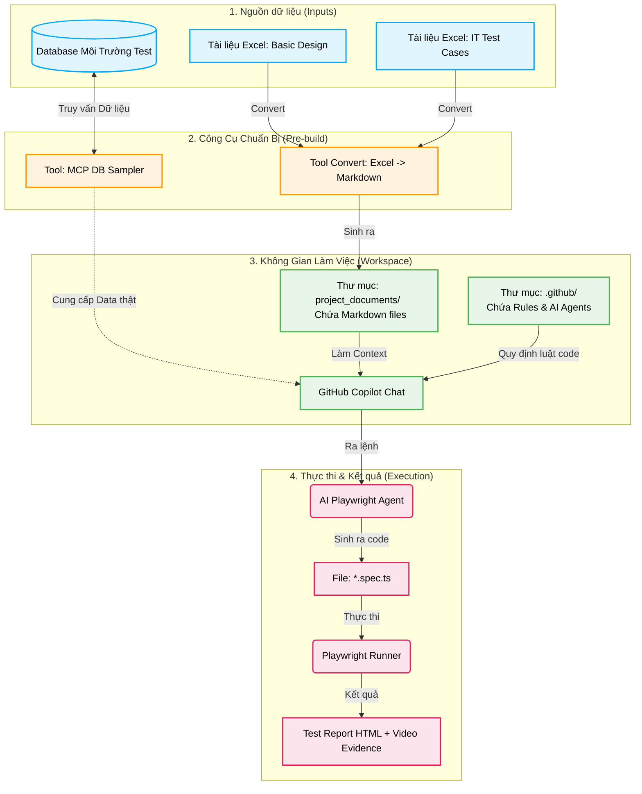

# Kế Hoạch Tạo Playwright Workspace Cho Dự Án Mới

> **Mục đích:** Quy trình từng bước hướng dẫn setup workspace Playwright hoàn chỉnh cho một dự án mới.
> **Cập nhật lần cuối:** 2026-07-09

---

## 0. Tổng Quan Kiến Trúc & Quy Trình (The Big Picture)

Dành cho các thành viên mới, quy trình dưới đây mô tả cách hệ thống vận hành. Mục tiêu cốt lõi của chúng ta là **giảm tối đa việc viết code test thủ công**, mà sử dụng AI đọc tài liệu và sinh code Playwright tự động.



> **Giải thích ngắn gọn:** 
> - Vì AI (Copilot) đọc file Excel (nhị phân) rất kém, ta cần bước (2) để convert tài liệu sang Markdown (Text). 
> - Đồng thời AI không tự bịa ra được user/pass test hợp lệ, nên ta dùng Tool (DB Sampler) để AI chui thẳng vào Database (3) lấy data mẫu.
> - Khi có đủ Context (Tài liệu MD) và Rules (trong `.github/`), ta chỉ việc chat với AI Agent để nó tự sinh ra code Test (4).

---

## 1. Thông Tin Dự Án

| Trường | Giá trị |
|--------|---------|
| Tên dự án | _(điền tên)_ |
| Tech stack FE | _(React / Vue / Angular / ...)_ |
| Tech stack BE | _(Spring Boot / Node.js / ...)_ |
| Kiến trúc | _(SPA / Web MVC)_ |
| Auth method | _(JWT Cookie / JWT localStorage / Session)_ |
| Danh sách role | _(admin, member, ...)_ |
| Scope test | _(ITa / ITb / cả hai)_ |

---

## 2. Thông Tin Môi Trường

| Trường | Giá trị |
|--------|---------|
| URL Frontend | _(http://localhost:3000)_ |
| URL Backend API | _(http://localhost:8080/api)_ |
| Database | _(PostgreSQL / MySQL / ...)_ |
| DB Host/Port | _(localhost:5432)_ |
| DB Name | _(tên database)_ |
| OS máy chạy test | _(Windows / Linux / macOS)_ |
| Node.js version | _(v18 / v20 / ...)_ |
| Account test | _(admin/pass, member/pass, ...)_ |

---

## 3. Cấu Trúc Workspace

```
project_workspace/
├── .github/
│   ├── copilot-instructions.md       # Quy tắc chung toàn workspace
│   ├── instructions/                 # Agent-specific instructions
│   ├── skills/                       # Domain knowledge skills
│   └── prompts/                      # Prompt templates
├── project_documents/
│   ├── basic-design/                 # FE/BE screen & API specs (markdown)
│   ├── workflow/                     # Business flow diagrams (markdown)
│   └── test-cases/                   # Test case ITa/ITb (markdown)
├── project_source_fe/                # Source code Frontend (submodule hoặc copy)
├── project_source_be/                # Source code Backend (submodule hoặc copy)
├── project_playwright/
│   ├── tests/                        # Test specs (.spec.ts)
│   ├── page-objects/                 # POM classes
│   ├── utils/                        # Helpers, fixtures, auth
│   ├── evidence/                     # Screenshots/videos kết quả test
│   ├── test-results/                 # Output JSON/XML của Playwright
│   ├── playwright.config.ts
│   └── package.json
├── project_tools/                    # Công cụ hỗ trợ (converters, DB sampler, ...)
├── reports/                          # Báo cáo tổng hợp, execution log
├── project_manifest.yml              # Trạng thái toàn cục dự án
└── README.md
```

---

## 4. Các Bước Chuẩn Bị (Pre-build)

---

### Bước 4.1 — Chuyển Đổi Tài Liệu Basic Design & Workflow

**Mục tiêu:** Chuyển tài liệu thiết kế từ Excel sang Markdown để AI agent có thể đọc và sinh test.

**Input:** File Excel chứa basic design (screen spec, API spec) và workflow diagram.

**Output:** Các file `.md` chuẩn trong `project_documents/basic-design/` và `project_documents/workflow/`.

**Các việc cần làm:**
- [ ] Xác định format Excel đang dùng (sheet nào, cột nào là gì)
- [ ] Tạo tool convert Excel → raw Markdown tại `project_tools/excel-to-md/`
  - Input: file `.xlsx`
  - Output: file `.md` theo template chuẩn
  - Tech: Python (openpyxl) hoặc Node.js (xlsx)
- [ ] Review output Markdown, chỉnh tay nếu cần
- [ ] Đặt file đúng thư mục theo naming convention

**Naming convention:**
```
basic-design/  [Design][SCREEN] {ScreenCode}_{ScreenName}.md
               [Design][API] API{ID}_{Group}_{Name}.md
workflow/      [Workflow] {FeatureName}_BusinessFlow.md
```

---

### Bước 4.2 — Chuyển Đổi Test Case IT Từ Excel Sang Markdown

**Mục tiêu:** Chuyển test case ITa/ITb từ Excel sang Markdown để làm input cho Playwright agent.

**Input:** File Excel test case IT (viewpoint, template, test steps, expected result).

**Output:** Các file `.md` chuẩn trong `project_documents/test-cases/`.

**Các việc cần làm:**
- [ ] Map cột Excel → field markdown (TC ID, Title, Precondition, Steps, Expected, Test Data)
- [ ] Tái sử dụng hoặc mở rộng tool từ Bước 4.1 để hỗ trợ format test case
- [ ] Validate output: đủ TC ID, steps rõ ràng, có expected result
- [ ] Đặt file theo naming convention

**Naming convention:**
```
test-cases/    [ITa] TC_{ScreenCode}_{FeatureName}.md
               [ITb] TC_FLOW_{FlowName}.md
```

---

### Bước 4.3 — Tạo Tool Kết Nối Database (DB Sampler)

**Mục tiêu:** Cho phép AI agent query dữ liệu thật từ DB để sinh test data chính xác, tương tự MCP DB Sampler hiện tại.

**Input:** Connection string tới DB local của dự án.

**Output:** Tool tại `project_tools/mcp-db-sampler/` có thể:
- List tables
- Get schema (columns, types)
- Get sample data
- Get valid foreign key values
- Execute read-only SELECT query

**Các việc cần làm:**
- [ ] Copy và điều chỉnh tool MCP DB Sampler từ workspace demo (`demo_tools/mcp-db-sampler/`)
- [ ] Cập nhật connection config cho DB mới (host, port, dbname, user, pass)
- [ ] Test kết nối và verify query hoạt động
- [ ] Đăng ký tool vào MCP config của VS Code workspace

---

### Bước 4.4 — Tạo Bộ Agent / Instruction / Skill / Prompt

**Mục tiêu:** Trang bị cho workspace bộ AI agent chuyên biệt để hỗ trợ từng bước trong quy trình test.

**Các việc cần làm:**

#### Instructions (quy tắc tự động áp dụng theo path)
- [ ] `playwright-agent.instructions.md` — quy tắc viết test Playwright (POM, locator, evidence)
- [ ] `docs-agent.instructions.md` — quy tắc đọc/viết tài liệu thiết kế
- [ ] `qa-gate.instructions.md` — checklist QA gate trước khi chốt

#### Skills (domain knowledge theo yêu cầu)
- [ ] `playwright-suite/SKILL.md` — workflow viết E2E test suite mới
- [ ] `playwright-review/SKILL.md` — workflow review test code
- [ ] `doc-ita-implement/SKILL.md` — workflow tạo tài liệu ITa
- [ ] `doc-itb-implement/SKILL.md` — workflow tạo tài liệu ITb
- [ ] `doc-workflow-implement/SKILL.md` — workflow tạo tài liệu Business Flow

#### Agents (chế độ chuyên biệt)
- [ ] `playwright-agent` — viết, debug, review E2E test
- [ ] `docs-agent` — chuyển đổi và chuẩn hóa tài liệu
- [ ] `qa-agent` — chạy QA gate cuối vòng

#### Prompts (automation liên hoàn)
- [ ] `playwright-itb-full-cycle.prompt.md` — viết → chạy → sửa → báo cáo
- [ ] `playwright-ita-full-cycle.prompt.md` — tương tự cho ITa
- [ ] `doc-itb-create-and-review.prompt.md` — tạo và review tài liệu ITb

---

## 5. Các Bước Tiếp Theo _(placeholder)_

> _(Thêm bước mới vào đây khi quy trình mở rộng)_

### Bước 5.1 — _(Tên bước)_

**Mục tiêu:** ...

**Các việc cần làm:**
- [ ] ...

---

## Ghi Chú

- Các bước có thể làm song song: 4.1, 4.2, 4.3 (không phụ thuộc nhau)
- Bước 4.4 nên làm sau khi có tài liệu markdown để agent có context test ngay
- Tool convert Excel (4.1/4.2) có thể dùng chung một codebase, chỉ khác template output

---

## 6. Mẫu Tham Khảo (Sample Reference)

Dưới đây là các tài liệu mẫu từ dự án Demo để team tham khảo cách một luồng Playwright được triển khai thực tế. Các file này đã được commit lên hệ thống.

### 6.1. Ánh xạ Tài liệu (Inputs) và Code (Outputs)

Bảng dưới đây minh họa sự liên kết giữa tài liệu phân tích (Input) và Test Code (Output) được sinh ra bởi AI cho 2 phạm vi test: ITa (Chức năng) và ITb (Luồng nghiệp vụ).

| Phạm vi (Scope) | Nguồn Dữ Liệu (Inputs) | Mã Nguồn Test (Outputs) |
|---|---|---|
| **ITa (Chức năng)** <br> *(Ví dụ: Quản lý Người Dùng)* | - **Basic Design:** `demo_docs/fe/[Design][SCREEN] ADMIN_USER_LIST_QuanLyNguoiDung.md` <br> - **Test Case:** `demo_docs/tests/ITa/[Test][ITa] TC_ADMIN_USER_LIST_QuanLyNguoiDung.md` | - **Page Object:** Các file trong `demo_playwright/page-objects/` <br> - **Test Script:** `demo_playwright/tests/ITa_functional/admin-users.01-list.spec.ts` |
| **ITb (Luồng)** <br> *(Ví dụ: Member quản lý bài)* | - **Workflow:** (Tài liệu luồng nghiệp vụ tương ứng) <br> - **Test Case:** `demo_docs/tests/ITb/[Test][ITb] TC_WF_Member_Manage_Posts.md` | - **Page Object:** Tái sử dụng các POM hiện có. <br> - **Test Script:** `demo_playwright/tests/ITb_scenarios/member-posts.01-manage.spec.ts` |

### 6.2. Cấu hình & Bằng chứng (Config & Evidence)

Bên cạnh code test, hãy tham khảo cách tổ chức báo cáo, dữ liệu động và công cụ hỗ trợ:

| Thành phần | Đường dẫn thư mục / File | Chú thích |
|---|---|---|
| **Cấu hình Core** | `demo_playwright/playwright.config.ts` | File cấu hình gốc của Playwright. |
| **Tiện ích (Utils)** | `demo_playwright/utils/evidence.ts` | Custom fixture để chụp ảnh màn hình và xử lý các thao tác dùng chung. |
| **Dữ liệu Mock** | `demo_playwright/chunk02-tc12.json`<br>`demo_playwright/smoke-result.json` | Dữ liệu mẫu thô. |
| **Báo cáo HTML** | `demo_playwright/playwright-report/` | Báo cáo UI đầy đủ nhất. Chạy lệnh: <br>`npx playwright show-report demo_playwright/playwright-report` |
| **Evidence** | `demo_playwright/test-results/` | File lưu ảnh chụp màn hình, video và zip trace của luồng test. |

> **💡 Lời khuyên:** Hãy mở file Test Case Markdown lên ở một tab, sau đó mở file Test Code (`.spec.ts`) tương ứng ở tab bên cạnh để thấy rõ AI đã bám sát từng Step trong tài liệu như thế nào!
